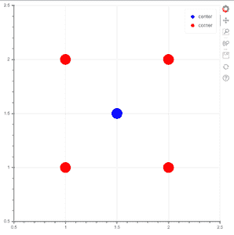

# 博克-注释和图例

> 原文:[https://www . geesforgeks . org/bokeh-annotations-and-legends/](https://www.geeksforgeeks.org/bokeh-annotations-and-legends/)

**先决条件:** [博克](https://www.geeksforgeeks.org/introduction-to-bokeh-in-python/)

Bokeh 包括几种类型的注释，允许用户向他们的可视化添加补充信息。注释用于添加关于主题的注释或更多信息。注释可以是标题、图例、箭头、带、标签等。

给你的数字添加图例可以帮助你正确地描述和定义它。因此，更清晰。Bokeh 中的传说实现起来很简单。它们可以是基本的、自动分组的、手动提及的、显式索引的以及交互式的。

下面给出的例子有助于您更好地理解:

**示例**:基础传说

legend_label 参数用于向任何一个标志符号添加基本标签。

## 蟒蛇 3

```
from bokeh.plotting import figure, output_file, show

x = [val for val in range(10)]
y = [val for val in range(0, 20, 2)]

output_file("basiclegend.html")

p = figure()

p.line(x, y, legend_label="My Red Line", line_color="red")
p.line(y, x, legend_label="My Orange Line", line_color="orange")
p.line(y[::-1], x, legend_label="My Green Line", line_color="green")

show(p)
```

**输出:**


**例 2:** 当我们想要将多个图例项分组为一个时，可以使用自动分组。

## 蟒蛇 3

```
from bokeh.plotting import figure, output_file, show
from bokeh.models import ColumnDataSource

p = figure(x_range=(0.5, 2.5), y_range=(0.5, 2.5))

source = ColumnDataSource(dict(
    x=[1, 1, 2, 2, 1.5],
    y=[1, 2, 1, 2, 1.5],
    color=['red', 'red', 'red', 'red', 'blue'],
    label=['corner', 'corner', 'corner', 'corner', 'center']
))
p.circle(x='x', y='y', radius=0.05, color='color',
         legend_group='label', source=source)

output_file("AutomaticGrouping.html")

show(p)
```

#### 输出:



**例 3:** 互动传说

## 蟒蛇 3

```
from bokeh.plotting import figure, output_file, show

p = figure()

x = [x for x in range(1, 11)]
colors = ['red', 'green', 'blue', 'yellow']
for i in range(2, 6):
    p.line(x, [val*i for val in x], line_width=2, color=colors[i-2],
           alpha=0.8, legend_label='Multiples of {}'.format(i))

p.legend.location = "top_left"
p.legend.click_policy = "hide"
output_file("interactive_legend.html")

show(p)
```

**输出:**

