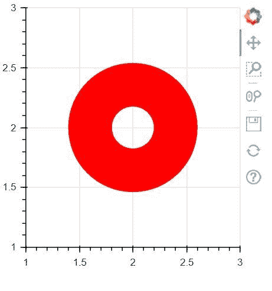
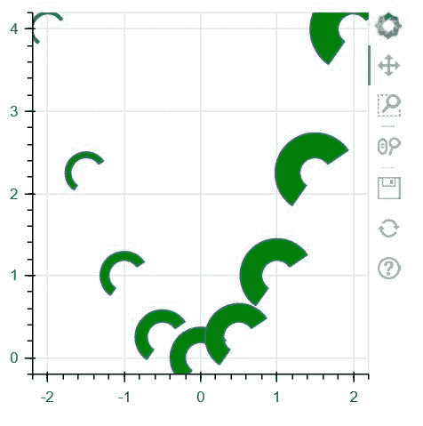

# Python 中的 bokeh . ploting . figure .环形 _ 楔形()函数

> 原文:[https://www . geesforgeks . org/bokeh-绘图-图形-环形 _ 楔形-python 中的函数/](https://www.geeksforgeeks.org/bokeh-plotting-figure-annular_wedge-function-in-python/)

**[Bokeh](https://www.geeksforgeeks.org/python-data-visualization-using-bokeh/#:~:text=Python%20%7C%20Data%20visualization%20using%20Bokeh, in%20Django%20and%20flask%20apps.)** 是 Python 中的数据可视化库，提供高性能的交互式图表和图，输出可以通过笔记本、html、服务器等多种媒介获得。**图形类**创建一个新的图形用于绘图。它是绘图的一个子类，通过默认轴、网格、工具等简化绘图创建。

## bokeh . ploting . figure .环形 _ 楔形()函数

bokeh 库绘图模块中的**环形 _ 楔形()功能**用于给图形添加环形楔形字形。

> **语法:**环形 _ 楔形(x，y，inner_radius，outer_radius，start_angle，end_angle，direction = ' anticlock '，*，end_angle_units='rad '，fill_alpha=1.0，fill_color='gray '，inner_radius_units='data '，line_alpha=1.0，line_cap='butt '，line_color='black '，line_dash=[]，line _ offset = 0，line_join= '斜角'，line_width=1，name=None
> 
> **参数:**该方法接受以下描述的参数:
> 
> *   **x:** 该参数是环形楔块中心的 x 坐标。
> *   **y:** 该参数是环形楔块中心的 y 坐标。
> *   **内半径:**该参数是环形楔的内半径。
> *   **外半径:**该参数是环形楔的外半径。
> *   **起始角度:**该参数是启动环形楔的角度。
> *   **end_angle:** 此参数是环形楔块的结束角度。
> *   **方向:**该参数是在起始角和结束角之间进行描边的方向。
> *   **填充α:**该参数是环形楔的填充α值。
> *   **填充颜色:**该参数是环形楔形的填充颜色值。
> *   **line_alpha:** 该参数为环形楔的 line alpha 值，默认值为 1.0。
> *   **线帽:**该参数为环形楔的线帽值，默认值为对接。
> *   **line_color:** 此参数为环形楔形的线条颜色值，默认值为黑色。
> *   **线划:**该参数是环形楔的线划值，默认值为[]。
> *   **线划偏移量:**该参数为环形楔的线划偏移量，默认值为 0。
> *   **线连接:**该参数为环形楔的线连接值，默认值为斜角。
> *   **线宽:**该参数为环形楔的线宽值，默认值为 1。
> *   **模式:**该参数可以是三个值中的一个:【“之前”、“之后”、“中心”】。
> *   **名称:**此参数是用户为此型号提供的名称。
> *   **标签:**此参数是用户为此模型提供的值。
> 
> **其他参数:**这些参数是**kwargs，描述如下:
> 
> *   **alpha:** 此参数用于一次性设置所有 alpha 关键字参数。
> *   **颜色:**此参数用于一次性设置所有颜色关键字参数。
> *   **legend_field:** 此参数是数据源中应该用于分组的列的名称。
> *   **legend_group:** 此参数是数据源中应该用于分组的列的名称。
> *   **legend_label:** 此参数是图例条目，与此处提供的文本完全一致。
> *   **静音:**该参数包含 bool 值。
> *   **名称:**此参数是可选的用户提供的名称，用于附加到渲染器。
> *   **来源:**此参数为用户提供的数据源。
> *   **视图:**该参数是过滤数据源的视图。
> *   **可见:**该参数包含布尔值。
> *   **x_range_name:** 此参数是用于映射 x 坐标的额外范围的名称。
> *   **y_range_name:** 此参数是用于映射 y 坐标的额外范围的名称。
> *   **等级:**此参数指定此字形的渲染等级顺序。
> 
> **返回:**该方法返回 GlyphRenderer 值。

以下示例说明了 bokeh .标绘中的 bokeh .标绘. figure .环形 _ 楔形()函数:
**示例 1:**

```
# Implementation of bokeh function

import numpy as np 
from bokeh.plotting import figure, output_file, show

x = [2]
y = [2]
r = .6

plot = figure(width = 300, height = 300)
plot.annular_wedge(x = x, y = y, inner_radius =.2,
                   outer_radius = r, start_angle = 0, 
                   end_angle = 6.5, line_color = "red",
                   fill_color ="red")

show(plot)
```

**输出:**


**例 2:**

```
# Implementation of bokeh function

import numpy as np 
from bokeh.plotting import figure, output_file, show

N = 9
x = np.linspace(-2, 2, N)
y = x**2
r = x / 12.0 + 0.4

plot = figure(width = 300, height = 300)
plot.annular_wedge(x = x, y = y, inner_radius =.2, 
                   outer_radius = r, start_angle = 0.6,
                   end_angle = 4.1, fill_color ="green")

show(plot)
```

**输出:**
