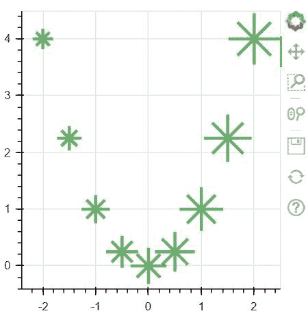

# Python 中的 bokeh . ploting . figure . asterisk()函数

> 原文:[https://www . geesforgeks . org/bokeh-绘图-图形-星号-python 中的函数/](https://www.geeksforgeeks.org/bokeh-plotting-figure-asterisk-function-in-python/)

**[Bokeh](https://www.geeksforgeeks.org/python-data-visualization-using-bokeh/#:~:text=Python%20%7C%20Data%20visualization%20using%20Bokeh, in%20Django%20and%20flask%20apps.)** 是 Python 中的数据可视化库，提供高性能的交互式图表和图，输出可以通过笔记本、html、服务器等多种媒介获得。**图形类**创建一个新的图形用于绘图。它是绘图的一个子类，通过默认轴、网格、工具等简化绘图创建。

## bokeh .标绘.图.星号()功能

bokeh 库绘图模块中的**星号()功能**用于配置星号字形并添加到本图中。

> **语法:**星号(x，y，size=4，angle=0.0，* angle _ units = ' rad '，fill_alpha=1.0，fill_color='gray '，line_alpha=1.0，line_cap='butt '，line_color='black '，line_dash=[]，line_dash_offset=0，line_join= '斜角'，line_width=1，name=None，tags=[]，**kwargs)
> 
> **参数:**该方法接受以下描述的参数:
> 
> *   **x:** 该参数是标记中心的 x 坐标。
> *   **y:** 此参数是标记中心的 y 坐标。
> *   **尺寸:**该参数是以屏幕空间单位表示的标记尺寸(直径)值。
> *   **角度:**此参数是旋转标记的角度。
> *   **填充α:**该参数是标记的填充α值。
> *   **填充颜色:**该参数是标记的填充颜色值。
> *   **line_alpha:** 此参数是默认值为 1.0 的标记的 line alpha 值。
> *   **line_cap:** 此参数是默认值为 butt 的标记的线帽值。
> *   **line_color:** 此参数是标记的线条颜色值，默认值为黑色。
> *   **划线:**此参数是标记的划线值，默认值为[]。
> *   **线划偏移量:**此参数是标记的线划偏移量值，默认值为 0。
> *   **线连接:**该参数是斜角默认值标记的线连接值。
> *   **线宽:**该参数是默认值为 1 的标记的线宽值。
> *   **模式:**该参数可以是三个值中的一个:【“之前”、“之后”、“中心”】。
> *   **名称:**此参数是用户为此型号提供的名称。
> *   **标签:**此参数是用户为此模型提供的值。
> 
> **其他参数:**这些参数是**kwargs，描述如下:
> 
> *   **alpha:** 此参数用于一次性设置所有 alpha 关键字参数。
> *   **颜色:**此参数用于一次性设置所有颜色关键字参数。
> *   **legend_field:** 此参数是数据源中应该用于分组的列的名称。
> *   **legend_group:** 此参数是数据源中应该用于分组的列的名称。
> *   **legend_label:** 此参数是图例条目，与此处提供的文本完全一致。
> *   **静音:**该参数包含 bool 值。
> *   **名称:**此参数是可选的用户提供的名称，用于附加到渲染器。
> *   **来源:**此参数为用户提供的数据源。
> *   **视图:**该参数是过滤数据源的视图。
> *   **可见:**该参数包含布尔值。
> *   **x_range_name:** 此参数是用于映射 x 坐标的额外范围的名称。
> *   **y_range_name:** 此参数是用于映射 y 坐标的额外范围的名称。
> *   **等级:**此参数指定此字形的渲染等级顺序。
> 
> **返回:**该方法返回 GlyphRenderer 值。

以下示例说明了 bokeh .标绘中的 bokeh .标绘.图.星号()函数:
**示例 1:**

```
# Implementation of bokeh function

import numpy as np 
from bokeh.plotting import figure, output_file, show

plot = figure(plot_width = 300, plot_height = 300)
plot.asterisk(x =[1, 2, 3], y =[3, 2, 1], size = 30,
         color ="green", alpha = 0.6)

show(plot)
```

**输出:**


**例 2:**

```
# Implementation of bokeh function

import numpy as np 
from bokeh.plotting import figure, output_file, show

N = 9
x = np.linspace(-2, 2, N)
y = x**2
sizes = np.linspace(20, 50, N)

plot = figure(plot_width = 300, plot_height = 300)
plot.asterisk(x = x, y = y, size = sizes,
         color ="green", alpha = 0.6, line_width = 3)

show(plot)
```

**输出:**
