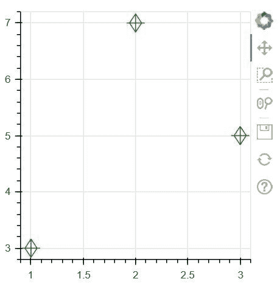
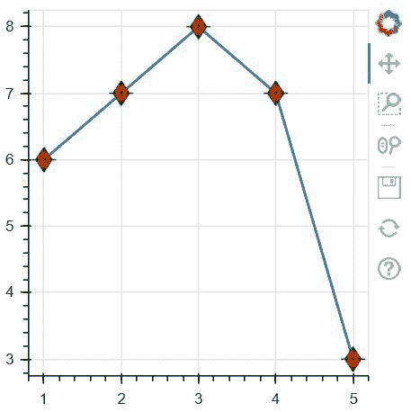

# Python 中的 bokeh . ploting . figure . diamond _ cross()函数

> 原文:[https://www . geesforgeks . org/bokeh-绘图-图形-钻石 _ 交叉-python 中的函数/](https://www.geeksforgeeks.org/bokeh-plotting-figure-diamond_cross-function-in-python/)

[**【Bokeh】**](https://www.geeksforgeeks.org/python-data-visualization-using-bokeh/#:~:text=Python%20%7C%20Data%20visualization%20using%20Bokeh, in%20Django%20and%20flask%20apps.)**是 Python 中的数据可视化库，提供高性能的交互式图表和绘图，输出可以通过笔记本、HTML 和服务器等多种媒介获得。**图形类**新建一个用于绘图的图形。它是绘图的一个子类，通过默认轴、网格、工具等简化绘图创建。**

## **bokeh . ploting . figure . diamond _ cross()函数**

**bokeh 库绘图模块中的 **diamond_cross()功能**用于配置 DiamondCross 字形并将其添加到本图中。**

> ****语法:** diamond_cross(x，y，size=4，angle=0.0，* angle _ units = ' rad '，fill_alpha=1.0，fill_color='gray '，line_alpha=1.0，line_cap='butt '，line_color='black '，line_dash=[]，line_dash_offset=0，line_join= '斜角'，line_width=1，name=None，tags=[]，**kwargs)**
> 
>  ****参数:**该方法接受以下描述的参数:
> 
> *   **x:** 该参数是标记中心的 x 坐标。
> *   **y:** 此参数是标记中心的 y 坐标。
> *   **尺寸:**该参数是以屏幕空间单位表示的标记尺寸(直径)值。
> *   **角度:**此参数是旋转标记的角度。
> *   **填充颜色:**该参数是标记的填充颜色值。
> *   **line_color:** 此参数是标记的线条颜色值，默认值为黑色。
> *   **划线:**此参数是标记的划线值，默认值为[]。
> *   **线连接:**该参数是斜角默认值标记的线连接值。
> *   **线宽:**该参数是默认值为 1 的标记的线宽值。
> *   **名称:**此参数是用户为此型号提供的名称。
> *   **标签:**此参数是用户为此模型提供的值。
> 
> **返回:**该方法返回 GlyphRenderer 值。**

**以下示例说明了 bokeh . ploting . figure . diamond _ cross()函数在 bokeh . ploting:
**示例 1:**** 

## **蟒蛇 3**

```py
# Implementation of bokeh function 

import numpy as np  
from bokeh.plotting import figure, output_file, show 

plot = figure(plot_width = 300, plot_height = 300) 
plot.diamond_cross(x = [1, 2, 3], y = [3, 7, 5],  
            size = 20, fill_color = None,
            line_color = "green", alpha = 0.9) 

show(plot) 
```

****输出:**** 

****

****例 2:**** 

## **蟒蛇 3**

```py
# Implementation of bokeh function 

import numpy as np  
from bokeh.plotting import figure, output_file, show 

x = [1, 2, 3, 4, 5] 
y = [6, 7, 8, 7, 3] 

output_file("geeksforgeeks.html") 

p = figure(plot_width = 300, plot_height = 300) 

p.line(x, y, line_width = 2) 
p.diamond_cross(x, y, fill_color ="red",  
         line_color ="green", size = 18) 

show(p) 
```

****输出:**** 

****