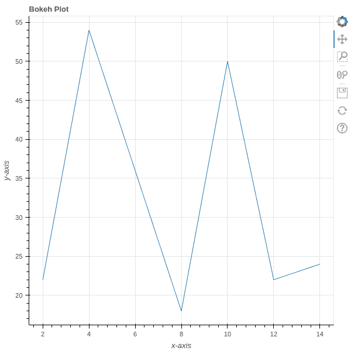

# 出口博克地块

> 原文:[https://www.geeksforgeeks.org/exporting-bokeh-plots/](https://www.geeksforgeeks.org/exporting-bokeh-plots/)

[Bokeh](https://www.geeksforgeeks.org/introduction-to-bokeh-in-python/) 是 Python 可用的交互式数据可视化库。使用 Bokeh，我们可以在任何 HTML 文件中嵌入我们的情节。它在内部使用超文本标记语言和 JavaScript 在网络浏览器中渲染图来表示。在幕后，它将数据源转换成一个 JSON 文件，该文件被用作 BokehJS(一个 JavaScript 库)的输入，并在现代浏览器中呈现可视化。在本文中，我们将了解如何将 Bokeh 图导出/保存到本地存储。

**我们需要以下依赖项来导出 bokeh 中的地块:**

*   硒
*   web 驱动程序

要使用 [conda](https://www.geeksforgeeks.org/how-to-setup-conda-environment-with-jupyter-notebook/) 安装这两个，请依次运行以下命令:

```
conda install selenium geckodriver -c conda-forge
conda install selenium python-chromedriver-binary -c conda-forge
```

**使用 pip:**

```
pip install selenium geckodriver firefox
```

## **方法一:使用 export_png()功能将地块保存为 PNG**

使用 export_png()函数，我们可以直接从 Python 代码中将我们的绘图导出为 png 图像。

> **语法:** export_png(obj，文件名，宽度，高度，webdriver)
> 
> **论据:**
> 
> *   **obj:** obj 可以是我们要出口的任何 **p** 批次。
> *   **文件名:I** t 为可选参数，默认绘图文件名为 python 文件名。
> *   **宽度:**为可选参数，用于设置导出的出图布局 obj 的宽度，默认情况下会被忽略。
> *   **高度**:可选参数，用于设置导出的出图布局 obj 的高度，默认忽略。
> *   **webdriver:** 这是一个可选参数，用于设置用于导出绘图的默认 webdriver 实例。默认情况下，如果我们没有指定任何内容，selenium web 驱动程序是可用的。

首先，准备要可视化的数据，然后调用 figure()函数创建一个带有默认属性(如标题和轴标签)的图。使用不同种类的渲染器创建不同种类的地块。例如，要渲染一个圆，我们可以使用 circle()函数代替 line()来渲染圆。使用 export_png(plot_obj，filename)函数保存绘图，然后使用 show()函数显示结果绘图。

## 蟒蛇 3

```
# importing necessary libraries
from bokeh.plotting import figure
from bokeh.plotting import output_file
from bokeh.plotting import show
from bokeh.io import export_png

# dummy data
x = [2, 4, 8, 10, 12, 14]
y = [22, 54, 18, 50, 22, 24]

# set output to static HTML file
output_file("line.html")

# Adding plot
fig = figure(
    title="Bokeh Plot",
    x_axis_label='x-axis',
    y_axis_label='y-axis',)

# add a line renderer to plot line
fig.line(x, y)

# saving the plot on disk
print('Exporting bokeh_plot.png.....')
export_png(fig, filename = "bokeh_plot.png")

# displaying plot
show(fig)
```

**输出:**

```
Exporting bokeh_plot.png....
```



导出为巴布亚新几内亚

## **方法二:使用 export_svg()功能将地块保存为 SVG**

使用 bokeh.io 中的 export_svg()函数，我们可以直接从 Python 代码中将我们的图导出为 svg 图像。

> **语法:** export_png(obj，文件名，宽度，高度，webdriver，超时)
> 
> **论据:**
> 
> *   **obj** : obj 可以是我们要导出的任何剧情。
> *   **文件名**:可选参数，默认绘图文件名为 python 文件名。
> *   **宽度**:可选参数，用于设置导出的出图布局 obj 的宽度，默认忽略。
> *   **高度**:可选参数，用于设置导出的出图布局 obj 的高度，默认忽略。
> *   **webdriver** :可选参数，用于设置导出图时使用的默认 webdriver 实例。默认情况下，如果我们没有指定任何内容，selenium web 驱动程序是可用的。
> *   **超时:**等待 Bokeh 初始化的最长时间(秒)。它的默认值是 5s。

首先，准备要可视化的数据，然后调用 figure()函数创建一个具有默认属性(如标题和轴标签)的图。使用不同种类的渲染器创建不同种类的地块，并使用 export_svg(plot_obj，filename)函数保存地块，然后使用 show()函数显示结果地块。

## 蟒蛇 3

```
# importing necessary libraries
from bokeh.plotting import figure
from bokeh.plotting import output_file
from bokeh.plotting import show
from bokeh.io import export_svgs

# dummy data
x = [1, 2, 3, 4, 5, 6, 7, 8, 9, 10]
y = [11, 12, 13, 14, 15, 16, 18, 17, 19, 20]

output_file("circle_bokeh.html")

# Adding plot
fig = figure(
    title="SVG Bokeh Plot",
    x_axis_label='x-axis',
    y_axis_label='y-axis',)

# add a circle renderer to plot
fig.circle(x, y, fill_color="green", size=20)

# saving the plot on disk
print('Exporting circle_bokeh.svg.....')
fig.output_backend = "svg"
export_svgs(fig, filename = "circle_bokeh.svg")

# displaying plot
show(fig)
```

**输出:**

```
Exporting circle_bokeh.svg.....
```


导出为 SVG

**注意:**导出的图将保存在展示 python 代码文件的文件夹中。