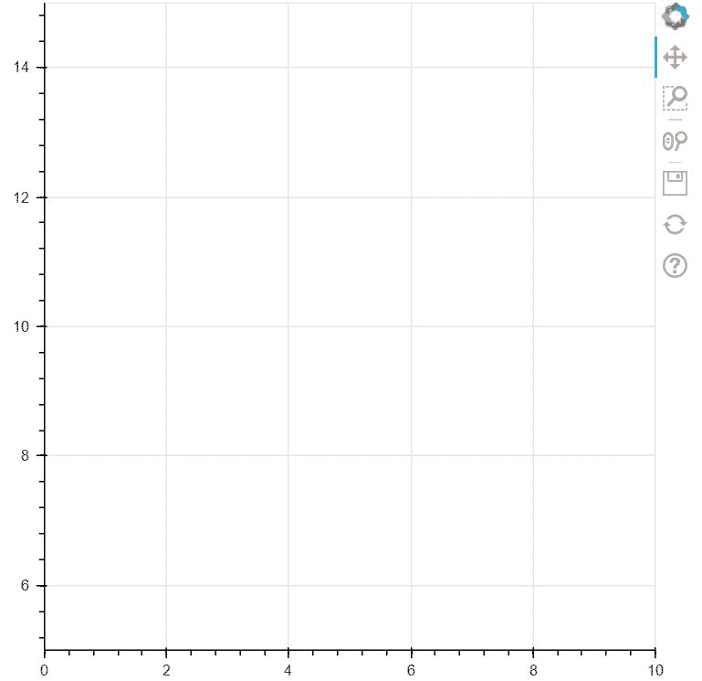
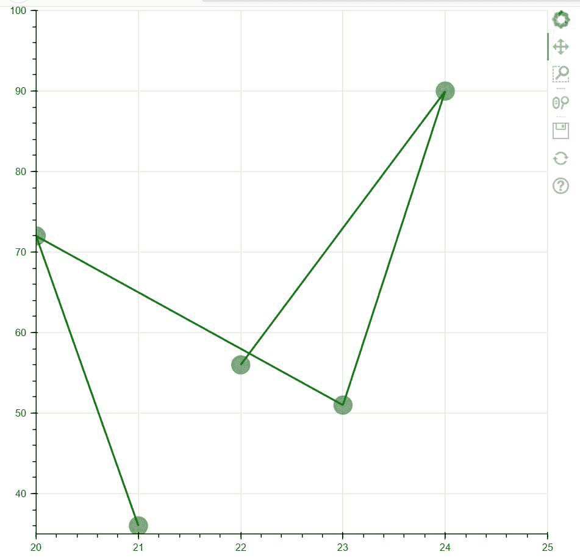

# 如何设置轴限 bokeh？

> 原文:[https://www.geeksforgeeks.org/how-to-set-axis-limits-bokeh/](https://www.geeksforgeeks.org/how-to-set-axis-limits-bokeh/)

在本文中，我们将学习如何在 **bokeh** 中为绘图设置轴限制。当我们绘制带有一组值的图形时，会自动创建点的 X 限制和 Y 限制。但是 bokeh 允许我们根据自己的选择设置这些轴限制。

因此，首先，我们需要知道，为了设置 X 轴和 Y 轴的轴限制，我们需要从我们的 **bokeh.models** 模块导入一个包，该模块被称为 **range1d** 。范围 1d 使我们能够为我们选择的图设置轴限制。

我们可以使用 google colab，也可以使用本地设备中的任何文本编辑器来完成上述实现。为了在本地设备上使用文本编辑器，我们需要首先打开命令提示符并编写以下代码。

```py
pip install bokeh
```

**安装完毕，现在准备进行主实现。**

在下面的代码中，我们正在根据我们的选择创建一个带有 X 轴和 Y 轴限制的空图。

**代码:**

## 蟒蛇 3

```py
# importing figure and show from
# bokeh.plotting
from bokeh.plotting import figure, show

# importing range1d from
# bokeh.models in order to change
# the X-Axis and Y-Axis ranges
from bokeh.models import Range1d

# Determining the plot height
# and plot width
fig = figure(plot_width=500, plot_height=500)

# With the help of x_range and
# y_range functions we are setting
# up the range of both the axis
fig.x_range = Range1d(0, 10)
fig.y_range = Range1d(5, 15)

# Thus an empty plot is created
# where the ranges of both the
# axes are custom set by us.
show(fig)
```

**输出:**



**说明:**

从代码中我们可以清楚地看到，我们设置了 0-10 的 X 轴限制和 5-15 的 Y 轴限制。事情已经在上面的图表中实现了。

**例 2:**

在第二个例子中，我们设置了自己的 X 轴和 Y 轴限制，然后我们在图中指向该范围内的一组点。下面的代码显示了上面的实现。

## 蟒蛇 3

```py
# importing figure and show from
# bokeh.plotting
from bokeh.plotting import figure, show

# importing range1d from
# bokeh.models in order to change
# the X-Axis and Y-Axis ranges
from bokeh.models import Range1d

# Determining the plot height
# and plot width
fig = figure(plot_width=620,
             plot_height=600)

# With the help of x_range and
# y_range functions we are setting
# up the range of both the axis
fig.x_range = Range1d(20, 25)
fig.y_range = Range1d(35, 100)

# Creating two graphs in a
# single figure where we are
# plotting the points in the range
# set by us
fig.line([21, 20, 23, 24, 22],
         [36, 72, 51, 90, 56],
         line_width=2, color="green")

fig.circle([21, 20, 23, 24, 22],
           [36, 72, 51, 90, 56],
           size=20, color="green",
           alpha=0.5)

# Showing the plot
show(fig)
```

**输出:**



**说明:**

由于这是我们定制的轴，图形的大小将完全取决于轴的限制。例如:如果两个轴的轴限制都较大，则上面绘制的图形将小于现在显示的图形。