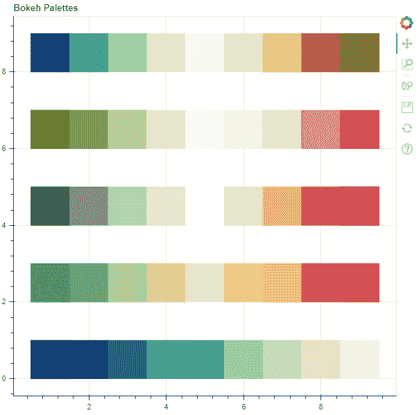
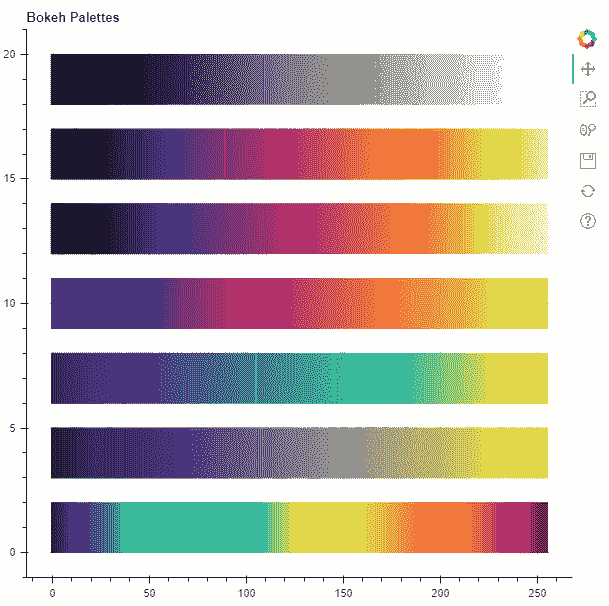

# 如何在 Python-Bokeh 中使用调色板？

> 原文:[https://www . geesforgeks . org/如何使用-python 中的调色板-bokeh/](https://www.geeksforgeeks.org/how-to-use-color-palettes-in-python-bokeh/)

Bokeh 是一个 Python 交互式数据可视化工具。它使用 HTML 和 JavaScript 来渲染它的图。它以现代网络浏览器为呈现目标，提供优雅、简洁的新颖图形结构和高性能交互性。Bokeh 在`bokeh.palettes`模块中为我们提供了多个调色板。让我们看看如何在 Bokeh 中使用这些调色板。

调色板是(十六进制)RGB 颜色字符串的简单 Python 列表。例如`blues8`调色板有颜色:`('#084594', '#2171b5', '#4292c6', '#6baed6', '#9ecae1', '#c6dbef', '#deebf7', '#f7fbff')`。

Bokeh 中有 5 种内置调色板:

1.  [Matplotlib 选项板](#matplotlib)
2.  [D3 调色板](#d3)
3.  布鲁尔托盘
4.  [缺色可用性调色板](#usability)
5.  大型托盘

## Matplotlib 选项板

Bokeh 为我们提供 [Matplotlib](https://matplotlib.org/examples/color/colormaps_reference.html) 调色板。Matplotlib 调色板有 5 种类型:

*   岩浆
*   地狱
*   血浆
*   翠绿色
*   公民炎

每种类型的调色板都有 10 种不同版本的调色板，颜色数量各不相同，分别为 3、4、5、6、7、8、9、10、11 和 256。

**示例:**我们将使用 [vbar()](https://www.geeksforgeeks.org/python-bokeh-plotting-vertical-bar-graphs/) 功能绘制多个竖线来演示 Matplotlib 调色板。

```py
# importing the modules 
from bokeh.plotting import figure, output_file, show 
from bokeh.palettes import Magma, Inferno, Plasma, Viridis, Cividis

# file to save the model 
output_file("gfg.html") 

# instantiating the figure object 
graph = figure(title = "Bokeh Palettes") 

# demonstrating the Magma palette
graph.vbar(x = [1, 2, 3, 4, 5, 6, 7, 8, 9, 10, 11], 
           top = [9] * 11,
           bottom = [8] * 11,
           width = 1,
           color = Magma[11])

# demonstrating the Inferno palette
graph.vbar(x = [1, 2, 3, 4, 5, 6, 7, 8, 9, 10, 11], 
           top = [7] * 11,
           bottom = [6] * 11,
           width = 1,
           color = Inferno[11])

# demonstrating the Plasma palette
graph.vbar(x = [1, 2, 3, 4, 5, 6, 7, 8, 9, 10, 11], 
           top = [5] * 11,
           bottom = [4] * 11,
           width = 1,
           color = Plasma[11])

# demonstrating the Viridis palette
graph.vbar(x = [1, 2, 3, 4, 5, 6, 7, 8, 9, 10, 11], 
           top = [3] * 11,
           bottom = [2] * 11,
           width = 1,
           color = Viridis[11])

# demonstrating the Cividis palette
graph.vbar(x = [1, 2, 3, 4, 5, 6, 7, 8, 9, 10, 11], 
           top = [1] * 11,
           width = 1,
           color = Cividis[11])

# displaying the model 
show(graph)
```

**输出:**


## D3 选项板

Bokeh 为我们提供 [D3](https://github.com/d3/d3-3.x-api-reference/blob/master/Ordinal-Scales.md#categorical-colors) 分类调色板。有 4 种 D3 调色板可供选择:

*   类别 10
*   类别 20
*   类别 y20b
*   类别 20c

**示例:**我们将使用 [vbar()](https://www.geeksforgeeks.org/python-bokeh-plotting-vertical-bar-graphs/) 功能绘制多个竖线来演示 D3 调色板。

```py
# importing the modules 
from bokeh.plotting import figure, output_file, show 
from bokeh.palettes import Category10, Category20, Category20b, Category20c

# file to save the model 
output_file("gfg.html") 

# instantiating the figure object 
graph = figure(title = "Bokeh Palettes") 

# demonstrating the Category10 palette
graph.vbar(x = [1, 2, 3, 4, 5, 6, 7, 8, 9, 10], 
           top = [9] * 10,
           bottom = [8] * 10,
           width = 1,
           color = Category10[10])

# demonstrating the Category20 palette
graph.vbar(x = [1, 2, 3, 4, 5, 6, 7, 8, 9, 10], 
           top = [7] * 10,
           bottom = [6] * 10,
           width = 1,
           color = Category20[10])

# demonstrating the Category20b palette
graph.vbar(x = [1, 2, 3, 4, 5, 6, 7, 8, 9, 10], 
           top = [5] * 10,
           bottom = [4] * 10,
           width = 1,
           color = Category20b[10])

# demonstrating the Category20c palette
graph.vbar(x = [1, 2, 3, 4, 5, 6, 7, 8, 9, 10], 
           top = [3] * 10,
           bottom = [2] * 10,
           width = 1,
           color = Category20c[10])

# displaying the model 
show(graph)
```

**输出:**


## 啤酒调色板

Bokeh 为我们提供 [ColorBrewer](https://colorbrewer2.org/) 调色板。有 35 种颜色布鲁尔调色板可供选择:

*   口音
*   布鲁斯音乐
*   BrBG
*   -今天
*   布布布布布布布布布布布布布布布布布布布布布布布布布布布布布布布布布布布布布布布
*   黑暗 2
*   GnBu(地名)
*   绿色
*   灰色衣服
*   OrRd
*   橙
*   PRGn(消歧义)
*   成对的
*   蜡笔 1
*   彩色粉笔 2
*   皮尤
*   酒馆
*   普云
*   要执行以下操作
*   PuRd
*   紫色
*   这是 RDB
*   RdGy
*   RdPu(消歧义)
*   RdYlBu
*   RdYlGn
*   红色
*   Set1
*   Set2
*   Set3
*   光谱的
*   YlGn
*   YlGnBu
*   YlOrBr
*   YlOrRd

**示例:**我们将使用 [vbar()](https://www.geeksforgeeks.org/python-bokeh-plotting-vertical-bar-graphs/) 功能绘制多个竖线来演示 ColorBrewer 调色板。

```py
# importing the modules 
from bokeh.plotting import figure, output_file, show 
from bokeh.palettes import BrBG, PiYG, RdGy, RdYlGn, YlGnBu

# file to save the model 
output_file("gfg.html") 

# instantiating the figure object 
graph = figure(title = "Bokeh Palettes") 

# demonstrating the BrBG palette
graph.vbar(x = [1, 2, 3, 4, 5, 6, 7, 8, 9], 
           top = [9] * 9,
           bottom = [8] * 9,
           width = 1,
           color = BrBG[9])

# demonstrating the PiYG palette
graph.vbar(x = [1, 2, 3, 4, 5, 6, 7, 8, 9], 
           top = [7] * 9,
           bottom = [6] * 9,
           width = 1,
           color = PiYG[9])

# demonstrating the RdGy palette
graph.vbar(x = [1, 2, 3, 4, 5, 6, 7, 8, 9], 
           top = [5] * 9,
           bottom = [4] * 9,
           width = 1,
           color = RdGy[9])

# demonstrating the RdYlGn palette
graph.vbar(x = [1, 2, 3, 4, 5, 6, 7, 8, 9], 
           top = [3] * 9,
           bottom = [2] * 9,
           width = 1,
           color = RdYlGn[9])

# demonstrating the YlGnBu palette
graph.vbar(x = [1, 2, 3, 4, 5, 6, 7, 8, 9], 
           top = [1] * 9,
           width = 1,
           color = YlGnBu[9])

# displaying the model 
show(graph) 
```

**输出:**


## 可用性调色板

Bokeh 为我们提供了一个调色板，对色弱或色盲的人很有用。

**示例:**我们将使用 [vbar()](https://www.geeksforgeeks.org/python-bokeh-plotting-vertical-bar-graphs/) 功能绘制多个竖线来演示可用性调色板。

```py
# importing the modules 
from bokeh.plotting import figure, output_file, show 
from bokeh.palettes import Colorblind

# file to save the model 
output_file("gfg.html") 

# instantiating the figure object 
graph = figure(title = "Bokeh Palettes") 

# demonstrating the Colorblind palette
graph.vbar(x = [1, 2, 3, 4, 5, 6, 7, 8], 
           top = [1] * 8,
           width = 1,
           color = Colorblind[8])

# displaying the model 
show(graph)
```

**输出:**


## 大型选项板

对于某些应用程序，上面讨论的调色板可能很小。Bokeh 为我们提供了大调色板，每个调色板有 256 种颜色。有 7 个大调色板:

*   灰色 256
*   地狱 256
*   Magma256
*   血浆 a256
*   Viridis256
*   civil dis 256
*   涡轮 256

**示例:**我们将使用 [vbar()](https://www.geeksforgeeks.org/python-bokeh-plotting-vertical-bar-graphs/) 功能绘制多个竖线来演示大型调色板。

```py
# importing the modules 
from bokeh.plotting import figure, output_file, show 
from bokeh.palettes import Greys256, Inferno256, Magma256, Plasma256
from bokeh.palettes import Viridis256, Cividis256, Turbo256

# file to save the model 
output_file("gfg.html") 

# instantiating the figure object 
graph = figure(title = "Bokeh Palettes") 

# demonstrating the Greys256 palette
graph.vbar(x = [i for i in range(256)], 
           top = [20] * 256,
           bottom = [18] * 256,
           width = 1,
           color = Greys256)

# demonstrating the Inferno256 palette
graph.vbar(x = [i for i in range(256)], 
           top = [17] * 256,
           bottom = [15] * 256,
           width = 1,
           color = Inferno256)

# demonstrating the Magma256 palette
graph.vbar(x = [i for i in range(256)], 
           top = [14] * 256,
           bottom = [12] * 256,
           width = 1,
           color = Magma256)

# demonstrating the Plasma256 palette
graph.vbar(x = [i for i in range(256)], 
           top = [11] * 256,
           bottom = [9] * 256,
           width = 1,
           color = Plasma256)

# demonstrating the Viridis256 palette
graph.vbar(x = [i for i in range(256)], 
           top = [8] * 256,
           bottom = [6] * 256,
           width = 1,
           color = Viridis256)

# demonstrating the Cividis256 palette
graph.vbar(x = [i for i in range(256)], 
           top = [5] * 256,
           bottom = [3] * 256,
           width = 1,
           color = Cividis256)

# demonstrating the Turbo256 palette
graph.vbar(x = [i for i in range(256)], 
           top = [2] * 256,
           bottom = [0] * 256,
           width = 1,
           color = Turbo256)

# displaying the model 
show(graph) 
```

**输出:**
