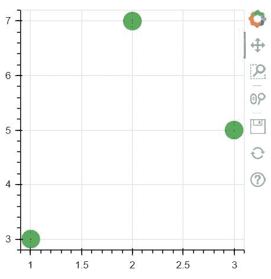

# 使用 Bokeh

在 Python 中制作圆字形

> 原文:[https://www . geesforgeks . org/make-an-circle-字形-in-python-using-bokeh/](https://www.geeksforgeeks.org/make-an-circle-glyphs-in-python-using-bokeh/)

**Bokeh** 是一款 [**Python**](https://www.geeksforgeeks.org/python-programming-language/) 交互数据可视化。与 [**Matplotlib**](https://www.geeksforgeeks.org/python-introduction-matplotlib/) 和 **Seaborn** 不同，Bokeh 使用 HTML 和 JavaScript 渲染其地块。它以现代网络浏览器为呈现目标，提供优雅、简洁的新颖图形结构和高性能交互性。

## 绘制圆形标志符号

不同的形状，如圆形、矩形、多边形等。可以，由图形对象绘制。Bokeh 图形类下面给出了绘制圆形字形的方法:

*   **圆圈()**
*   **圆 _ 十字()**
*   **circle_x()**

**1。circle()方法:** circle()方法是一种用于给图形添加圆形字形并需要其中心的 x 和 y 坐标的方法。

> **语法:**圆(x，y，* angle = 0.0，angle_units='rad '，fill_alpha=1.0，fill_color='gray '，line_alpha=1.0，line_cap='butt '，line_color='black '，line_dash=[]，line_dash_offset=0，line_join= '斜角'，line_width=1，name=None，radius=None，radius_dimension='x '，radius_units='data '，size=4，tags=[]，**kwargs
> 
> **参数:**该方法接受以下描述的参数:
> 
> *   **x:** 该参数是标记中心的 x 坐标。
> *   **y:** 此参数是标记中心的 y 坐标。
> *   **角度:**此参数是旋转标记的角度。
> *   **填充α**:该参数是标记的填充α值。
> *   **填充颜色**:该参数是标记的填充颜色值。
> *   **半径**:该参数是圆标记的半径值。
> *   **半径 _ 尺寸**:该参数是测量圆半径的尺寸。
> *   **尺寸**:该参数是屏幕空间单位中标记的尺寸(直径)值。

**示例:**

```
# Implementation of bokeh function 

import numpy as np  
from bokeh.plotting import figure, output_file, show 

plot = figure(plot_width = 300, plot_height = 300) 
plot.circle(x = [1, 2, 3], y = [3, 7, 5],  
            size = 20, color ="green", alpha = 0.6) 

show(plot) 
```

**输出:**


**2。circle_cross()方法:** circle_cross()方法是一种用于将带有“+”十字穿过中心的圆字形添加到图形中，并且需要其中心的 x 和 y 坐标。

> **语法:** circle_cross(x，y，size=4，angle=0.0，* angle _ units = ' rad '，fill_alpha=1.0，fill_color='gray '，line_alpha=1.0，line_cap='butt '，line_color='black '，line_dash=[]，line_dash_offset=0，line_join= '斜角'，line_width=1，name=None，tags=[]，**kwargs)
> 
> **参数:**该方法接受以下描述的参数:
> 
> *   **x:** 该参数是标记中心的 x 坐标。
> *   **y:** 此参数是标记中心的 y 坐标。
> *   **角度:**此参数是旋转标记的角度。
> *   **填充α**:该参数是标记的填充α值。
> *   **填充颜色**:该参数是标记的填充颜色值。
> *   **半径**:该参数是圆标记的半径值。
> *   **半径 _ 尺寸**:该参数是测量圆半径的尺寸。
> *   **尺寸**:该参数是屏幕空间单位中标记的尺寸(直径)值。

**示例:**

```
# Implementation of bokeh function 

import numpy as np  
from bokeh.plotting import figure, output_file, show 

plot = figure(plot_width = 300, plot_height = 300) 
plot.circle_cross(x = [1, 2, 3], y = [3, 7, 5], 
          size = 20, color ="green", alpha = 0.6) 

show(plot) 
```

**输出:**


**3。circle_x()方法:** circle_x()方法是一个用来添加一个带有一个穿过中心的‘X’十字的圆字形的方法。并需要其中心的 x 和 y 坐标。

> **语法:** circle_x(x，y，size=4，angle=0.0，* angle _ units = ' rad '，fill_alpha=1.0，fill_color='gray '，line_alpha=1.0，line_cap='butt '，line_color='black '，line_dash=[]，line_dash_offset=0，line_join= '斜角'，line_width=1，name=None，tags=[]，**kwargs)
> 
> **参数:**该方法接受以下描述的参数:
> 
> *   **x:** 该参数是标记中心的 x 坐标。
> *   **y:** 此参数是标记中心的 y 坐标。
> *   **角度:**此参数是旋转标记的角度。
> *   **填充α**:该参数是标记的填充α值。
> *   **填充颜色**:该参数是标记的填充颜色值。
> *   **半径**:该参数是圆标记的半径值。
> *   **半径 _ 尺寸**:该参数是测量圆半径的尺寸。
> *   **尺寸**:该参数是屏幕空间单位中标记的尺寸(直径)值。

**示例:**

```
# Implementation of bokeh function 

import numpy as np  
from bokeh.plotting import figure, output_file, show 

plot = figure(plot_width = 300, plot_height = 300) 
plot.circle_x(x = [1, 2, 3], y = [3, 7, 5], size = 20, 
         color ="green", alpha = 0.6) 

show(plot) 
```

**输出:**
