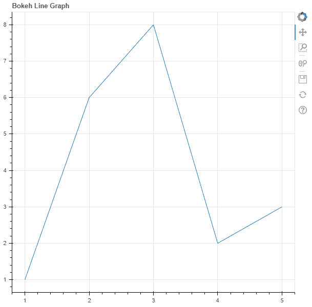
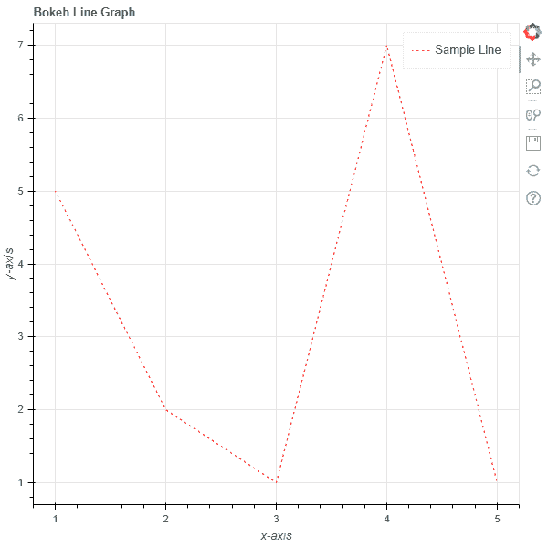
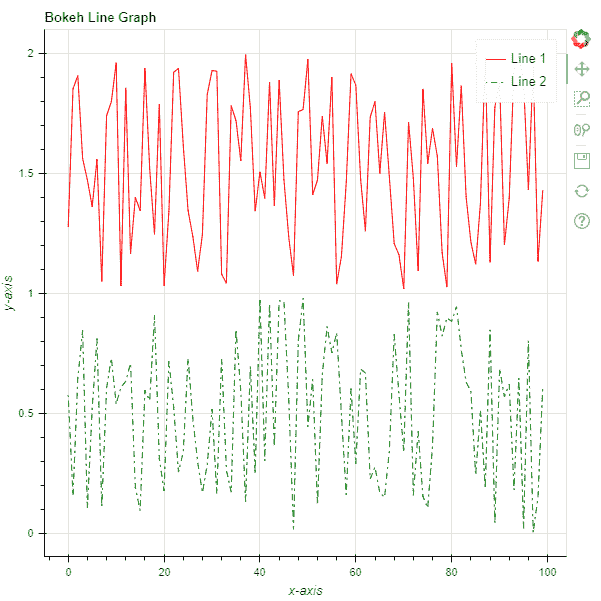

# Python Bokeh–绘制线图

> 原文:[https://www . geesforgeks . org/python-bokeh-绘图-折线图/](https://www.geeksforgeeks.org/python-bokeh-plotting-a-line-graph/)

Bokeh 是一个 Python 交互式数据可视化工具。它使用 HTML 和 JavaScript 来渲染它的图。它以现代网络浏览器为呈现目标，提供优雅、简洁的新颖图形结构和高性能交互性。

Bokeh 可用于**绘制线图**。可以使用`plotting`模块的`line()`方法绘制线图。

## 标绘.图.线()

> **语法:**行(参数)
> 
> **参数:**
> 
> *   **x :** 待绘制点的 x 坐标
> *   **y :** 待标绘点的 y 坐标
> *   **line _ alpha:**line alpha 的百分比值，默认为 1
> *   **线帽:**线的线帽值，默认为对接
> *   **线条 _ 颜色:**线条的颜色，默认为黑色
> *   **line_dash :** value of line dash such as :
>     *   固体
>     *   虚线
>     *   有点的
>     *   dotdash！dotdash！dotdash
>     *   达什特
>     
>     默认为实心
>     
>     
> *   **线划偏移量:**线划偏移量的值，默认为 0
> *   **线连接:**线连接的值，默认为斜角
> *   **线宽:**线宽值，默认为 1
> *   **名称:**用户提供的型号名称
> *   **标签:**用户为此模型提供的值
> 
> **其他参数:**
> 
> *   **alpha :** 一次性设置所有 alpha 关键字参数
> *   **颜色:**一次性设置所有颜色关键字参数
> *   **legend_field :** 数据源中应使用的列的名称
> *   **legend_group :** 数据源中应使用的列的名称
> *   **图例 _ 标签:**标记图例条目
> *   **静音:**确定字形是否应该渲染为静音，默认为假
> *   **名称:**附加到渲染器的可选用户提供的名称
> *   **来源:**用户提供的数据源
> *   **视图:**用于过滤数据源的视图
> *   **可见:**决定是否渲染字形，默认为真
> *   **x_range_name :** 用于映射 x 坐标的额外范围的名称
> *   **y_range_name :** 用于映射 y 坐标的额外范围的名称
> *   **等级:**指定此字形的渲染等级顺序
> 
> **返回:**类的一个对象`GlyphRenderer`

**示例 1 :** 在本例中，我们将使用默认值绘制图表。

```
# importing the modules
from bokeh.plotting import figure, output_file, show

# file to save the model
output_file("gfg.html")

# instantiating the figure object
graph = figure(title = "Bokeh Line Graph")

# the points to be plotted
x = [1, 2, 3, 4, 5]
y = [1, 6, 8, 2, 3]

# plotting the line graph
graph.line(x, y)

# displaying the model
show(graph)
```

**输出:**


**示例 2 :** 在本例中，我们将绘制一个线图，虚线与其他参数并列。

```
# importing the modules
from bokeh.plotting import figure, output_file, show

# file to save the model
output_file("gfg.html")

# instantiating the figure object
graph = figure(title = "Bokeh Line Graph")

# name of the x-axis
graph.xaxis.axis_label = "x-axis"

# name of the y-axis
graph.yaxis.axis_label = "y-axis"

# the points to be plotted
x = [1, 2, 3, 4, 5]
y = [5, 2, 1, 7, 1]

# color of the line
line_color = "red"

# type of line
line_dash = "dotted"

# offset of line dash
line_dash_offset = 1

# name of the legend
legend_label = "Sample Line"

# plotting the line graph for AAPL
graph.line(x, y,
           line_color = line_color,
           line_dash = line_dash,
           line_dash_offset = line_dash_offset,
           legend_label = legend_label)

# displaying the model
show(graph)
```

**输出:**


**例 3 :** 现在我们来看看如何在同一个图中绘制多条线。我们将使用`random()`函数生成点。

```
# importing the modules
from bokeh.plotting import figure, output_file, show
import random

# file to save the model
output_file("gfg.html")

# instantiating the figure object
graph = figure(title = "Bokeh Line Graph")

# name of the x-axis
graph.xaxis.axis_label = "x-axis"

# name of the y-axis
graph.yaxis.axis_label = "y-axis"

# plotting line 1
# generating the points to be plotted
x = []
y = []
for i in range(100):
    x.append(i)
for i in range(100):
    y.append(1 + random.random())

# parameters of line 1
line_color = "red"
line_dash = "solid"
legend_label = "Line 1"

# plotting the line
graph.line(x, y,
           line_color = line_color,
           line_dash = line_dash,
           legend_label = legend_label)

# plotting line 2
# generating the points to be plotted
x = []
y = []
for i in range(100):
    x.append(i)
for i in range(100):
    y.append(random.random())

# parameters of line 2
line_color = "green"
line_dash = "dotdash"
line_dash_offset = 1
legend_label = "Line 2"

# plotting the line
graph.line(x, y,
           line_color = line_color,
           line_dash = line_dash,
           line_dash_offset = line_dash_offset,
           legend_label = legend_label)

# displaying the model
show(graph)
```

**输出:**
