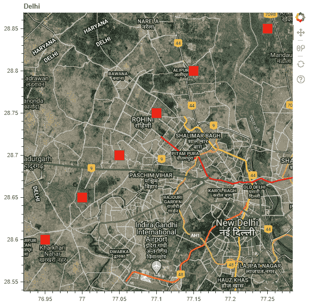

# Python Bokeh–在谷歌地图上绘制字形

> 原文:[https://www . geesforgeks . org/python-bokeh-绘图-字形-a-google-map/](https://www.geeksforgeeks.org/python-bokeh-plotting-glyphs-over-a-google-map/)

Bokeh 是一个 Python 交互式数据可视化工具。它使用 HTML 和 JavaScript 来渲染它的图。它以现代网络浏览器为呈现目标，提供优雅、简洁的新颖图形结构和高性能交互性。

Bokeh 可以用来在谷歌地图上绘制字形。字形是一种象形文字或符号。要在 Bokeh 中使用谷歌地图，我们将使用`plotting`类的`gmap()`功能。

## gmap()

> **语法:** gmap(参数)
> **参数:**
> 
> *   **Google _ API _ key:**Google API 的键
> *   **map_options :** GMapOptions，即谷歌地图特有的配置
> *   **激活 _ 拖动:**初始激活的拖动工具
> *   **激活 _ 检查:**检查初始激活的工具
> *   **激活 _ 滚动:**初始激活的滚动工具
> *   **激活 _ 轻敲:**初始激活的轻敲工具
> *   **标题:**谷歌地图的标题
> *   **工具:**绘图应该从哪些工具开始
> *   **x 轴标签:**x 轴的标签
> *   **x 轴位置:**x 轴的位置
> *   **x_minor_ticks :** 相邻 x 轴主刻度之间的次刻度数
> *   **y 轴标签:**y 轴的标签
> *   **y 轴位置:**y 轴的位置
> *   **y_minor_ticks :** 相邻 y 轴主刻度之间的次刻度数
> 
> **返回:【GMap 类的一个对象**

现在让我们看看如何使用`GMapOptions()`功能配置谷歌地图:

## GMapOptions()

> **语法:** GMapOptions(参数)
> **参数:**
> 
> *   **lat :** 谷歌地图的中心纬度
> *   **lng :** 谷歌地图的中心经度
> *   **地图类型:**用于地块的地图类型，以下是可用的地图类型:
>     *   混合物
>     *   路标
>     *   卫星
>     *   地带
> *   **名称:**谷歌地图的名称
> *   **比例尺控制:**谷歌地图是否应该显示其距离比例尺控制
> *   **样式:**用于地块的地图样式
> *   **订阅的事件:**Python 回调订阅的事件列表
> *   **标签:**与谷歌地图模型相关联的标签
> *   **倾斜:**倾斜地图的角度
> *   **缩放:**谷歌地图的初始缩放级别
> *   **apply_theme :** 模型的主题
> 
> **返回:**GmaPops 类的一个对象

## 让我们看看如何在谷歌地图上绘制字形:

1.  导入所需的库和模块:
    *   bokeh .标绘的 gmap
    *   bokeh.models 中的 ColumnDataSource 和 GMapOptions
    *   从 bokeh.io 输出文件和显示
2.  使用`output_file()`创建一个文件来存储我们的模型。
3.  使用`GMapOptions()`配置谷歌地图。
4.  使用`gmap()`生成一个谷歌地图对象。
5.  使用`ColumnDataSource()`确定字形的坐标。
6.  在创建的谷歌地图对象上生成字形。
7.  使用`show()`显示谷歌地图。

```
# importing the required modules
from bokeh.plotting import gmap
from bokeh.models import ColumnDataSource, GMapOptions
from bokeh.io import output_file, show

# file to save the model
output_file("gfg.html")

# configuring the Google map
lat = 28.7041
lng = 77.1025
map_type = "hybrid"
zoom = 11
google_map_options = GMapOptions(lat = lat,
                                 lng = lng,
                                 map_type = map_type,
                                 zoom = zoom)

# generating the Google map
google_api_key = ""
title = "Delhi"
google_map = gmap(google_api_key,
                  google_map_options,
                  title = title)

# the coordinates of the glyphs
source = ColumnDataSource(
    data = dict(lat = [28.6, 28.65, 28.7, 28.75, 28.8, 28.85],
                lon = [76.95, 77, 77.05, 77.1, 77.15, 77.25]))

# generating the glyphs on the Google map
x = "lon"
y = "lat"
size = 20
fill_color = "red"
fill_alpha = 1
google_map.square(x = x,
                  y = y,
                  size = size,
                  fill_color = fill_color,
                  fill_alpha = fill_alpha,
                  source = source)

# displaying the model
show(google_map)
```

**输出:**
