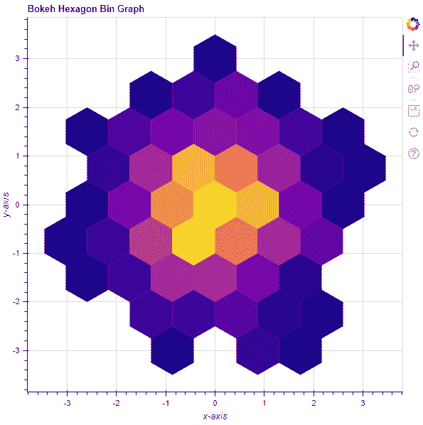

# Python Bokeh–在图形上绘制六边形箱

> 原文:[https://www . geeksforgeeks . org/python-bokeh-标绘-hexagon-bins-on-a-graph/](https://www.geeksforgeeks.org/python-bokeh-plotting-hexagon-bins-on-a-graph/)

Bokeh 是一个 Python 交互式数据可视化工具。它使用 HTML 和 JavaScript 来渲染它的图。它以现代网络浏览器为呈现目标，提供优雅、简洁的新颖图形结构和高性能交互性。

Bokeh 可用于在图形上绘制六边形图块。可以使用`plotting`模块的`hexbin()`方法在图形上绘制六边形图块。

## 标绘. figure.hexbin()

> **语法:** hexbin(参数)
> 
> **参数:**
> 
> *   **x :** 六边形图块箱的 x 坐标的 NumPy 数组
> *   **y :** 六边形图块箱的 y 坐标的 NumPy 数组
> *   **尺寸:**六边形瓷砖箱的半径，默认为 1
> *   **调色板:**方向值，默认为 Viridis256
> *   **方向:**调色板颜色映射面元，默认为点
> *   **线条 _ 颜色:**线条的颜色，默认为黑色
> *   **fill_color :** 六边形图块库标记的填充颜色值
> *   **长宽比:**长宽比缩放值
> 
> 任何额外的关键字参数都被传递给`hex_tile()`。
> 
> **返回:**类的对象`GlyphRenderer`和`DataFrame`

**示例 1 :** 在本例中，我们将使用默认值绘制图表。

```py
# importing the modules 
from bokeh.plotting import figure, output_file, show 
import numpy as np

# file to save the model 
output_file("gfg.html") 

# instantiating the figure object 
graph = figure(title = "Bokeh Hexagon Bin Graph") 

# the points to be plotted 
x = np.array([1, 2, 3, 4, 5, 6, 7, 8, 9])
y = np.array([1, 2, 3, 4, 5, 6, 7, 8, 9])

# plotting the graph 
graph.hexbin(x, y, size = 1) 

# displaying the model 
show(graph) 
```

**输出:**


**示例 2 :** 在此示例中，我们将绘制具有不同参数的六边形面元

```py
# importing the modules 
from bokeh.plotting import figure, output_file, show 
import numpy as np

# file to save the model 
output_file("gfg.html") 

# instantiating the figure object 
graph = figure(title = "Bokeh Hexagon Bin Graph") 

# name of the x-axis 
graph.xaxis.axis_label = "x-axis"

# name of the y-axis 
graph.yaxis.axis_label = "y-axis"

# the points to be plotted 
x = np.random.standard_normal(500)
y = np.random.standard_normal(500)

# size of the bins
size = 0.5

# color palette of the graph
palette = "Plasma256"

# plotting the graph 
graph.hexbin(x, y,
             size = 0.5,
             palette = palette) 

# displaying the model 
show(graph)  
```

**输出:**
