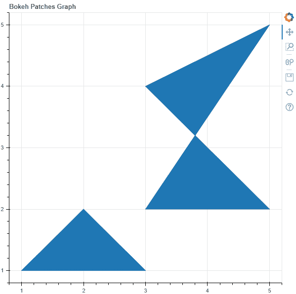
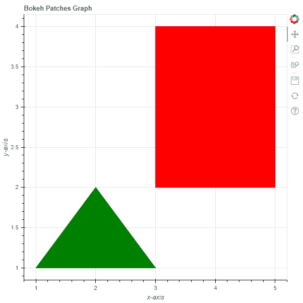

# Python Bokeh–在图形上绘制多个面片

> 原文:[https://www . geesforgeks . org/python-bokeh-标绘-多图补片/](https://www.geeksforgeeks.org/python-bokeh-plotting-multiple-patches-on-a-graph/)

Bokeh 是一个 Python 交互式数据可视化工具。它使用 HTML 和 JavaScript 来渲染它的图。它以现代网络浏览器为呈现目标，提供优雅、简洁的新颖图形结构和高性能交互性。

Bokeh 可用于在图形上绘制多个面片。可以使用`plotting`模块的`patches()`方法在图形上绘制多个面片。

## 绘图.图.补丁()

> **语法:**补丁(参数)
> 
> **参数:**
> 
> *   **xs :** 面片的 x 坐标
> *   **ys :** 斑块的 y 坐标
> 
> **返回:**类的一个对象`GlyphRenderer`

**示例 1 :** 在本例中，我们将使用默认值绘制图表。

```
# importing the modules 
from bokeh.plotting import figure, output_file, show 

# file to save the model 
output_file("gfg.html") 

# instantiating the figure object 
graph = figure(title = "Bokeh Patches Graph") 

# the points to be plotted
xs = [[1, 2, 3], [3, 5, 3, 5]]
ys = [[1, 2, 1], [2, 2, 4, 5]]

# plotting the graph 
graph.patches(xs, ys) 

# displaying the model 
show(graph)
```

**输出:**


**示例 2 :** 在此示例中，我们将使用各种其他参数绘制面片

```
# importing the modules 
from bokeh.plotting import figure, output_file, show 

# file to save the model 
output_file("gfg.html") 

# instantiating the figure object 
graph = figure(title = "Bokeh Patches Graph") 

# name of the x-axis 
graph.xaxis.axis_label = "x-axis"

# name of the y-axis 
graph.yaxis.axis_label = "y-axis"

# points to be plotted
xs = [[1, 2, 3], [3, 5, 5, 3]]
ys = [[1, 2, 1], [4, 4, 2, 2]]

# color value of the patches
color = ["green", "red"]

# fill alpha value of the patches
fill_alpha = 1

# plotting the graph 
graph.patches(xs, ys,
              color = color,
              fill_alpha = fill_alpha) 

# displaying the model 
show(graph)
```

**输出:**
