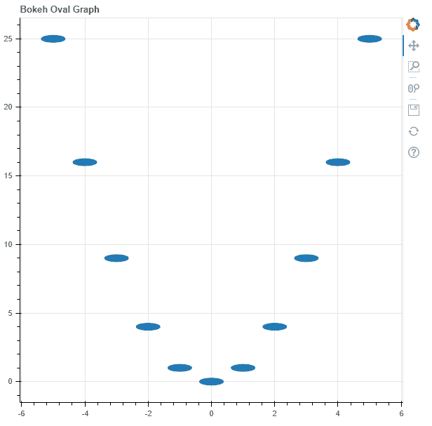

# Python Bokeh–在图形上绘制椭圆

> 原文:[https://www . geesforgeks . org/python-bokeh-ploting-ovals-on-a-graph/](https://www.geeksforgeeks.org/python-bokeh-plotting-ovals-on-a-graph/)

Bokeh 是一个 Python 交互式数据可视化工具。它使用 HTML 和 JavaScript 来渲染它的图。它以现代网络浏览器为呈现目标，提供优雅、简洁的新颖图形结构和高性能交互性。

Bokeh 可用于在图形上绘制椭圆。可以使用`plotting`模块的`oval()`方法在图形上绘制椭圆。

## 绘图.图形.椭圆形()

> **语法:**椭圆形(参数)
> 
> **参数:**
> 
> *   **x :** 椭圆形标记中心的 x 坐标
> *   **y :** 椭圆形标记中心的 y 坐标
> *   **宽度:**椭圆形标记的宽度
> *   **高度:**椭圆形标记的高度
> *   **宽度单位:**椭圆形标记的宽度单位
> *   **高度单位:**椭圆形标记的高度单位
> *   **角度:**椭圆形标记的旋转角度，默认为 0
> *   **角度 _ 单位:**角度的单位，默认为弧度
> *   **填充α:**椭圆形标记的填充α值
> *   **填充颜色:**椭圆形标记的填充颜色值
> *   **line _ alpha:**line alpha 的百分比值，默认为 1
> *   **线帽:**线的线帽值，默认为对接
> *   **线条 _ 颜色:**线条的颜色，默认为黑色
> *   **线划:**线划的值，如:实线、虚线、虚线、点划线、点划线[默认为实线]
> *   **线划偏移量:**线划偏移量的值，默认为 0
> *   **线连接:**线连接的值，默认为斜角
> *   **线宽:**线宽值，默认为 1
> *   **名称:**用户提供的型号名称
> *   **标签:**用户为模型提供的值
> 
> **其他参数:**
> 
> *   **alpha :** 一次性设置所有 alpha 关键字参数
> *   **颜色:**一次性设置所有颜色关键字参数
> *   **legend_field :** 数据源中应使用的列的名称
> *   **legend_group :** 数据源中应使用的列的名称
> *   **图例 _ 标签:**标记图例条目
> *   **静音:**确定字形是否应该渲染为静音，默认为假
> *   **名称:**附加到渲染器的可选用户提供的名称
> *   **来源:**用户提供的数据源
> *   **视图:**用于过滤数据源的视图
> *   **可见:**决定是否渲染字形，默认为真
> *   **x_range_name :** 用于映射 x 坐标的额外范围的名称
> *   **y_range_name :** 用于映射 y 坐标的额外范围的名称
> *   **等级:**指定此字形的渲染等级顺序
> 
> **返回:**类的一个对象`GlyphRenderer`

**示例 1 :** 在本例中，我们将使用默认值绘制图表。

```
# importing the modules
from bokeh.plotting import figure, output_file, show

# file to save the model
output_file("gfg.html")

# instantiating the figure object
graph = figure(title = "Bokeh Oval Graph")

# the points to be plotted
x = [-5, -4, -3, -2, -1, 0, 1, 2, 3, 4, 5]
y = [i ** 2 for i in x]

# plotting the graph
graph.oval(x, y,
           height = 0.5,
           width = 1)

# displaying the model
show(graph)
```

**输出:**


**示例 2 :** 在本例中，我们将在其他参数旁边用虚线绘制椭圆，六边形的大小与其值成比例。

```
# importing the modules
from bokeh.plotting import figure, output_file, show

# file to save the model
output_file("gfg.html")

# instantiating the figure object
graph = figure(title = "Bokeh Oval Graph")

# name of the x-axis
graph.xaxis.axis_label = "x-axis"

# name of the y-axis
graph.yaxis.axis_label = "y-axis"

# the points to be plotted
x = [-5, -4, -3, -2, -1, 0, 1, 2, 3, 4, 5]
y = [i ** 2 for i in x]

# width of the ovals
height = [i * 2 for i in y]

# angle of the ovals
width = [i * 2.5 for i in y]

# angle of the ovals
angle = 10

# fill color value
fill_color = None

# color of the line
line_color = "red"

# type of line
line_dash = "dotted"

# offset of line dash
line_dash_offset = 1

# width of the dashes
line_width = 10

# name of the legend
legend_label = "Sample Ovals"

# plotting the graph
graph.oval(x, y,
          height = height,
          width = width,
          angle = angle,
          fill_color = fill_color,
          line_color = line_color,
          line_dash = line_dash,
          line_dash_offset = line_dash_offset,
          line_width = line_width,
          legend_label = legend_label)

# displaying the model
show(graph)
```

**输出:**
