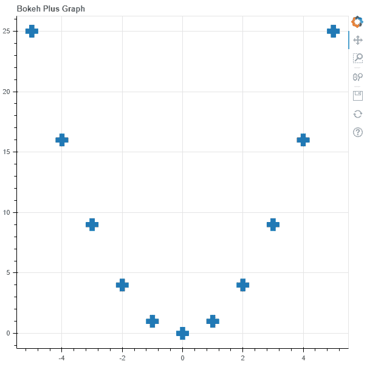
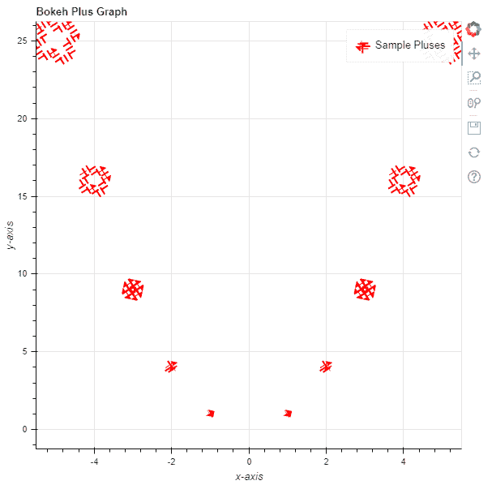

# Python Bokeh–在图形上绘制脉冲

> 原文:[https://www . geesforgeks . org/python-bokeh-ploting-plus-on-a-graph/](https://www.geeksforgeeks.org/python-bokeh-plotting-pluses-on-a-graph/)

Bokeh 是一个 Python 交互式数据可视化工具。它使用 HTML 和 JavaScript 来渲染它的图。它以现代网络浏览器为呈现目标，提供优雅、简洁的新颖图形结构和高性能交互性。

Bokeh 可用于在图表上绘制加号。可以使用`plotting`模块的`plus()`方法在图形上绘制 pluses。

## 绘图. figure.plus()

> **语法:**加(参数)
> 
> **参数:**
> 
> *   **x :** 正标记中心的 x 轴坐标
> *   **y :** 加号标记的 y 轴坐标
> 
> **返回:**类的一个对象`GlyphRenderer`

**示例 1 :** 在本例中，我们将使用默认值绘制图表。

```
# importing the modules
from bokeh.plotting import figure, output_file, show

# file to save the model
output_file("gfg.html")

# instantiating the figure object
graph = figure(title = "Bokeh Plus Graph")

# the points to be plotted
x = [-5, -4, -3, -2, -1, 0, 1, 2, 3, 4, 5]
y = [i ** 2 for i in x]

# plotting the graph
graph.plus(x, y, size = 20)

# displaying the model
show(graph)
```

**输出:**


**示例 2 :** 在本例中，我们将在其他参数旁边用虚线绘制加号，六边形的大小与其值成比例。

```
# importing the modules
from bokeh.plotting import figure, output_file, show

# file to save the model
output_file("gfg.html")

# instantiating the figure object
graph = figure(title = "Bokeh Plus Graph")

# name of the x-axis
graph.xaxis.axis_label = "x-axis"

# name of the y-axis
graph.yaxis.axis_label = "y-axis"

# the points to be plotted
x = [-5, -4, -3, -2, -1, 0, 1, 2, 3, 4, 5]
y = [i ** 2 for i in x]

# size of the hexagons
size = [i * 2 for i in y]

# angle of the hexagons
angle = 10

# fill color value
fill_color = None

# color of the line
line_color = "red"

# type of line
line_dash = "dotted"

# offset of line dash
line_dash_offset = 1

# width of the dashes
line_width = 10

# name of the legend
legend_label = "Sample Pluses"

# plotting the graph
graph.plus(x, y,
           size = size,
           angle = angle,
           fill_color = fill_color,
           line_color = line_color,
           line_dash = line_dash,
           line_dash_offset = line_dash_offset,
           line_width = line_width,
           legend_label = legend_label)

# displaying the model
show(graph)
```

**输出:**
