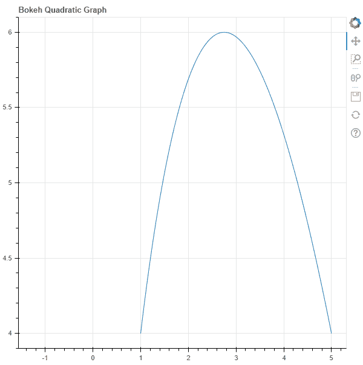
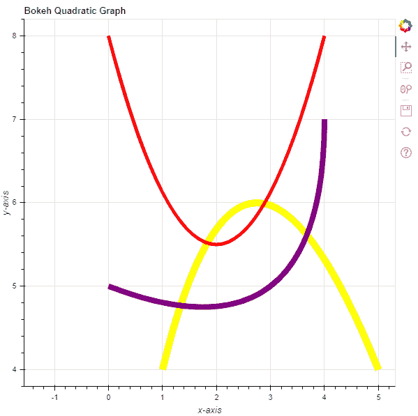

# Python Bokeh–在图形上绘制二次曲线

> 原文:[https://www . geeksforgeeks . org/python-bokeh-绘图-二次曲线在图形上/](https://www.geeksforgeeks.org/python-bokeh-plotting-quadratic-curves-on-a-graph/)

Bokeh 是一个 Python 交互式数据可视化工具。它使用 HTML 和 JavaScript 来渲染它的图。它以现代网络浏览器为呈现目标，提供优雅、简洁的新颖图形结构和高性能交互性。

Bokeh 可用于在图上绘制二次曲线。可以使用`plotting`模块的`quadratic()`方法在图形上绘制二次曲线。

## 绘图.图形.二次()

> **语法:**二次(参数)
> 
> **参数:**
> 
> *   **x0 :** 二次曲线起点的 x 坐标
> *   **y0 :** 二次曲线起点的 y 坐标
> *   **x1 :** 二次曲线端点的 x 坐标
> *   **y1 :** 二次曲线终点的 y 坐标
> *   **cx :** 二次曲线控制点的 x 坐标
> *   **cy :** 二次曲线控制点的 y 坐标
> 
> **返回:**类的一个对象`GlyphRenderer`

**示例 1 :** 在本例中，我们将使用默认值绘制图表。

```py
# importing the modules
from bokeh.plotting import figure, output_file, show

# file to save the model
output_file("gfg.html")

# instantiating the figure object
graph = figure(title = "Bokeh Quadratic Graph")

# the points to be plotted
x0 = 1
y0 = 4
x1 = 5
y1 = 4
cx = 2.5
cy = 8

# plotting the graph
graph.quadratic(x0, y0,
                x1, y1,
                cx, cy)

# displaying the model
show(graph)
```

**输出:**


**示例 2 :** 在本例中，我们将绘制多个带有各种其他参数的二次曲线。

```py
# importing the modules 
from bokeh.plotting import figure, output_file, show 

# file to save the model 
output_file("gfg.html") 

# instantiating the figure object 
graph = figure(title = "Bokeh Quadratic Graph") 

# name of the x-axis 
graph.xaxis.axis_label = "x-axis"

# name of the y-axis 
graph.yaxis.axis_label = "y-axis"

# points to be plotted
x0 = [1, 0, 0]
y0 = [4, 8, 5]
x1 = [5, 4, 4]
y1 = [4, 8, 7]
cx = [2.5, 2, 4]
cy = [8, 3, 4]

# line color value of the quadratic
line_color = ["yellow", "red", "purple"]

# line width value of the quadratic
line_width = [10, 5, 8]

# plotting the graph 
graph.quadratic(x0, y0,
                x1, y1,
                cx, cy,
                line_color = line_color,
                line_width = line_width) 

# displaying the model 
show(graph)
```

**输出:**
