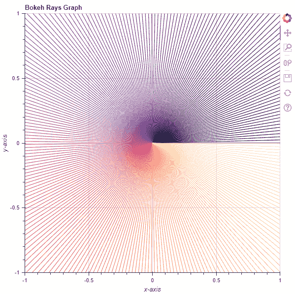

# Python Bokeh–在图形上绘制光线

> 原文:[https://www . geesforgeks . org/python-bokeh-绘图-图形上的光线/](https://www.geeksforgeeks.org/python-bokeh-plotting-rays-on-a-graph/)

Bokeh 是一个 Python 交互式数据可视化工具。它使用 HTML 和 JavaScript 来渲染它的图。它以现代网络浏览器为呈现目标，提供优雅、简洁的新颖图形结构和高性能交互性。

Bokeh 可用于在图形上绘制光线。可以使用`plotting`模块的`ray()`方法在图形上绘制光线。

## 标绘. figure.ray()

> **语法:**光线(参数)
> 
> **参数:**
> 
> *   **x :** 射线起点的 x 坐标
> *   **y :** 光线起点的 y 坐标
> *   **长度:**射线的长度
> *   **长度单位:**射线长度的单位
> 
> **返回:**类的一个对象`GlyphRenderer`

**示例 1 :** 在本例中，我们将使用默认值绘制图表。

```py
# importing the modules
from bokeh.plotting import figure, output_file, show

# file to save the model
output_file("gfg.html")

# instantiating the figure object
graph = figure(title = "Bokeh Rays Graph")

# the points to be plotted
x = 0
y = 0

# plotting the graph
graph.ray(x, y)

# displaying the model
show(graph)
```

**输出:**


**示例 2 :** 在本例中，我们将使用各种其他参数绘制多条射线。

```py
# importing the modules
from bokeh.plotting import figure, output_file, show
from bokeh.palettes import magma
import numpy

# file to save the model
output_file("gfg.html")

# instantiating the figure object
graph = figure(title = "Bokeh Rays Graph")

# name of the x-axis 
graph.xaxis.axis_label = "x-axis"

# name of the y-axis 
graph.yaxis.axis_label = "y-axis"

# the points to be plotted
x = [0] * 256
y = [0] * 256

# angles of the rays
angle = numpy.linspace(0.00, 6.28, num = 256).tolist()

# color of the rays
color = magma(256)

# plotting the graph
graph.ray(x, y,
          angle = angle,
          color = color)

# displaying the model
show(graph)
```

**输出:**
