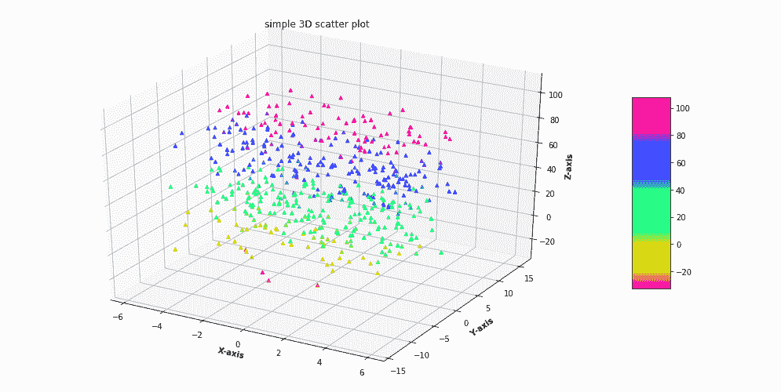

# 使用 Matplotlib 在 Python 中绘制三维散点图

> 原文:[https://www . geeksforgeeks . org/3d-python 中的散点图-使用-matplotlib/](https://www.geeksforgeeks.org/3d-scatter-plotting-in-python-using-matplotlib/)

A **三维散点图**是一种数学图，是三维绘图的最基本版本，用于使用笛卡尔坐标将数据的属性显示为数据集的三个变量。为了创建三维散点图，Matplotlib 的 **mplot3d 工具包**用于启用三维绘图。一般来说，三维散点图是通过使用 ax .散点图库的函数创建的，该函数接受 X、Y 和 Z 数据集来创建散点图，而该函数的其余属性与二维散点图的属性相同。
**示例 1:** 让我们使用 ax .散点图 3D()函数创建一个基本的三维散点图。

## 蟒蛇 3

```py
# Import libraries
from mpl_toolkits import mplot3d
import numpy as np
import matplotlib.pyplot as plt

# Creating dataset
z = np.random.randint(100, size =(50))
x = np.random.randint(80, size =(50))
y = np.random.randint(60, size =(50))

# Creating figure
fig = plt.figure(figsize = (10, 7))
ax = plt.axes(projection ="3d")

# Creating plot
ax.scatter3D(x, y, z, color = "green")
plt.title("simple 3D scatter plot")

# show plot
plt.show()
```

**输出:**


**例 2 :** 为了更好的理解，我们再举一个例子。

## 蟒蛇 3

```py
# Import libraries
from mpl_toolkits import mplot3d
import numpy as np
import matplotlib.pyplot as plt

# Creating dataset
z = 4 * np.tan(np.random.randint(10, size =(500))) + np.random.randint(100, size =(500))
x = 4 * np.cos(z) + np.random.normal(size = 500)
y = 4 * np.sin(z) + 4 * np.random.normal(size = 500)

# Creating figure
fig = plt.figure(figsize = (16, 9))
ax = plt.axes(projection ="3d")

# Add x, y gridlines
ax.grid(b = True, color ='grey',
        linestyle ='-.', linewidth = 0.3,
        alpha = 0.2)

# Creating color map
my_cmap = plt.get_cmap('hsv')

# Creating plot
sctt = ax.scatter3D(x, y, z,
                    alpha = 0.8,
                    c = (x + y + z),
                    cmap = my_cmap,
                    marker ='^')

plt.title("simple 3D scatter plot")
ax.set_xlabel('X-axis', fontweight ='bold')
ax.set_ylabel('Y-axis', fontweight ='bold')
ax.set_zlabel('Z-axis', fontweight ='bold')
fig.colorbar(sctt, ax = ax, shrink = 0.5, aspect = 5)

# show plot
plt.show()
```

**输出:**

