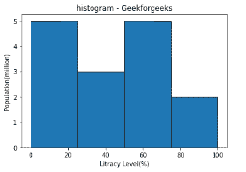

# 在 Matplotlib 中的直方图条周围添加边框

> 原文:[https://www . geeksforgeeks . org/add-a-边框-环绕-直方图-条形-in-matplotlib/](https://www.geeksforgeeks.org/add-a-border-around-histogram-bars-in-matplotlib/)

**先决条件:**T2【马特洛特利

在本文中，我们将看到如何使用 matplotlib 在我们的图中的直方图条周围添加边框，这里我们将举两个不同的例子来展示我们的图。

**进场:**

*   导入所需模块。
*   创建数据。
*   在直方图条周围添加边框。
*   通常绘制数据。
*   显示图。

**下面是实现:**

**例 1:**

在这个例子中，我们将传递一个 **edgecolor = 'Black'** 值作为边缘颜色参数给 plt.hist()来改变条形边框颜色。

## 蟒蛇 3

```
# importing package
from matplotlib import pyplot as plt
import numpy as np

#create data
fig,ax = plt.subplots(1,1)
a = np.array([22, 87, 5, 43, 56, 73, 55,
              54, 11, 20, 51, 5, 79, 31, 27])

b = (0, 25, 50, 75, 100)

# Adjust the border color
ax.hist(a, b, edgecolor = "black")

ax.set_title("histogram - Geekforgeeks")
ax.set_xlabel('Litracy Level(%)')
ax.set_ylabel('Population(million)')

plt.show()
```

**输出:**



**例 2:**

在这个例子中，我们将通过一个两个边缘颜色， **edgecolor** = 'Black '和' red '值作为边缘颜色参数到 plt.hist()来改变条形边框颜色。

## 蟒蛇 3

```
# importing package
from matplotlib import pyplot as plt
import numpy as np

#create data
fig,ax = plt.subplots(1, 1)

a = np.array([20, 73, 55, 31, 51, 5, 79, 5,
              43, 22, 87, 54, 11, 56, 27])

b = np.array([0, 25, 50, 75, 100])

# Adjust the border color
ax.hist(a, edgecolor = "black", color = 'pink')
ax.hist(b, edgecolor = "red", color = 'gray')

ax.set_title("Histogram - Geekforgeeks")
plt.show()
```

**输出:**

