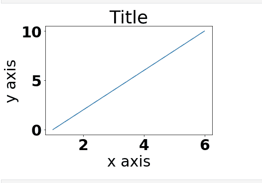
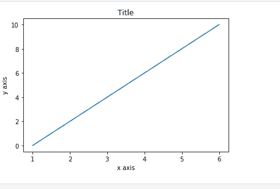

# 在 Matplotlib 中更改字体大小

> 原文:[https://www . geesforgeks . org/change-font-size-in-matplotlib/](https://www.geeksforgeeks.org/change-font-size-in-matplotlib/)

[Matplotlib](https://www.geeksforgeeks.org/python-introduction-matplotlib/) 库主要用于创建二维图形和图。它有一个名为 [pyplot](https://www.geeksforgeeks.org/pyplot-in-matplotlib/) 的模块，使绘图变得容易。要更改 Matplotlib 中的字体大小，下面给出的两种方法可以与适当的参数一起使用:

**方法 1:**matplotlib . rcparams . update()

rcParams 是 matplotlib 库的一个实例，用于处理默认 matplotlib 值，因此要更改默认字体大小，我们只需将值传递给关键字体

**进场:**

*   导入模块
*   创建数据
*   将带有值的 rcParams.update()设置为 font.size 键。
*   通常绘制数据
*   显示图

**示例:**

## 蟒蛇 3

```
import matplotlib.pyplot as plt

# setting font sizeto 30
plt.rcParams.update({'font.size': 30})

x = [1, 2, 3, 4, 5, 6]
y = [0, 2, 4, 6, 8, 10]

# plotting a plot
plt.plot(x, y)

# setting title name
plt.title("Title")

# setting x axis label
plt.xlabel("x axis")

# setting y axis label
plt.ylabel("y axis")

plt.show()
```

**输出:**



**方法 2:** matplotlib.rc(组，**kwargs):

该功能设置当前 rc 参数。组是像线、字体、轴等 rc 的分组，kwargs 是字典属性名称和值对。

**进场:**

*   导入模块
*   创建数据
*   创建一个字体字典来传递字体值
*   将该字体值提供给 rc()
*   通常绘制数据
*   显示数据

**示例:**

## 蟒蛇 3

```
import matplotlib.pyplot as plt

# creating a dictionary
font = {'size': 10}

# using rc function
plt.rc('font', **font)

x = [1, 2, 3, 4, 5, 6]
y = [0, 2, 4, 6, 8, 10]

# plotting a plot
plt.plot(x, y)

# setting title name
plt.title("Title")

# setting x axis label
plt.xlabel("x axis")

# setting y axis label
plt.ylabel("y axis")

plt.show()
```

**输出:**

