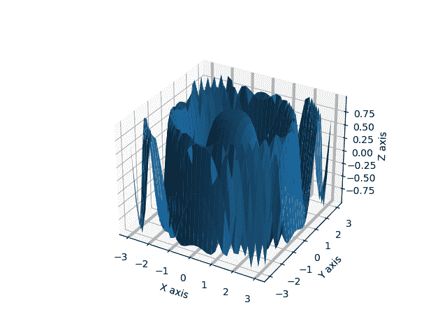
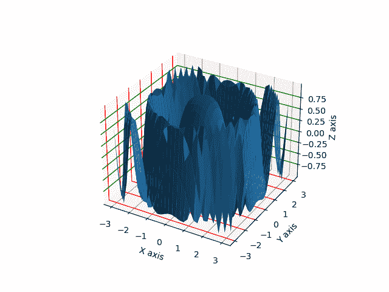

# 在 Python–Matplotlib

中更改三维曲面图中的网格线厚度

> 原文:[https://www . geesforgeks . org/change-grid-line-thickness-in-3d-surface-plot-in-python-matplotlib/](https://www.geeksforgeeks.org/change-grid-line-thickness-in-3d-surface-plot-in-python-matplotlib/)

**先决条件:** [**马特洛特利**](https://www.geeksforgeeks.org/three-dimensional-plotting-in-python-using-matplotlib/)

使用 Matplotlib 库，我们可以通过导入 mplot3d 工具包绘制三维图。在这个图中，我们将改变三维表面图中网格线的厚度。曲面图是三维数据的图表，它显示因变量(Y)和两个自变量(X 和 Y)之间的函数关系，而不是显示单个数据点。

网格线是穿过绘图以显示坐标轴刻度的线。图中的网格线有助于图表的查看者了解图中特定的未标记数据点代表了什么值。特别是在剧情过于复杂无法分析的时候有帮助，所以根据需要，我们可以调整或者改变网格线的粗细或者网格线的样式。

### 方法

*   导入必要的库。
*   创建用于打印的三维数据。
*   使用*ax =*[*matplotlib . pyplot . gca(' projection=3d ')*](https://www.geeksforgeeks.org/matplotlib-pyplot-gca-in-python/)创建三维坐标系，这里 GCA 代表获取当前网格，通过参数 projection = 3d，它将生成三维坐标系。
*   现在为了改变网格线的厚度，我们必须通过使用 *ax.xaxis.update({“线宽”:3})* 或任何你想要设置的网格宽度来更新各个轴的轴信息，这是针对 x 轴的，就像你可以通过分别写 Y axis，Z axis 代替 xaxis 来设置 Y 轴和 Z 轴一样。
*   如果想改变各个轴的颜色，只需在字典 *ax.xaxis.update({“线宽”:3，“颜色”:“红色”})中传递“颜色”:“红色”})* 或您想要设置的任何颜色。
*   现在，在进行更改后，使用传递 3d 数据中的 *ax.plot_surface(x，y，z)* 绘制曲面图。
*   在参数传递字符串中使用 ax.set_xlabel()设置 X，Y 和 Z 标签。
*   现在使用 matplotlib.pyplot.show()函数可视化该图。

**示例 1:使用 Matplotlib 更改三维曲面图中 X 轴网格线的厚度。**

## 计算机编程语言

```
# importing necessary libraries
import matplotlib.pyplot as plt
from mpl_toolkits.mplot3d import Axes3D
import numpy as np

# function to create data for plotting
def data_creation():

    # creating 3d data
    x = np.outer(np.linspace(-3, 3, 30), np.ones(30))
    y = x.copy().T # transpose
    z = np.cos(x ** 2 + y ** 2)
    return (x,y,z)

# main function
if __name__ == '__main__':

    # creating three dimensional co-ordinate system
    ax = plt.gca(projection='3d')

    # calling data creation function and storing in
    # the variables
    data_x,data_y,data_z = data_creation()

    # changing grid lines thickness of x axis to 3
    ax.xaxis._axinfo["grid"].update({"linewidth":3})

    # plotting surface plot
    ax.plot_surface(data_x,data_y,data_z)

    # giving label name to x,y and z axis
    ax.set_xlabel("X axis")
    ax.set_ylabel("Y axis")
    ax.set_zlabel("Z axis")

    # visualizing the plot
    plt.show()
```

**输出:**



在上面的例子中，我们已经改变了 X 轴的网格线厚度，如上图所示，X 轴网格线有一条较粗的灰色线。这可以通过更新上述示例代码中相应轴的 _axinfo 字典来完成，我们的相应轴是 X 轴。

**示例 2:使用 Matplotlib 更改三维曲面图中 X 轴网格线的厚度。**

## 计算机编程语言

```
# importing necessary libraries
import matplotlib.pyplot as plt
from mpl_toolkits.mplot3d import Axes3D
import numpy as np

# function to create data for plotting
def data_creation():

    # creating 3d data
    x = np.outer(np.linspace(-3, 3, 30), np.ones(30))
    y = x.copy().T # transpose
    z = np.cos(x ** 2 + y ** 2)
    return (x,y,z)

# main function
if __name__ == '__main__':
    # creating three dimensional co-ordinate system
    ax = plt.gca(projection='3d')

    # calling data creation function and storing in the variables
    data_x,data_y,data_z = data_creation()

    # changing grid lines thickness of Y axis to 3
    ax.yaxis._axinfo["grid"].update({"linewidth":3})

    # plotting surface plot
    ax.plot_surface(data_x,data_y,data_z)

    # giving label name to x,y and z axis
    ax.set_xlabel("X axis")
    ax.set_ylabel("Y axis")
    ax.set_zlabel("Z axis")

    # visualizing the plot
    plt.show()
```

**输出:**


在上面的例子中，我们改变了 Y 轴的网格线厚度，如上图所示，Y 轴网格线有一条较粗的灰色线。我们已经将 Y 轴的网格线厚度设置为 3。

**例 3:使用 Matplotlib 改变 3D 曲面图中 Z 轴网格线的粗细。**

## 计算机编程语言

```
# importing necessary libraries
import matplotlib.pyplot as plt
from mpl_toolkits.mplot3d import Axes3D
import numpy as np

# function to create data for plotting
def data_creation():
    # creating 3d data
    x = np.outer(np.linspace(-3, 3, 30), np.ones(30))
    y = x.copy().T # transpose
    z = np.cos(x ** 2 + y ** 2)
    return (x,y,z)

# main function
if __name__ == '__main__':
    # creating three dimensional co-ordinate system
    ax = plt.gca(projection='3d')

    # calling data creation function and storing in the variables
    data_x,data_y,data_z = data_creation()

    # changing grid lines thickness of Z axis to 3
    ax.zaxis._axinfo["grid"].update({"linewidth":3})

    # plotting surface plot
    ax.plot_surface(data_x,data_y,data_z)

    # giving label name to x,y and z axis
    ax.set_xlabel("X axis")
    ax.set_ylabel("Y axis")
    ax.set_zlabel("Z axis")

    # visualizing the plot
    plt.show()
```

**输出:**


在上面的例子中，我们已经改变了 Z 轴的网格线厚度，如上图所示，Z 轴网格线有一条较粗的灰色线。我们已经将 Z 轴的网格线厚度设置为 3。

**示例 4:使用 Matplotlib 更改所有三个轴的网格线厚度和颜色。**

## 计算机编程语言

```
# importing necessary libraries
import matplotlib.pyplot as plt
from mpl_toolkits.mplot3d import Axes3D
import numpy as np

# function to create data for plotting
def data_creation():

    # creating 3d data
    x = np.outer(np.linspace(-3, 3, 30), np.ones(30))
    y = x.copy().T # transpose
    z = np.cos(x ** 2 + y ** 2)
    return (x,y,z)

# main function
if __name__ == '__main__':
    # creating three dimensional co-ordinate system
    ax = plt.gca(projection='3d')

    # calling data creation function and storing in the variables
    data_x,data_y,data_z = data_creation()

    # changing grid lines thickness of x axis to 1
    ax.xaxis._axinfo["grid"].update({"linewidth":1})

    # changing grid lines thickness of Y axis to 1 and giving color to red
    ax.yaxis._axinfo["grid"].update({"linewidth":1,'color':'red'})

    # changing grid lines thickness of Z axis to 1 and giving color to green
    ax.zaxis._axinfo["grid"].update({"linewidth":1,'color':'green'})

    # plotting surface plot
    ax.plot_surface(data_x,data_y,data_z)

    # giving label name to x,y and z axis
    ax.set_xlabel("X axis")
    ax.set_ylabel("Y axis")
    ax.set_zlabel("Z axis")

    # visualizing the plot
    plt.show()
```

**输出:**



在上面的例子中，我们已经将 X、Y 和 Z 轴的网格线厚度设置为 1，并将 Y 轴的颜色更改为红色，将 Z 轴的颜色更改为绿色，通过更新 _axinfo 和更新字典，我们已经设置了 3D 绘图的线宽和颜色。