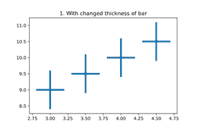
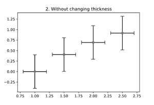

# 在 Matplotlib

中更改误差条厚度

> 原文:[https://www . geeksforgeeks . org/change-the-error-bar-thickness-in-matplotlib/](https://www.geeksforgeeks.org/change-the-error-bar-thickness-in-matplotlib/)

[Matplotlib](https://www.geeksforgeeks.org/python-introduction-matplotlib/) 是数据分析广泛使用的 Python 库。 *Matplotlib.pyplot.errorbar()是一个 pyplot 模块*，由一个提供类似 MATLAB 界面的函数组成。

## **改变误差杆厚度**

在改变误差线的厚度之前，让我们看看什么是误差线，以及我们如何绘制和使用它们。

**误差线:**误差线是我们在数据中包含的线，传达了报告测量中的不可预测性。通俗地说，它显示数据可变性的图形表示，并在图表上显示误差测量。

> **语法:***matplotlib . pyplot . error bar(x，y，yerr=None，xerr=None，fmt= "，ecolor=None，elinewidth =None，倾覆= None，barsabove=False，lolims=False，uplims=False，xlolims=False，xuplims=False，errorevery=1，capthick=None，*，data=None，* * * kwargs)*

**例 1:**

## 蟒蛇 3

```
# importing necessary libraries
import matplotlib.pyplot as plt

# example data
x = np.arange(3, 5, 0.5)
y = np.arange(9, 11, 0.5)

# ploting with default thickness of bar
plt.title("1\. Without changing thickness")
plt.errorbar(x, y, xerr=0.2, yerr=0.6, fmt='o')
plt.show()

# ploting with changed thickness of bar
plt.title("1\. With changed thickness of bar")

# change elinwidth to change the thickness of bar
plt.errorbar(x, y, xerr=0.2, yerr=0.6, fmt='o', elinewidth=4)
plt.show()
```

**输出:**


图 1.1



图 1.2

正如我们在两幅图像中看到的不同。elinewidth 参数取整数值，然后增加误差线的厚度。

**例 2:**

## 蟒蛇 3

```
# importing necessary libraries
import matplotlib.pyplot as plt

# example data
x = np.arange(1, 3, 0.5)
y = np.log(x)

# ploting with default thickness of bar
plt.title("2\. Without changing thickness")
plt.errorbar(x, y, xerr=0.2, yerr=0.4, fmt='o', ecolor='black', capsize=5)
plt.show()

# ploting with changed thickness of bar
# change elinwidth to change the thickness of bar
plt.title("2\. With changed thickness of bar")
plt.errorbar(x, y, xerr=0.2, yerr=0.4, fmt='o', elinewidth=4,
             ecolor='black', capsize=5, capthick=3)

plt.show()
```

**输出:**



图 2.1


图 2.2

在上面的例子中，我们已经应用了倾覆作为包含关于不确定性有多大的完整信息的上限。如果条形越小，标准越低，数据的分布越小，这意味着数据集中在平均值附近，如果条形越大，标准越大，数据的分布越大。