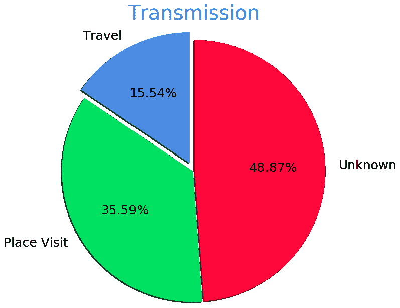
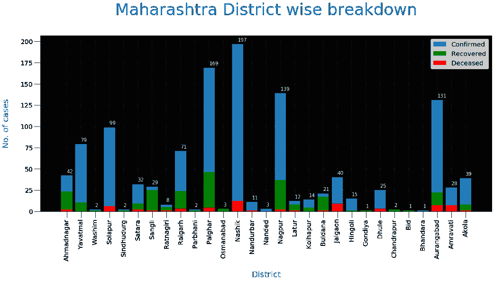

# Python 中使用 matplotlib 的新冠肺炎数据可视化

> 原文:[https://www . geeksforgeeks . org/新冠肺炎-数据-可视化-使用-matplotlib-in-python/](https://www.geeksforgeeks.org/covid-19-data-visualization-using-matplotlib-in-python/)

想象一下病毒是如何开始从一个零号病人传播到今天的 400 万人，感觉很不现实。这是可能的，因为运输系统。早些时候，我们没有今天交通系统的一小部分。

好吧，你现在可以遵循的好做法是给你的杂货产品消毒，并让它们闲置一两天。在我们找到可能远离我们数年的疫苗之前，在公共场所保持社交距离是减少病例数量的唯一方法。确保你以额外药片或食物的形式服用维生素 C。嗯，这不会阻止你得电晕，但至少如果你被感染了，你的免疫力会比没有服用它来对抗病毒的人更强。最后一个练习是用合十礼或瓦坎达礼代替你的握手。

## 入门指南

我们将浏览 matplotlib 中可用的一些基本地块，并使其更具美感。

**以下是我们将使用 matplotlib** 设计的可视化效果

*   简单情节？—?日期处理
*   圆形分格统计图表
*   条形图

**链接到数据集(CSV):** 点击此处

### 初始化数据集

导入新冠肺炎印度案例时间序列数据集

```
data = pd.read_csv('case_time_series.csv')

```


case_time_series.csv 数据集有 7 列。我们将收集每日确认每日恢复和每日死亡的变量作为数组。

```
Y = data.iloc[61:,1].values #Stores Daily Confirmed
R = data.iloc[61:,3].values #Stores Daily Recovered
D = data.iloc[61:,5].values #Stores Daily Deceased

```

```
X = data.iloc[61:,0] #Stores Date

```

*Y'* 变量存储“每日确诊”冠状病毒病例

*R'* 变量存储“每日恢复”的冠状病毒病例

D *'* 变量存储“每日死者”冠状病毒病例

“X”变量存储“日期”列

## 绘制简单图

我们将遵循面向对象的绘图方法。绘图函数采用两个参数，即 X 轴值和 Y 轴值绘图。在这种情况下，我们将传递带有“日期”的“X”变量和带有“每日确认”的“Y”变量来绘图。

**示例:**

## 蟒蛇 3

```
import numpy as np
import pandas as pd
import matplotlib.pyplot as plt

data = pd.read_csv('case_time_series.csv')

Y = data.iloc[61:,1].values 
R = data.iloc[61:,3].values 
D = data.iloc[61:,5].values 
X = data.iloc[61:,0] 

plt.plot(X,Y)
```

**输出:**


我们得到了上面代码执行的简单图，它看起来像这样，其中 X 轴有日期，Y 轴有确诊病例数。但是这并不是沿着轴的大数据集值的最佳表示，因为您可以看到“日期”在 X 轴上重叠。为了克服这个挑战，我们将引入一些新的函数来更好地控制图形的美观。

### 美学

为了控制图形的美观，如标签、标题、颜色和大小，我们将应用更多的功能，如下所示。

```
plt.figure(figsize=(25,8))

```

这将为图形创建一个画布，其中第一个值“25”是图形的宽度参数位置，“8”是图形的高度参数位置。

```
ax = plt.axes()

```

让我们创建一个图形轴的对象作为“ax ”,这样就更容易实现函数了。

```
ax.grid(linewidth=0.4, color='#8f8f8f') 

```

。“网格”功能允许您在图形上创建网格线。网格线的宽度可以通过简单地传递参数“线宽”来调整，通过传递“颜色”参数来改变其颜色。

```
ax.set_facecolor("black") 

ax.set_xlabel('\nDate',size=25,
              color='#4bb4f2')

ax.set_ylabel('Number of Confirmed Cases\n',
               size=25,color='#4bb4f2')

```

。“set_facecolor”允许您设置图形的背景颜色，这里是黑色。。set _ xlabel“and”。“set_ylabel”允许您沿两个轴设置标签，标签的大小和颜色可以更改。

```
ax.plot(X,Y,
        color='#1F77B4',
        marker='o',
        linewidth=4,
        markersize=15,
        markeredgecolor='#035E9B')

```

现在我们通过调用绘图函数再次绘制图表，其中“X”为日期，“Y”为每日确认。可以通过传递颜色、线宽？—?要更改颜色并调整绘图线和标记的宽度，请标记颜色？—?要创建标记(在这种情况下是圆形)，请调整标记的大小并定义标记的边缘颜色。

**完整代码:**

## 蟒蛇 3

```
import numpy as np
import pandas as pd
import matplotlib.pyplot as plt

data = pd.read_csv('case_time_series.csv')

Y = data.iloc[61:,1].values 
R = data.iloc[61:,3].values 
D = data.iloc[61:,5].values 
X = data.iloc[61:,0] 

plt.figure(figsize=(25,8))

ax = plt.axes()
ax.grid(linewidth=0.4, color='#8f8f8f') 

ax.set_facecolor("black") 
ax.set_xlabel('\nDate',size=25,color='#4bb4f2')
ax.set_ylabel('Number of Confirmed Cases\n',
              size=25,color='#4bb4f2')

ax.plot(X,Y,
        color='#1F77B4',
        marker='o',
        linewidth=4,
        markersize=15,
        markeredgecolor='#035E9B')
```

**输出:**


我们仍然可以看到日期是重叠的，沿着轴的标签不够清晰。所以现在我们要改变坐标轴的刻度，并标注这些图。

```
plt.xticks(rotation='vertical',size='20',color='white')
plt.yticks(size=20,color='white')
plt.tick_params(size=20,color='white')

```

。xticks '和。“yticks”允许您更改日期和每日确认字体。为了使日期不相互重叠，我们将通过传递“旋转=垂直”来垂直表示它们。为了使刻度易于阅读，我们将字体颜色改为白色，大小改为 20。

。“tick_params”允许您更改虚线的大小和颜色，虚线看起来像是刻度和图形之间的桥梁。

```
for i,j in zip(X,Y):
    ax.annotate(str(j),xy=(i,j+100),
                color='white',size='13')

```

。“注释”允许您在图表上进行注释。在这里，我们编写了一个代码，通过运行一个 for 循环来注释绘制点，该循环在绘制点绘制。字符串(j)包含“Y”变量，即每日确认。传递的任何字符串都将被绘制出来。XY 是应该绘制字符串的坐标。最后可以定义颜色和大小。请注意，我们在 XY 坐标中为 j 添加了+100，这样字符串就不会与标记重叠，并且它在 Y 轴上的距离为 100 个单位？—?轴。

```
ax.annotate('Second Lockdown 15th April',
            xy=(15.2, 860),
            xytext=(19.9,500),
            color='white',
            size='25',
            arrowprops=dict(color='white',
                            linewidth=0.025))
```

要注释一个指向图中某个位置的箭头，并且它的尾部包含字符串，我们可以定义“arrowprops”参数以及由“xytext”定义的尾部坐标。请注意,“箭头道具”的修改可以使用字典来完成。

```
plt.title("COVID-19 IN : Daily Confrimed\n",
          size=50,color='#28a9ff')

```

最后，我们用'来定义标题。' title '和传递字符串，其大小和颜色。

**完整代码:**

## 蟒蛇 3

```
import numpy as np
import pandas as pd
import matplotlib.pyplot as plt

data = pd.read_csv('case_time_series.csv')

Y = data.iloc[61:,1].values 
R = data.iloc[61:,3].values 
D = data.iloc[61:,5].values 
X = data.iloc[61:,0] 

plt.figure(figsize=(25,8))

ax = plt.axes()
ax.grid(linewidth=0.4, color='#8f8f8f') 

ax.set_facecolor("black") 
ax.set_xlabel('\nDate',size=25,color='#4bb4f2')
ax.set_ylabel('Number of Confirmed Cases\n',
              size=25,color='#4bb4f2')

plt.xticks(rotation='vertical',size='20',color='white')
plt.yticks(size=20,color='white')
plt.tick_params(size=20,color='white')

for i,j in zip(X,Y):
    ax.annotate(str(j),xy=(i,j+100),color='white',size='13')

ax.annotate('Second Lockdown 15th April',
            xy=(15.2, 860),
            xytext=(19.9,500),
            color='white',
            size='25',
            arrowprops=dict(color='white',
                            linewidth=0.025))

plt.title("COVID-19 IN : Daily Confrimed\n",
          size=50,color='#28a9ff')

ax.plot(X,Y,
        color='#1F77B4',
        marker='o',
        linewidth=4,
        markersize=15,
        markeredgecolor='#035E9B')
```

**输出:**


## 圆形分格统计图表

我们将绘制传播饼图，根据旅行、地方访问和未知原因来了解病毒是如何传播的。

### 初始化数据集

```
slices = [62, 142, 195]
activities = ['Travel', 'Place Visit', 'Unknown']

```

因此，我们已经创建了列表切片，基于该切片我们的饼图将被划分，并且相应的活动是有价值的。

### 绘制 Pir 图

```
cols=['#4C8BE2','#00e061','#fe073a']
exp = [0.2,0.02,0.02]

```

```
plt.pie(slices,
labels=activities, 
textprops=dict(size=25,color='black'),
radius=3,
colors=cols,
autopct='%2.2f%%',
explode=exp,
shadow=True,
startangle=90)

```

```
plt.title('Transmission\n\n\n\n',color='#4fb4f2',size=40)

```

绘制一个我们称之为“饼图”的图表。“pie”函数，它接受 x 个值，这里是“切片”,在此基础上，pie 被分割，后面是标签，标签有对应的字符串和它所代表的值。“textprops”可以更改这些字符串值。要改变饼图的半径或大小，我们称之为“半径”。对于美学，我们称“阴影”为真，“起始角度”为 90°。我们可以通过传递相应颜色的列表来定义要分配的颜色。为了分隔出每一块派，我们可以传递相应的值列表来“分解”。“自动扫描”定义了允许显示的位置数量。在这种情况下，autopct 允许小数点前后有 2 个位置。

**完成** **代码:**

## 蟒蛇 3

```
slices = [62, 142, 195]
activities = ['Travel', 'Place Visit', 'Unknown']

cols=['#4C8BE2','#00e061','#fe073a']
exp = [0.2,0.02,0.02]

plt.pie(slices,labels=activities,
        textprops=dict(size=25,color='black'),
        radius=3,
        colors=cols,
        autopct='%2.2f%%',
        explode=exp,
        shadow=True,
        startangle=90)

plt.title('Transmission\n\n\n\n',color='#4fb4f2',size=40)
```

**输出:**



## 条形图

现在，我们将绘制最常见类型的曲线图，即条形图。在这里，我们将绘制一个州的地区冠状病毒病例。

### 初始化数据集

```
data = pd.read_csv('district.csv')
data.head()

```


```
re=data.iloc[:30,5].values
de=data.iloc[:30,4].values
co=data.iloc[:30,3].values
x=list(data.iloc[:30,0])

```

所有地区的恢复电晕患者计数。

所有地区的死者电晕患者计数。

所有地区都有确诊的电晕患者。

' x '储存地区名称。

### 绘制条形图

```
plt.figure(figsize=(25,10))
ax=plt.axes()

ax.set_facecolor('black')
ax.grid(linewidth=0.4, color='#8f8f8f')

plt.xticks(rotation='vertical',
           size='20',
           color='white')#ticks of X

plt.yticks(size='20',color='white')

ax.set_xlabel('\nDistrict',size=25,
              color='#4bb4f2')
ax.set_ylabel('No. of cases\n',size=25,
              color='#4bb4f2')

plt.tick_params(size=20,color='white')

ax.set_title('Maharashtra District wise breakdown\n',
             size=50,color='#28a9ff')

```

美学的代码将与我们在前面的剧情中看到的一样。唯一会改变的是调用 bar 函数。

```
plt.bar(x,co,label='re')
plt.bar(x,re,label='re',color='green')
plt.bar(x,de,label='re',color='red')

for i,j in zip(x,co):
    ax.annotate(str(int(j)),
                xy=(i,j+3),
                color='white',
                size='15')

plt.legend(['Confirmed','Recovered','Deceased'],
           fontsize=20)

```

画一个我们称之为'的条形图。并传递给它 x 轴和 y 轴值。在这里，我们为所有三种情况(即已恢复、已确认、已死亡)调用了三次绘图函数，并且所有三个值都是相对于 y 轴和 x 轴绘制的，这三个轴都是地区名称。如您所见，我们通过迭代已确认病例值，仅对已确认的数字进行注释。此外，我们已经提到了。“图例”表示图形的图例。

**完整代码:**

## 蟒蛇 3

```
data = pd.read_csv('district.csv')
data.head()

re=data.iloc[:30,5].values
de=data.iloc[:30,4].values
co=data.iloc[:30,3].values
x=list(data.iloc[:30,0])

plt.figure(figsize=(25,10))
ax=plt.axes()

ax.set_facecolor('black')
ax.grid(linewidth=0.4, color='#8f8f8f')

plt.xticks(rotation='vertical',
           size='20',
           color='white')#ticks of X

plt.yticks(size='20',color='white')

ax.set_xlabel('\nDistrict',size=25,
              color='#4bb4f2')
ax.set_ylabel('No. of cases\n',size=25,
              color='#4bb4f2')

plt.tick_params(size=20,color='white')

ax.set_title('Maharashtra District wise breakdown\n',
             size=50,color='#28a9ff')

plt.bar(x,co,label='re')
plt.bar(x,re,label='re',color='green')
plt.bar(x,de,label='re',color='red')

for i,j in zip(x,co):
    ax.annotate(str(int(j)),
                xy=(i,j+3),
                color='white',
                size='15')

plt.legend(['Confirmed','Recovered','Deceased'],
           fontsize=20)
```

**输出:**

