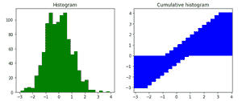

# 在 Matplotlib 中创建累积直方图

> 原文:[https://www . geesforgeks . org/create-a-累积-直方图-in-matplotlib/](https://www.geeksforgeeks.org/create-a-cumulative-histogram-in-matplotlib/)

直方图是数据的图形表示。我们可以用直方图的形式表示任何类型的数字数据。在本文中，我们将看到如何在 Matplotlib 中创建一个累积直方图

**累计频率:**累计频率分析是对数值出现频率的分析。它是一个频率和频率分布中所有频率的总和。

**示例:**

> x 包含[1，2，3，4，5]，则 x 的累积频率为[1，3，6，10，15]。
> 
> 解释:
> 
> [1,1+2,1+2+3,1+2+3+4,1+2+3+4+5]

在 Python 中，我们可以用 [dataframe.hist](https://www.geeksforgeeks.org/pandas-dataframe-hist-function-in-python/) 和累计频率 [stats.cumfreq()](https://www.geeksforgeeks.org/scipy-stats-cumfreq-function-python/) 直方图生成直方图。

**例 1:**

## 蟒蛇 3

```py
# importing pyplot for getting graph
import matplotlib.pyplot as plt

# importing numpy for getting array
import numpy as np

# importing scientific python
from scipy import stats

# list of values
x = [10, 40, 20, 10, 30, 10, 56, 45]

res = stats.cumfreq(x, numbins=4,
                    defaultreallimits=(1.5, 5))

# generating random values
rng = np.random.RandomState(seed=12345)

# normalizing
samples = stats.norm.rvs(size=1000,
                         random_state=rng)

res = stats.cumfreq(samples,
                    numbins=25)

x = res.lowerlimit + np.linspace(0, res.binsize*res.cumcount.size,
                                 res.cumcount.size)

# specifying figure size
fig = plt.figure(figsize=(10, 4))

# adding sub plots
ax1 = fig.add_subplot(1, 2, 1)

# adding sub plots
ax2 = fig.add_subplot(1, 2, 2)

# getting histogram using hist function
ax1.hist(samples, bins=25,
         color="green")

# setting up the title
ax1.set_title('Histogram')

# cumulative graph
ax2.bar(x, res.cumcount, width=4, color="blue")

# setting up the title
ax2.set_title('Cumulative histogram')

ax2.set_xlim([x.min(), x.max()])

# display hte figure(histogram)
plt.show()
```

**输出:**


**例 2:**

## 蟒蛇 3

```py
# importing numpy for getting array
import numpy as np

# importing scientific python
from scipy import stats

# list of values
x = [10, 40, 20, 10, 30, 10, 56, 45]

res = stats.cumfreq(x, numbins=4,
                    defaultreallimits=(1.5, 5))

# generating random values
rng = np.random.RandomState(seed=12345)

# normalizing
samples = stats.norm.rvs(size=1000,
                         random_state=rng)

res = stats.cumfreq(samples,
                    numbins=25)

x = res.lowerlimit + np.linspace(0, res.binsize*res.cumcount.size,
                                 res.cumcount.size)

fig = plt.figure(figsize=(10, 4))

ax1 = fig.add_subplot(1, 2, 1)
ax2 = fig.add_subplot(1, 2, 2)

ax1.hist(samples, bins=25, color="green")

ax1.set_title('Histogram')
ax2.bar(x, x, width=2, color="blue")

ax2.set_title('Cumulative histogram')
ax2.set_xlim([x.min(), x.max()])

plt.show()
```

**输出:**

