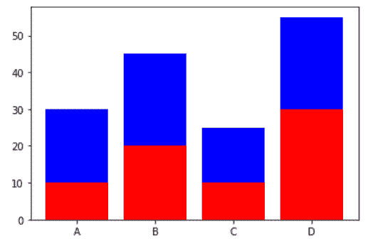

# 在 Matplotlib 中创建堆叠条形图

> 原文:[https://www . geesforgeks . org/create-a-stacked-bar-plot-in-matplotlib/](https://www.geeksforgeeks.org/create-a-stacked-bar-plot-in-matplotlib/)

在本文中，我们将学习如何在 [Matplotlib](https://www.geeksforgeeks.org/python-introduction-matplotlib/) 中创建堆叠条形图。让我们讨论一些概念:

*   Matplotlib 是一个巨大的 Python 可视化库，用于数组的 2D 图。Matplotlib 可能是一个多平台数据可视化库，构建在 [NumPy](https://www.geeksforgeeks.org/python-numpy/) 数组上，旨在与更广泛的 SciPy 堆栈一起工作。
*   条形图或条形图可以是用矩形条表示知识类别的图形，矩形条的长度和高度与它们所表示的值成比例。条形图通常水平或垂直绘制。
*   堆叠条形图表示最高 1 的不同组。条形的峰值取决于各组结果混合物的最终高度。它从谷底到价值，而不是从零到价值。

**进场:**

1.  汇入资源库(Matplotlib)
2.  导入/创建数据。
3.  以堆叠方式绘制条形图。

**例 1:(简单堆积条形图)**

## 蟒蛇 3

```
# importing package
import matplotlib.pyplot as plt

# create data
x = ['A', 'B', 'C', 'D']
y1 = [10, 20, 10, 30]
y2 = [20, 25, 15, 25]

# plot bars in stack manner
plt.bar(x, y1, color='r')
plt.bar(x, y2, bottom=y1, color='b')
plt.show()
```

**输出:**



**示例 2:(包含 2 个以上数据的堆叠条形图)**

## 蟒蛇 3

```
# importing package
import matplotlib.pyplot as plt
import numpy as np

# create data
x = ['A', 'B', 'C', 'D']
y1 = np.array([10, 20, 10, 30])
y2 = np.array([20, 25, 15, 25])
y3 = np.array([12, 15, 19, 6])
y4 = np.array([10, 29, 13, 19])

# plot bars in stack manner
plt.bar(x, y1, color='r')
plt.bar(x, y2, bottom=y1, color='b')
plt.bar(x, y3, bottom=y1+y2, color='y')
plt.bar(x, y4, bottom=y1+y2+y3, color='g')
plt.xlabel("Teams")
plt.ylabel("Score")
plt.legend(["Round 1", "Round 2", "Round 3", "Round 4"])
plt.title("Scores by Teams in 4 Rounds")
plt.show()
```

**输出:**


**示例 3:(使用** [**数据框**](https://www.geeksforgeeks.org/python-pandas-dataframe/) **绘制的堆叠条形图)**

## 蟒蛇 3

```
# importing package
import matplotlib.pyplot as plt
import numpy as np
import pandas as pd

# create data
df = pd.DataFrame([['A', 10, 20, 10, 26], ['B', 20, 25, 15, 21], ['C', 12, 15, 19, 6],
                   ['D', 10, 18, 11, 19]],
                  columns=['Team', 'Round 1', 'Round 2', 'Round 3', 'Round 4'])
# view data
print(df)

# plot data in stack manner of bar type
df.plot(x='Team', kind='bar', stacked=True,
        title='Stacked Bar Graph by dataframe')
```

**输出:**

```
  Team  Round 1  Round 2  Round 3  Round 4
0    A       10       20       10       26
1    B       20       25       15       21
2    C       12       15       19        6
3    D       10       18       11       19
```

