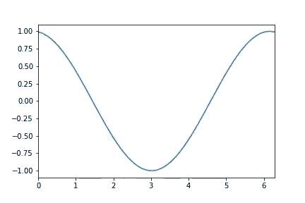

# 使用 Python Matplotlib 创建动画 GIF

> 原文:[https://www . geesforgeks . org/create-an-animated-gif-using-python-matplotlib/](https://www.geeksforgeeks.org/create-an-animated-gif-using-python-matplotlib/)

在本文中，我们将讨论如何使用 Python 中的 Matplotlib 创建动画 GIF。

[Matplotlib](https://www.geeksforgeeks.org/python-introduction-matplotlib/) 只能用于创建基于数学的动画。这些可以包括在圆周上移动的一个点，或者像声波一样的正弦或余弦波。在 Matplotlib 中，我们有一个名为 animation 的库，我们可以从中导入一个名为 FuncAnimation()的函数。此功能用于创建动画。该函数用于每次以特定的时间间隔调用一个 ***动画函数*** ，并在图中显示动画函数的输出。因此，这个函数主要将这四个作为它的输入。

**语法:**

```
 FuncAnimation( Figure, AnimationFunction, Frames, Interval)
```

此外，还有其他功能和对象，它们一起使动画成为可能。它们如下所示:

1.  我们将要求 [NumPy](https://www.geeksforgeeks.org/numpy-tutorial/) 用于各种数学函数和数组。
2.  最后，我们将需要 matplotlib 的绘图能力，它将从 pyplot 模块导入。

导入所需的模块

```
import numpy as np
from matplotlib.animation import FuncAnimation
from IPython import display
import matplotlib.pyplot as plt
```

### 入门 **:**

*   这个想法是首先创建一个简单的任何函数的图(这里我们取了例如余弦)，然后**函数动画**函数将继续调用**动画函数**，在给定的时间间隔后作为参数连续传递给它。
*   我们只需要给出这样一个实现，它将导致我们已经通过的**动画功能**中的情节位置发生变化。由于间隔太小(以毫秒为单位)，所以我们觉得它是动画。

这是创建动画的基本思想。

### **创建动画:**

我们将创建一个以视频动画格式显示的余弦波。

下面列出了使用的各种步骤和想法。

*   创建一个图形，其中动画将与 x 轴和 y 轴一起显示。这是通过创建一个我们可以限制 x 轴和 y 轴的图来完成的。

## 蟒蛇 3

```
Figure = plt.figure()

# creating a plot
lines_plotted = plt.plot([])    

# putting limits on x axis since
# it is a trigonometry function
# (0,2∏)
line_plotted = lines_plotted[0]

plt.xlim(0,2*np.pi) 

# putting limits on y since it is a
# cosine function
plt.ylim(-1.1,1.1)   

# initialising x from 0 to 2∏
x = np.linspace(0,2*np.pi,100)  

#initially
y = 0
```

*   现在让我们创建我们的动画功能，它将根据参数帧连续改变绘图的 x 和 y 坐标。原因是 fun 动漫会根据帧连续调用这个函数。因为动画仅仅意味着一帧接一帧地创建视频。

## 蟒蛇 3

```
# function takes frame as an input
def AnimationFunction(frame):

    # setting y according to frame
    # number and + x. It's logic
    y = np.cos(x+2*np.pi*frame/100)

    # line is set with new values of x and y
    line_plotted.set_data((x, y))
```

*   现在是时候调用我们的函数动画函数了，它将根据帧数连续调用上面定义的函数。我们给出的时间间隔是 25 毫秒。

> anim _ created =fun 动漫(图，AnimationFunction，帧数=100，间隔=25)

*   现在是时候展示我们的动画了。因此，我们必须通过下面给出的代码来制作一个 HTML 文件:

## 蟒蛇 3

```
video = anim_created.to_html5_video()
html = display.HTML(video)
display.display(html)

# good practice to close the plt object.
plt.close()
```

因此，完整的代码可以在本地运行(如果安装了库)，也可以在 Jupyter 笔记本或合作笔记本上在线运行。

**输出:**



因此，我们能够使用 Matplotlib 创建动画，这使得学习数学变得容易。