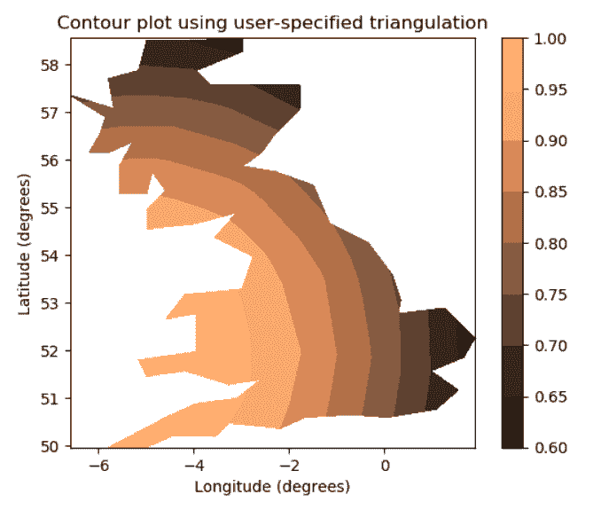

# 使用 Matplotlib

在 Python 中的非结构化三角形网格上绘制轮廓

> 原文:[https://www . geeksforgeeks . org/draw-非结构化三角形网格上的等高线-python-use-matplotlib/](https://www.geeksforgeeks.org/draw-contours-on-an-unstructured-triangular-grid-in-python-using-matplotlib/)

**[Matplotlib](https://www.geeksforgeeks.org/python-introduction-matplotlib/)** 是一个 Python 库，它是一个支持丰富绘图类型的开源绘图库，可以用来绘制 2D 和 3D 图形。借助 **matplotlib** ，通过可视化数据可以很容易地理解数据。您还可以生成曲线图、饼图、直方图以及许多其他图表。它提供了一个类似 MATLAB 的绘图界面。

## tricontour()

`tricontour`matplotlib 库 pyplot 模块的功能绘制等高线，可用于在非结构化的三角形网格上绘制等高线。它返回`TriContourSet`对象。

> **语法:**三角龙(x，y，三角测量，**kwargs)
> 
> **参数:**该方法由以下参数组成。
> 
> *   **x，y :** 网格的坐标。
> *   **三角测量:**这是一个*三角测量*对象。
> *   **z :** 它是要绘制轮廓的值的数组，三角测量中每个点一个。
> *   **N :** 它为 N 个间隔自动选择多达 N+1 个轮廓级别。
> *   **V :** 它以序列 V 中指定的值绘制等高线，并且必须按递增顺序。

**示例:**

```py
import matplotlib.pyplot as plt
import matplotlib.tri as tri
import numpy as np

n_angles = 56
n_radii = 8
min_radius = 0.25
radii = np.linspace(min_radius, 0.95, n_radii)

angles = np.linspace(0, 2 * np.pi, n_angles, endpoint = False)
angles = np.repeat(angles[..., np.newaxis], n_radii, axis = 1)
angles[:, 1::2] += np.pi / n_angles

x = (radii * np.cos(angles)).flatten()
y = (radii * np.sin(angles)).flatten()
z = (np.cos(radii) * np.cos(3 * angles)).flatten()

# Create the Triangulation; no triangles so
# Delaunay triangulation created.
triang = tri.Triangulation(x, y)

# Mask off unwanted triangles.
triang.set_mask(np.hypot(x[triang.triangles].mean(axis = 1), 
                         y[triang.triangles].mean(axis = 1))
                < min_radius)

fig1, ax1 = plt.subplots()
ax1.set_aspect('equal')

tcf = ax1.tricontourf(triang, z, cmap ='inferno')
fig1.colorbar(tcf)

ax1.tricontour(triang, z, colors ='k')
ax1.set_title('Contour plot for Delaunay triangulation')
```

**输出:**


## tricontourf()

`tricontourf`matplotlib 库 pyplot 模块的函数填充顶部封闭的区间，可用于在非结构化三角形网格上绘制等高线。函数签名和返回值与`tricontour`相同。

> **语法:**三角帆(x，y，三角测量，**kwargs)
> 
> **参数:**该方法由以下参数组成。
> 
> *   **x，y :** 网格的坐标。
> *   **三角测量:**这是一个*三角测量*对象。
> *   **z :** 它是要绘制轮廓的值的数组，三角测量中每个点一个。
> *   **N :** 它为 N 个间隔自动选择多达 N+1 个轮廓级别。
> *   **V :** 它填充在 V 中的值之间的 *(len(V)-1)* 区域，并且它必须以递增的顺序。

**示例:**

```py
import matplotlib
matplotlib.axes.Axes.tricontourf
matplotlib.pyplot.tricontourf
matplotlib.tri.Triangulation

xy = np.asarray([
    [-0.101, 0.872], [-0.080, 0.883], [-0.069, 0.888],
    [-0.054, 0.890], [-0.045, 0.897], [-0.057, 0.895],
    [-0.073, 0.900], [-0.087, 0.898], [-0.090, 0.904],
    [-0.069, 0.907], [-0.069, 0.921], [-0.080, 0.919],
    [-0.073, 0.928], [-0.052, 0.930], [-0.048, 0.942],
    [-0.062, 0.949], [-0.054, 0.958], [-0.069, 0.954], 
    [-0.087, 0.952], [-0.087, 0.959], [-0.080, 0.966], 
    [-0.085, 0.973], [-0.087, 0.965], [-0.097, 0.965],
    [-0.097, 0.975], [-0.092, 0.984], [-0.101, 0.980], 
    [-0.108, 0.980], [-0.104, 0.987], [-0.102, 0.993], 
    [-0.115, 1.001], [-0.099, 0.996], [-0.101, 1.007],
    [-0.090, 1.010], [-0.087, 1.021], [-0.069, 1.021],
    [-0.052, 1.022], [-0.052, 1.017], [-0.069, 1.010],
    [-0.064, 1.005], [-0.048, 1.005], [-0.031, 1.005],
    [-0.031, 0.996], [-0.040, 0.987], [-0.045, 0.980],
    [-0.052, 0.975], [-0.040, 0.973], [-0.026, 0.968],
    [-0.020, 0.954], [-0.006, 0.947], [ 0.003, 0.935], 
    [ 0.006, 0.926], [ 0.005, 0.921], [ 0.022, 0.923], 
    [ 0.033, 0.912], [ 0.029, 0.905], [ 0.017, 0.900], 
    [ 0.012, 0.895], [ 0.027, 0.893], [ 0.019, 0.886],
    [ 0.001, 0.883], [-0.012, 0.884], [-0.029, 0.883], 
    [-0.038, 0.879], [-0.057, 0.881], [-0.062, 0.876],
    [-0.078, 0.876], [-0.087, 0.872], [-0.030, 0.907], 
    [-0.007, 0.905], [-0.057, 0.916], [-0.025, 0.933],
    [-0.077, 0.990], [-0.059, 0.993]])

x = np.degrees(xy[:, 0])
y = np.degrees(xy[:, 1])
x0 = -5
y0 = 52
z = np.exp(-0.01 * ((x - x0) ** 2 + (y - y0) ** 2))

triangles = np.asarray([
    [67, 66,  1], [65,  2, 66], [ 1, 66,  2], 
    [64,  2, 65], [63,  3, 64], [60, 59, 57], 
    [ 2, 64,  3], [ 3, 63,  4], [ 0, 67,  1], 
    [62,  4, 63], [57, 59, 56], [59, 58, 56],
    [61, 60, 69], [57, 69, 60], [ 4, 62, 68],
    [ 6,  5,  9], [61, 68, 62], [69, 68, 61], 
    [ 9,  5, 70], [ 6,  8,  7], [ 4, 70,  5], 
    [ 8,  6,  9], [56, 69, 57], [69, 56, 52],
    [70, 10,  9], [54, 53, 55], [56, 55, 53],
    [68, 70,  4], [52, 56, 53], [11, 10, 12],
    [69, 71, 68], [68, 13, 70], [10, 70, 13],
    [51, 50, 52], [13, 68, 71], [52, 71, 69], 
    [12, 10, 13], [71, 52, 50], [71, 14, 13],
    [50, 49, 71], [49, 48, 71], [14, 16, 15],
    [14, 71, 48], [17, 19, 18], [17, 20, 19],
    [48, 16, 14], [48, 47, 16], [47, 46, 16],
    [16, 46, 45], [23, 22, 24], [21, 24, 22],
    [17, 16, 45], [20, 17, 45], [21, 25, 24],
    [27, 26, 28], [20, 72, 21], [25, 21, 72], 
    [45, 72, 20], [25, 28, 26], [44, 73, 45],
    [72, 45, 73], [28, 25, 29], [29, 25, 31], 
    [43, 73, 44], [73, 43, 40], [72, 73, 39], 
    [72, 31, 25], [42, 40, 43], [31, 30, 29], 
    [39, 73, 40], [42, 41, 40], [72, 33, 31], 
    [32, 31, 33], [39, 38, 72], [33, 72, 38],
    [33, 38, 34], [37, 35, 38], [34, 38, 35], 
    [35, 37, 36]])

fig2, ax2 = plt.subplots()
ax2.set_aspect('equal')
tcf = ax2.tricontourf(x, y, triangles, z, cmap ='copper')
fig2.colorbar(tcf)

ax2.set_title('Contour plot using user-specified triangulation')
ax2.set_xlabel('Longitude (degrees)')
ax2.set_ylabel('Latitude (degrees)')

plt.show()
```

**输出:**
