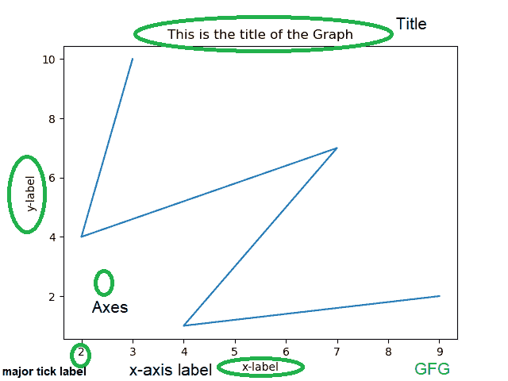
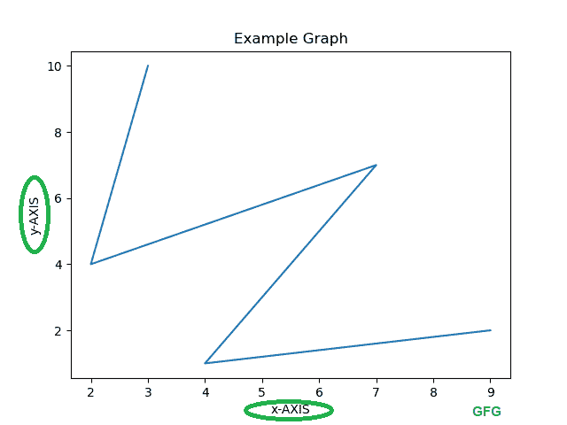

# 在 Python-Matplotlib 中格式化轴

> 原文:[https://www . geesforgeks . org/formatting-axes-in-python-matplotlib/](https://www.geeksforgeeks.org/formatting-axes-in-python-matplotlib/)

**[Matplotlib](https://www.geeksforgeeks.org/python-introduction-matplotlib/)** 是一个用于创建静态、动画和交互式数据可视化的 python 库。

注:更多信息请参考[Matplotlib 简介](https://www.geeksforgeeks.org/python-introduction-matplotlib/)

## 什么是斧头？

这就是你认为的‘阴谋’。它是包含数据空间的图像区域。轴包含两个或三个处理数据限制的轴(如果是三维)对象。下图显示了包含图形的图形的不同部分。



轴的不同方面可以根据需要改变。

**1。标记 x、y 轴**

**语法:**

> 对于 x 轴
> Axes.set_xlabel(self，xlabel，fontdict=None，labelpad=None，\*\*kwargs)
> 
> 对于 y 轴:
> axes . set _ ylabel(self、ylabel、fontdict=None、labelpad=None、\*\*kwargs)

这些函数用于命名 x 轴和 y 轴。

**示例:**

```
# importing matplotlib module
import matplotlib.pyplot as plt
import numpy as np

# x-axis & y-axis values
x = [3, 2, 7, 4, 9]
y = [10, 4, 7, 1, 2]

# create a figure and axes
fig, ax = plt.subplots()

# setting title to graph
ax.set_title('Example Graph')

# label x-axis and y-axis
ax.set_ylabel('y-AXIS')
ax.set_xlabel('x-AXIS')

# function to plot and show graph
ax.plot(x, y)
plt.show()
```

**输出:**


**2。x、y 轴极限**

**语法:**

**x 轴:**

> Axes.set_xlim(self，左=无，右=无，emit =真，auto =假，*，xmin =无，xmax =无)
> 
> **参数:**
> 
> *   **左**和**右**–浮动，可选
>     数据坐标中的左 xlim(起点)和右 xlim(终点)。不通过会使限制保持不变。
> *   **自动**–布尔或无，可选
>     开启 x 轴自动缩放。“真”打开，“假”关闭(默认操作)，“无”保持不变。
> *   **xmin、xmax** :它们分别相当于左和右，同时传递 xmin 和左或者 xmax 和右都是错误的。
>     
>     
>     **返回:**
>     **右，左**–(浮动，浮动)

**对于 y 轴:**

> Axes.set_ylim(self，底部=无，顶部=无，发射=真，自动=假，\*，ymin =无，ymax =无)
> 
> **参数:**
> 
> *   **底部**和**顶部**–浮动，可选
>     数据坐标中的底部叶立德(起点)和顶部叶立德(终点)。不通过会使限制保持不变。
> *   **自动**–布尔或无，可选
>     开启 y 轴自动缩放。“真”打开，“假”关闭(默认操作)，“无”保持不变。
> *   **ymin、ymax** :它们分别相当于左、右，同时传递 ymin 和左或者 ymax 和右都是错误的。
>     
>     
>     **返回:**
>     **底部，顶部**–(浮动，浮动)

**示例:**

```
import matplotlib.pyplot as plt
import numpy as np

x = [3, 2, 7, 4, 9]
y = [10, 4, 7, 1, 2]

# create a figure and axes
fig, ax = plt.subplots()

ax.set_title('Example Graph')

ax.set_ylabel('y-AXIS')
ax.set_xlabel('x-AXIS')

# set x, y-axis limits 
ax.set_xlim(0, 10)
ax.set_ylim(0, 10)

# function to plot and show graph
ax.plot(x, y)
plt.show()
```

**输出:**


**3。大刻度和小刻度**

刻度是 x 轴和 y 轴的值/大小。次要刻度是主要刻度的划分。有两类**定位器**和**格式化器**。定位器决定记号的位置，格式化程序控制记号的格式。这两个类必须从 matplotlib 导入。

*   **MultipleLocator()** 将刻度放在某个基数的倍数上。

*   **FormatStrFormatter** 使用格式字符串(例如，“%d”或“%1.2f”或“%1.1f cm”)来格式化刻度标签。

**注意:**次要刻度默认为关闭状态，通过设置次要定位器可以在没有标签的情况下打开次要刻度，次要刻度标签可以通过次要格式化程序打开。

**示例:**

```
# importing matplotlib module and respective classes
import matplotlib.pyplot as plt
import numpy as np
from matplotlib.ticker import (MultipleLocator,
                               FormatStrFormatter,
                               AutoMinorLocator)

x = [3, 2, 7, 4, 9]
y = [10, 4, 7, 1, 2]

fig, ax = plt.subplots()

ax.set_title('Example Graph')

ax.set_ylabel('y-AXIS')
ax.set_xlabel('x-AXIS')

ax.set_xlim(0, 10)
ax.set_ylim(0, 10)

# Make x-axis with major ticks that 
# are multiples of 11 and Label major 
# ticks with '% 1.2f' formatting
ax.xaxis.set_major_locator(MultipleLocator(10))
ax.xaxis.set_major_formatter(FormatStrFormatter('% 1.2f'))

# make x-axis with minor ticks that 
# are multiples of 1 and label minor 
# ticks with '% 1.2f' formatting
ax.xaxis.set_minor_locator(MultipleLocator(1))
ax.xaxis.set_minor_formatter(FormatStrFormatter('% 1.2f'))

ax.plot(x, y)
plt.show()
```

**输出:**
