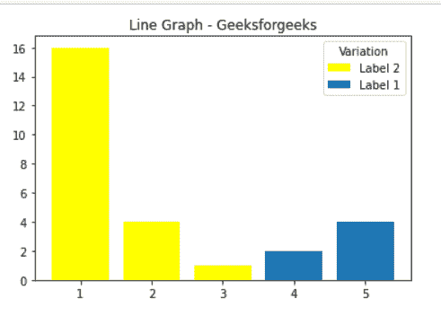

# 如何给 Matplotlib 图例添加标题？

> 原文:[https://www . geesforgeks . org/如何将标题添加到 matplotlib-legend/](https://www.geeksforgeeks.org/how-to-add-a-title-to-a-matplotlib-legend/)

**先决条件:**T2【马特洛特利

在本文中，我们将了解如何使用 matplotlib 在我们的图表中为图例添加标题，这里我们将举两个不同的例子来展示我们的图表。

**进场:**

*   导入所需模块。
*   创建数据。
*   为图例添加标题。
*   通常绘制数据。
*   显示图。

**下面是实现:**

**例 1:**

在本例中，我们将借助 matplotlib 绘制不同的线条，并使用 title 参数 plt.legend()来指定图例标题。

## 蟒蛇 3

```
# importing package
import matplotlib.pyplot as plt
import numpy as np

# create data
X = [1, 2, 3, 4, 5]

# plot lines
plt.plot(X, np.sin(X), label = "Curve-1")
plt.plot(X, np.cos(X), label = "Curve-2")

# Add a title to a legend
plt.legend(title = "Legend Title")
plt.title("Line Graph - Geeksforgeeks")

plt.show()
```

**输出:**


**例 2:**

在本例中，我们将在 matplotlib 的帮助下绘制一个条形图，并使用 title 参数 plt.legend()来指定图例标题。

## 蟒蛇 3

```
# importing package
import matplotlib.pyplot as plt

# sample code 
plt.bar([1, 2, 3], [16, 4, 1], 
        color ='yellow',
        label = 'Label 2') 

plt.bar([4, 5], [2, 4], 
        label = 'Label 1')

# Add a title to a legend
plt.legend(title = "Variation Rate")

plt.title("Line Graph - Geeksforgeeks")

plt.show()
```

**输出:**

