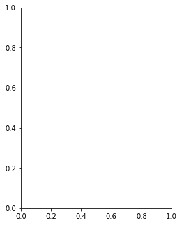
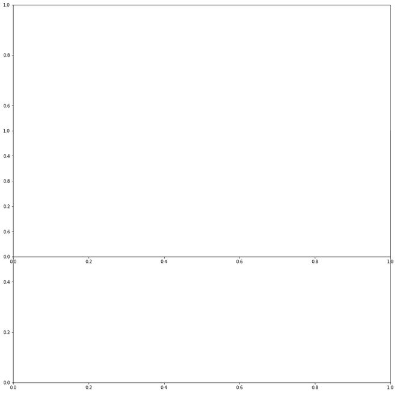

# 如何用 Python 在 Matplotlib 中给图形添加轴？

> 原文:[https://www . geesforgeks . org/如何用 python 将轴添加到 matplotlib 图形中/](https://www.geeksforgeeks.org/how-to-add-axes-to-a-figure-in-matplotlib-with-python/)

[**Matplotlib**](https://www.geeksforgeeks.org/python-introduction-matplotlib/) 是 Python 中的一个库，用于创建图形并提供自定义图形的工具。它允许绘制不同类型的数据，几何图形。在本文中，我们将看到如何在 matplotlib 中向图形添加轴。

我们可以通过在 *add_axes()* 方法中传递一个列表参数，在 *matplotlib* 中给一个图形添加轴。

> **语法:**matplotlib . pyplot . figure . add _ axes(rect)
> 
> **参数:**
> 
> **rect:** 这个参数是新轴的尺寸[xmin，ymin，dx，dy]。它将以下元素作为列表中的参数:
> 
> *   **xmin:** 左下角水平坐标。
> *   **ymin:** 左下角垂直坐标。
> *   **dx:** 支线剧情的宽度。
> *   **dy:** 支线剧情的高度。
> 
> **返回:**该方法根据使用的投影返回轴类。

### 以下是一些描述如何在 *matplotlib:* 中给图形添加轴的程序

**例 1:**

## 蟒蛇 3

```
# Importing library
import matplotlib

# Create figure() objects
# This acts as a container
# for the different plots
fig = matplotlib.pyplot.figure()

# Creating axis
# add_axes([xmin,ymin,dx,dy])
axes = fig.add_axes([0.5, 1, 0.5, 1])

# Depict illustration
fig.show()
```

**输出:**



**例 2:**

## 蟒蛇 3

```
# Importing library
import matplotlib

# Create figure() objects
# This acts as a container 
# for the different plots
fig=matplotlib.pyplot.figure() 

# Creating two axes
# add_axes([xmin,ymin,dx,dy])
axes=fig.add_axes([0,0,2,2]) 
axes1=fig.add_axes([0,1,2,2])

# Depict illustration
fig.show()
```

**输出:**



**例 3:**

## 蟒蛇 3

```
# Import libraries
import matplotlib
import numpy

# Create figure() objects
# This acts as a container
# for the different plots
fig = matplotlib.pyplot.figure()

# Generate line graph
x = numpy.arange(0, 1.414*2, 0.05)
y1 = numpy.sin(x)
y2 = numpy.cos(x)

# Creating two axes
# add_axes([xmin,ymin,dx,dy])
axes1 = fig.add_axes([0, 0, 1, 1])
axes1.plot(x, y1)
axes2 = fig.add_axes([0, 1, 1, 1])
axes2.plot(x, y2)

# Show plot
plt.show()
```

**输出:**

