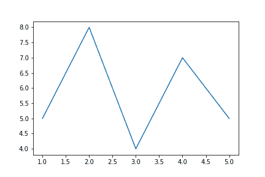
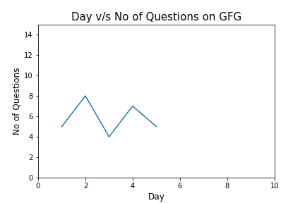

# 如何给 Matplotlib 添加文本？

> 原文:[https://www . geesforgeks . org/如何将文本添加到 matplotlib/](https://www.geeksforgeeks.org/how-to-add-text-to-matplotlib/)

[**Matplotlib**](https://www.geeksforgeeks.org/python-introduction-matplotlib/) 是 Python 中可视化数据的绘图库，灵感来源于 MATLAB，意思是使用的术语(轴、图形、绘图)将与 MATLAB 中使用的术语相似。[**【Pyplot】**](https://www.geeksforgeeks.org/pyplot-in-matplotlib/)是 Matplotlib 库中的一个模块，是 Matplotlib 模块的类壳接口。

它提供了我们能想到的几乎任何一种情节。在这篇文章中，我们将关注一个更具体的主题，即在 matplotlib 图中添加文本。以下命令用于在 matplotlib 图中创建文本。

<figure class="table">

| **命令** | **描述** |
| 文本 | 这用于在轴的任意位置添加文本。 |
| 给…作注解 | 这用于在轴的任意位置添加带有可选箭头的注释。 |
| set_xlabel | 这用于向轴的 x 轴添加标签。 |
| set _ ylabel-设定值 | 这用于向轴的 y 轴添加标签。 |
| 设置标题 | 这用于向轴添加标题。 |
| 文本 | 这用于在图形的任意位置添加文本。 |
| 小标题 | 这用于向图中添加标题。 |

</figure>

我们将逐一查看每个命令，首先，让我们创建一个日 v/s Question 的基本图，我们将在其上添加各种文本对象。

**代码:**

## 蟒蛇 3

```py
# Code to add text on matplotlib

# Importing library
import matplotlib.pyplot as plt

# Creating x-value and y-value of data
x = [1, 2, 3, 4, 5]
y = [5, 8, 4, 7, 5]

# Creating figure
fig = plt.figure()

# Adding axes on the figure
ax = fig.add_subplot(111)

# Plotting data on the axes
ax.plot(x, y)

plt.show()
```

**输出:**



输出图看起来很简单。现在，让我们看看一些文本命令，把它添加到我们的剧情中。

*   **set_title()** 用于添加轴的标题。第一个也是强制性的参数是你想给的标题，其余的是可选的，可以合成它。
*   类似地， **set_xlabel()** 和 **set_ylabel()** 用于给 x 轴和 y 轴添加标题。它也以标题作为论据。

最好调整 y 轴上的范围，这样我们以后就可以有一些空间来添加文本。为此，我们将使用 ax.axis()，它允许指定值范围(前两个用于 x 轴，另外两个用于 y 轴)。

现在，让我们添加它的标题以及 x 轴和 y 轴的名称。

**代码:**

## 蟒蛇 3

```py
# Adding title
ax.set_title('Day v/s No of Questions on GFG', fontsize=15)

# Adding axis title
ax.set_xlabel('Day', fontsize=12)
ax.set_ylabel('No of Questions', fontsize=12)

# Seting axis limits
ax.axis([0, 10, 0, 15])
```

**输出:**



现在，它看起来比以前的版本更好。是时候给我们的剧情添加文字了。首先，让我们看看他们。

**axes.text()** 用于在 axes 的任意位置添加文本。为此，我们需要指定文本的位置，当然还有文本是什么。例如，以下代码将添加“GFG 实践”文本。它将根据指定坐标的点进行定位(在这种情况下为[1，13])。参数 **bbox** 用于用方框捕捉文本。作为 bbox 参数的参数，我们传递一个包含格式样式的字典。

**代码:**

## 蟒蛇 3

```py
# Adding text on the plot.
ax.text(1, 13, 'Practice on GFG', style='italic', bbox={
        'facecolor': 'grey', 'alpha': 0.5, 'pad': 10})
```

如果我们不想框住文本，那么就不要给 bbox 参数赋值。下面的代码添加不带框的指定文本。

**代码:**

## 蟒蛇 3

```py
# Adding text without box on the plot.
ax.text(8, 13, 'December', style='italic')
```