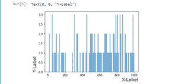
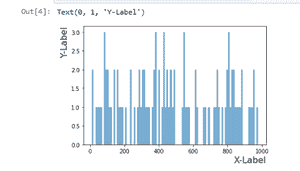

# 如何在 Matplotlib 中调整轴标签的位置？

> 原文:[https://www . geeksforgeeks . org/matplotlib 中如何调整轴标签位置/](https://www.geeksforgeeks.org/how-to-adjust-position-of-axis-labels-in-matplotlib/)

在本文中，我们将看到如何在 Matplotlib 中调整 x 轴和 y 轴标签的位置，Matplotlib 是一个用 python 语言进行绘图的库。默认情况下，这些标签放在中间，但是我们可以使用 matplotlib 的 set_xlabel 和 set_ylabel 函数中的“loc”参数来更改这些位置。

**注意:****【loc】**参数仅在**Matplotlib 3 . 3 . 0 版**之后可用。

**让我们一步一步来理解:**

**第一步:**

首先，让我们导入所有需要的库。

## 蟒蛇 3

```
import matplotlib.pyplot as plt
import numpy as np
```

**第二步:**

现在我们将使用 NumPy 库创建假数据。这里我们使用随机模块中的样本子模块来创建随机值的数据集。

## 蟒蛇 3

```
from random import sample
data = sample(range(1, 1000), 100)
```

**第三步:**

现在我们已经创建了数据，让我们使用 matplotlib 的默认选项绘制这些数据，然后开始实验它的位置。我们可以清楚地看到，默认情况下，这些标签位于中心。bin 参数告诉您数据将被划分到的 bin 的数量。Matplotlib 允许您使用 alpha 属性调整曲线图的透明度。默认情况下，alpha=1

## 蟒蛇 3

```
fig, ax = plt.subplots() 
ax.hist( data, bins = 100, alpha = 0.6) 
ax.set_xlabel("X-Label" , fontsize = 16)
ax.set_ylabel("Y-label" , fontsize = 16)
```

**输出:**


标签的默认位置

## 使用 loc 参数更改标签的位置

在这里，我们将使用 loc 参数将 y 标签移动到底部，将 x 标签移动到最右边。

## 蟒蛇 3

```
fig, ax = plt.subplots() 
ax.hist( data, bins = 100, alpha = 0.6) 
ax.set_xlabel("X-Label",
              fontsize = 16, loc = "right")

ax.set_ylabel("Y-Label", 
              fontsize = 16, loc = "bottom")
```

**输出:**



底部是 y 标签，最右边是 X 标签

让我们再举一个例子，我们将把 y 标签移到顶部。

## 蟒蛇 3

```
fig, ax = plt.subplots() 
ax.hist( data, bins = 100, alpha = 0.6) 
ax.set_xlabel("X-Label", 
              fontsize = 16, loc = "right")

ax.set_ylabel("Y-Label", 
              fontsize = 16, loc = "top")
```

**输出:**



顶部的 y 标签和最右侧的 X 标签