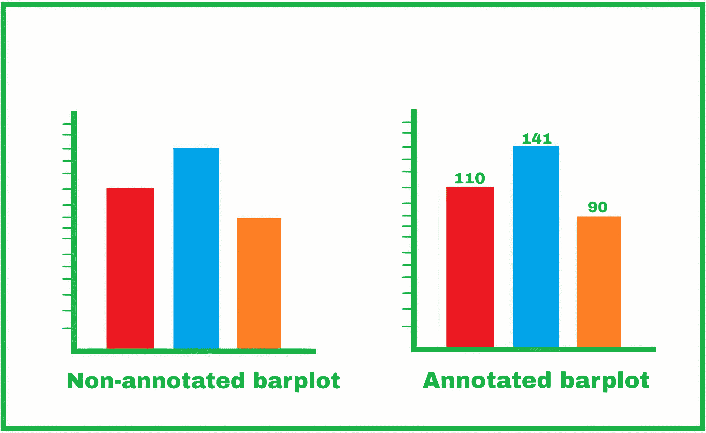
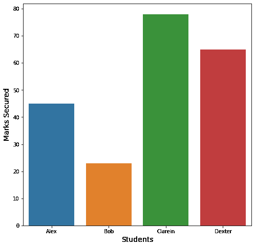

# 如何用 Python 中的 Matplotlib 标注 Barplot 中的条？

> 原文:[https://www . geeksforgeeks . org/如何用 python 中的 matplotlib 注释 bar-in-bar plot/](https://www.geeksforgeeks.org/how-to-annotate-bars-in-barplot-with-matplotlib-in-python/)

**注释**是指在图表中添加注释，说明它代表什么值。当图形被缩小或被过度填充时，用户经常会从图形中读取值。在本文中，我们将讨论如何使用 *matplotlib* 库来注释 python 中创建的条形图。

以下是带注释和不带注释的条形图示例:



未注释与注释条形图

### **分步方法:**

*   让我们首先绘制熊猫数据帧的简单图表，现在我们已经准备好了以下数据帧:

## 蟒蛇 3

```
# Importing libraries for dataframe creation
# and graph plotting
import numpy as np
import pandas as pd
import seaborn as sns
import matplotlib.pyplot as plt

# Creating our own dataframe
data = {"Name": ["Alex", "Bob", "Clarein", "Dexter"],
        "Marks": [45, 23, 78, 65]}

# Now convert this dictionary type data into a pandas dataframe
# specifying what are the column names
df = pd.DataFrame(data, columns=['Name', 'Marks'])
```

**输出:**


用户生成的熊猫数据帧

*   现在让我们开始使用*海底*库绘制数据框。我们得到以下结果。但是不太清楚条形图中的实际值是多少。当相邻地块的值非常接近时，也会出现这种情况。

## 蟒蛇 3

```
# Defining the plotsize
plt.figure(figsize=(8, 6))

# Defining the x-axis, the y-axis and the data
# from where the values are to be taken
plots = sns.barplot(x="Name", y="Marks", data=df)

# Setting the x-acis label and its size
plt.xlabel("Students", size=15)

# Setting the y-axis label and its size
plt.ylabel("Marks Secured", size=15)

# Finallt plotting the graph
plt.show()
```

**输出:**



数据框的原始条形图

*   添加注释。我们这里的策略是遍历所有的条，并在所有的条上放一个文本，指出特定条的值。这里我们将使用 Matplpotlib 的名为**的函数注释()。**我们可以在各种场景中找到该功能的各种用途，目前，我们将只是在顶部显示各个条的值。

我们的步骤是:

1.  遍历这些条
2.  得到横条的 x 轴位置(x)和宽度(w)这将帮助我们得到文字的 x 坐标即 *get_x()+get_width()/2* 。
3.  文本的 y 坐标(y)可以使用条的高度找到，即 *get_height()*
4.  所以我们有了坐标的标注值即 *get_x()+get_width()/2，get_height()*
5.  但是这会将注释精确地打印在条的边界上，因此为了获得更令人满意的注释图，我们使用参数 *xyplot=(0，8)* 。这里 8 表示将从条的顶部离开的像素。因此，我们可以使用 *xy=(0，-8)* 来低于该条线。
6.  因此，我们执行以下代码来获得带注释的图:

## 蟒蛇 3

```
# Defining the plot size
plt.figure(figsize=(8, 8))

# Defining the values for x-axis, y-axis
# and from which dataframe the values are to be picked
plots = sns.barplot(x="Name", y="Marks", data=df)

# Iterrating over the bars one-by-one
for bar in plots.patches:

  # Using Matplotlib's annotate function and
  # passing the coordinates where the annotation shall be done
  # x-coordinate: bar.get_x() + bar.get_width() / 2
  # y-coordinate: bar.get_height()
  # free space to be left to make graph pleasing: (0, 8)
  # ha and va stand for the horizontal and vertical alignment
    plots.annotate(format(bar.get_height(), '.2f'),
                   (bar.get_x() + bar.get_width() / 2,
                    bar.get_height()), ha='center', va='center',
                   size=15, xytext=(0, 8),
                   textcoords='offset points')

# Setting the label for x-axis
plt.xlabel("Students", size=14)

# Setting the label for y-axis
plt.ylabel("Marks Secured", size=14)

# Setting the title for the graph
plt.title("This is an annotated barplot")

# Finally showing the plot
plt.show()
```

**输出:**


用条形图值注释的条形图

**以下是基于上述方法的完整程序:**

## 蟒蛇 3

```
# Importing libraries for dataframe creation
# and graph plotting
import numpy as np
import pandas as pd
import seaborn as sns
import matplotlib.pyplot as plt

# Creating our own dataframe
data = {"Name": ["Alex", "Bob", "Clarein", "Dexter"],
        "Marks": [45, 23, 78, 65]}

# Now convert this dictionary type data into a pandas dataframe
# specifying what are the column names
df = pd.DataFrame(data, columns=['Name', 'Marks'])

# Defining the plot size
plt.figure(figsize=(8, 8))

# Defining the values for x-axis, y-axis
# and from which dataframe the values are to be picked
plots = sns.barplot(x="Name", y="Marks", data=df)

# Iterrating over the bars one-by-one
for bar in plots.patches:

  # Using Matplotlib's annotate function and
  # passing the coordinates where the annotation shall be done
  # x-coordinate: bar.get_x() + bar.get_width() / 2
  # y-coordinate: bar.get_height()
  # free space to be left to make graph pleasing: (0, 8)
  # ha and va stand for the horizontal and vertical alignment
  plots.annotate(format(bar.get_height(), '.2f'),
                   (bar.get_x() + bar.get_width() / 2,
                    bar.get_height()), ha='center', va='center',
                   size=15, xytext=(0, 8),
                   textcoords='offset points')

# Setting the label for x-axis
plt.xlabel("Students", size=14)

# Setting the label for y-axis
plt.ylabel("Marks Secured", size=14)

# Setting the title for the graph
plt.title("This is an annotated barplot")

# Finally showing the plot
plt.show()
```