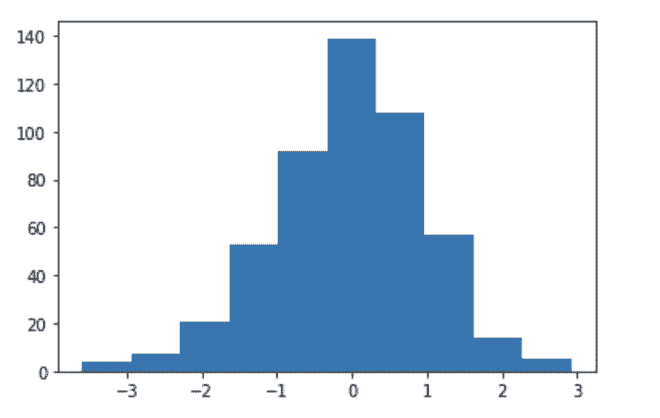
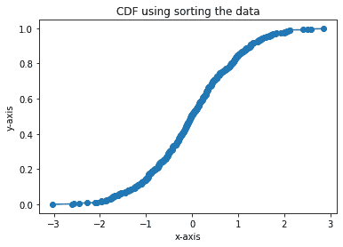

# 如何用 Python 中的 Matplotlib 计算并绘制一个累积分布函数？

> 原文:[https://www . geeksforgeeks . org/如何用 python 中的 matplotlib 计算和绘制累积分布函数/](https://www.geeksforgeeks.org/how-to-calculate-and-plot-a-cumulative-distribution-function-with-matplotlib-in-python/)

**先决条件:** [**马特洛特利**](https://www.geeksforgeeks.org/python-introduction-matplotlib/)

Matplotlib 是 Python 中的一个库，它是 NumPy 库的数字-数学扩展。实值随机变量 X 的[累积分布函数](https://www.geeksforgeeks.org/mathematics-probability-distributions-set-1/) (CDF)，或者只是 X 的分布函数，在 X 处求值，是 X 取小于或等于 X 的值的概率。

**CDF 的性质:**

*   每个累积分布函数 F(X)都是非递减的
*   如果 cdf 函数的最大值在 x，F(x) = 1。
*   CDF 的范围从 0 到 1。

### 方法 1:使用直方图

可以使用概率分布函数计算 CDF。随机变量的每个点将累积形成 CDF。

**示例:**

> 包含 2 个球的组合套装可以是红色或蓝色的，可以在下面的套装中。
> 
> {RR，RB，BR，BB}
> 
> t ->红球数量。
> 
> P(x = t) -> t = 0 : 1 / 4 [BB]
> 
> t = 1 : 2 / 4 [RB，BR]
> 
> t = 2 : 1 / 4 [RR]
> 
> **CDF :**
> 
> F(x) = P(x<=t)
> 
> x = 0 : P(0) -> 1 / 4
> 
> x = 1 : P(1) + P(0) -> 3 / 4
> 
> x = 2 : P(2) + P(1) + P(0) -> 1

**接近**

*   导入模块
*   声明数据点的数量
*   初始化随机值
*   使用上述数据绘制直方图
*   获取直方图数据
*   使用直方图数据查找 PDF
*   计算 CDF
*   CDF 打印

**示例:**

## 蟒蛇 3

```
# defining the libraries
import numpy as np
import matplotlib.pyplot as plt
import pandas as pd
%matplotlib inline

# No of Data points
N = 500

# initializing random values
data = np.random.randn(N)

# getting data of the histogram
count, bins_count = np.histogram(data, bins=10)

# finding the PDF of the histogram using count values
pdf = count / sum(count)

# using numpy np.cumsum to calculate the CDF
# We can also find using the PDF values by looping and adding
cdf = np.cumsum(pdf)

# plotting PDF and CDF
plt.plot(bins_count[1:], pdf, color="red", label="PDF")
plt.plot(bins_count[1:], cdf, label="CDF")
plt.legend()
```

**输出:**

PDF 和 CDF 的直方图:



绘制的 CDF:


CDF 绘图

### 方法 2:数据排序

该方法描述了如何使用排序数据计算和绘制 CDF。为此，我们首先对数据进行排序，然后处理进一步的计算。

**接近**

*   导入模块
*   声明数据点的数量
*   创建数据
*   按升序对数据进行排序
*   获取 CDF
*   CDF 打印
*   显示图

**示例:**

## 蟒蛇 3

```
# defining the libraries
import numpy as np
import matplotlib.pyplot as plt
import pandas as pd
%matplotlib inline

# No of data points used
N = 500

# normal distribution
data = np.random.randn(N)

# sort the data in ascending order
x = np.sort(data)

# get the cdf values of y
y = np.arange(N) / float(N)

# plotting
plt.xlabel('x-axis')
plt.ylabel('y-axis')

plt.title('CDF using sorting the data')

plt.plot(x, y, marker='o')
```

**输出:**

