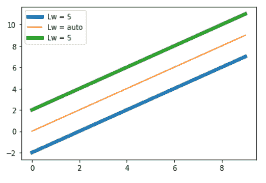
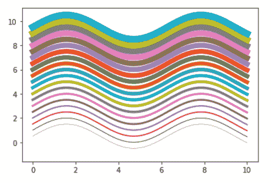

# 如何用 Python 在 Matplotlib 中更改图形绘制的线宽？

> 原文:[https://www . geeksforgeeks . org/如何用 python 更改 matplotlib 中图形的线宽/](https://www.geeksforgeeks.org/how-to-change-the-line-width-of-a-graph-plot-in-matplotlib-with-python/)

**先决条件** : [马特洛特利布](https://www.geeksforgeeks.org/python-introduction-matplotlib/)

在本文中，我们将学习如何用 Python 在 Matplotlib 中更改图形绘制的线宽。为此，必须熟悉给定的概念:

*   [**Matplotlib**](https://www.geeksforgeeks.org/python-introduction-matplotlib/)**:**Matplotlib 是一个巨大的 Python 可视化库，用于数组的 2D 图。Matplotlib 可能是一个多平台数据可视化库，构建在 NumPy 数组上，旨在与更广泛的 SciPy 堆栈一起工作。它是由约翰·亨特在 2002 年推出的。
*   [**曲线图**](https://www.geeksforgeeks.org/graph-plotting-in-python-set-1/) **:** 曲线图是一种表示数据集的图形技术，通常表现为显示两个或多个变量之间关系的曲线图。
*   **线宽:**一条线的宽度称为线宽。可以使用一个特性在 matplotlib 中改变图形的线宽。

### 方法

*   导入包
*   导入或创建数据
*   用线画一个曲线图
*   使用线宽功能设置线宽(lw 也可以用作短形式)。

**例 1:**

## 蟒蛇 3

```
# importing packages
import matplotlib.pyplot as plt
import numpy as np

# create data
x_values = np.arange(0, 10)
y_values = np.arange(0, 10)

# Adjust the line widths
plt.plot(x_values, y_values - 2, linewidth=5)
plt.plot(x_values, y_values)
plt.plot(x_values, y_values + 2, lw=5)

# add legends and show
plt.legend(['Lw = 5', 'Lw = auto', 'Lw = 5'])
plt.show()
```

**输出:**



**例 2 :**

## 蟒蛇 3

```
# importing packages
import matplotlib.pyplot as plt
import numpy as np

# create data
x_values = np.linspace(0, 10, 1000)
y_values = np.sin(x_values)

# Adjust the line widths
for i in range(20):
    plt.plot(x_values, y_values + i*0.5, lw=i*0.5)

plt.show()
```

**输出:**



**例 3 :**

## 蟒蛇 3

```
# importing packages
import matplotlib.pyplot as plt
import numpy as np

# create data
x_values = np.linspace(0, 10, 1000)

# Adjust the line widths
for i in range(20):
    plt.plot(x_values, np.sin(x_values) + i*0.5, lw=i*0.4)
    plt.plot(x_values, np.cos(x_values) + i*0.5, lw=i*0.4)

plt.show()
```

**输出:**

