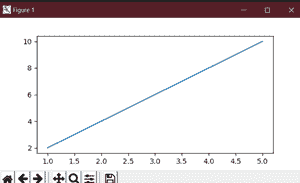
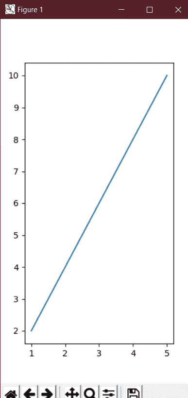

# 如何改变 matplotlib 绘制的图形大小？

> 原文:[https://www . geeksforgeeks . org/如何更改用 matplotlib 绘制的图形大小/](https://www.geeksforgeeks.org/how-to-change-the-size-of-figures-drawn-with-matplotlib/)

matplotlib 的主要目的是创建一个表示数据的图形。可视化数据的用途是通过将数据整理成更容易理解的形式来讲述故事，突出趋势和异常值。我们可以用所有不同类型的数据填充图形，包括轴、曲线图、几何形状等。“当”我们绘制图形时，我们可能希望将图形的大小设置为某个大小。你可能想让身材变宽，变高，等等。

这可以通过一个名为**的属性 **matplotlib** 来实现。figsize 属性允许我们以单位英寸来指定图形的宽度和高度。**

> **语法:**
> 
> 将 matplotlib.pyplot 输入为 plt
> 
> fig _ name = PLT . fig(fig size =(宽度、高度))

figsize 属性是函数 fig()的一个参数。它是一个可选属性，默认情况下，图形的尺寸为(6.4，4.8)。这是一个标准图，函数中没有提到属性。

通常每个单位英寸是 80×80 像素。每单位英寸的像素数可以通过参数 **dpi、**来改变，也可以在同一功能中指定。

**进场:**

*   我们创建一个变量 plt_1，并将其设置为，PLT . fig size =(6，3))。
*   这将创建一个宽度为 6 英寸、高度为 3 英寸的图形对象。
*   figsize 属性的值是 2 个值的元组。

**例 1** :

## 蟒蛇 3

```
# We start by importing matplotlib
import matplotlib.pyplot as plt

# Plotting a figure of width 6 and height 3
plt_1 = plt.figure(figsize=(6, 3))

# Let's plot the equation y=2*x
x = [1, 2, 3, 4, 5]

# y = [2,4,6,8,10]
y = [x*2 for x in x]

# plt.plot() specifies the arguments for x-axis
# and y-axis to be plotted
plt.plot(x, y)

# To show this figure object, we use the line,
# fig.show()
plt.show()
```

**输出:**

如果您使用的是除 jupyter 笔记本之外的 python IDE，那么这种方法是可行的。如果您正在使用

jupyter 笔记本，那你就不会用了，plt.show()。相反，您可以在

导入 matplotlib % matplotlib 后的代码。



**例 2:**

为了了解 matplotlib 中图形大小调整的动态特性，现在我们需要创建一个尺寸反转的图形。高度现在将是宽度的两倍。

## 蟒蛇 3

```
# We start by importing matplotlib
import matplotlib.pyplot as plt

# Plotting a figure of width 3 and height 6
plt_1 = plt.figure(figsize=(3, 6))

# Let's plot the equation y=2*x
x = [1, 2, 3, 4, 5]

# y = [2,4,6,8,10]
y = [x*2 for x in x]

# plt.plot() specifies the arguments for
# x-axis and y-axis to be plotted
plt.plot(x, y)

# To show this figure object, we use the line,
# fig.show()
plt.show()
```

**输出:**

