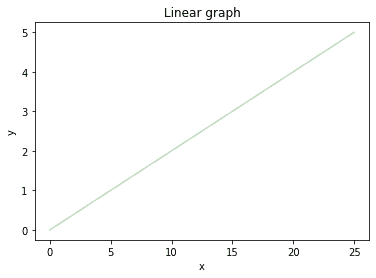
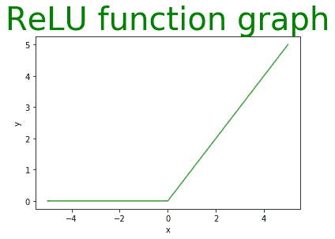
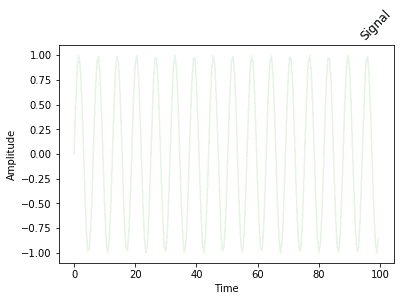
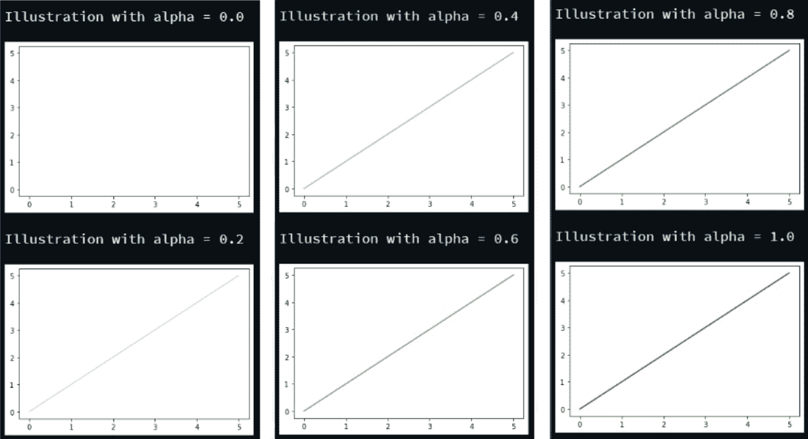

# 如何用 Python 改变 Matplotlib 中一个图形图的透明度？

> 原文:[https://www . geeksforgeeks . org/如何用 python 更改图中图的透明度/](https://www.geeksforgeeks.org/how-to-change-the-transparency-of-a-graph-plot-in-matplotlib-with-python/)

[**Matplotlib**](https://www.geeksforgeeks.org/python-introduction-matplotlib/) 是 Python 中的一个库，它是 *NumPy* 库的数值-数学扩展。 [***Pyplot***](https://www.geeksforgeeks.org/pyplot-in-matplotlib/) 是一个基于状态的 m *atplotlib* 模块的接口，提供了一个类似 MATLAB 的接口。 *Pyplot* 中可以使用的各种图有线图、等高线图、直方图、散点图、三维图等。

为了在 *matplotlib* 中改变图形图的透明度，我们将使用 *matplotlib.pyplot.plot()* 函数。 *matplotlib* 库中*绘图()* 功能用于制作 2D 插图。

> **语法:**matplotlib . pyplot . plot(\ * args，scalex=True，scaley=True，data=None，\*\*kwargs)
> 
> **参数:**该方法接受以下描述的参数:
> 
> *   **x，y:** 这些参数是数据点的水平和垂直坐标。x 值是可选的。
> *   **fmt:** 该参数为可选参数，包含字符串值。
> *   **数据:**该参数为可选参数，是一个带有标签数据的对象。
> 
> **返回:**这将返回以下内容:
> 
> *   **线:**这将返回表示打印数据的线 2D 对象列表。

我们将要使用的另一个参数是 **alpha** 参数，这个参数负责使用 matplotlib 库描述的任何插图的透明度。它的值范围从 0 到 1，默认情况下，它的值是 1，表示插图的不透明度。

### 以下是一些描述如何使用 *matplotlib* 库更改曲线图透明度的示例

**例 1:**

## 蟒蛇 3

```
# importing module
import matplotlib.pyplot as plt

# assigning x and y coordinates
y = [0, 1, 2, 3, 4, 5]
x = [0, 5, 10, 15, 20, 25]

# depicting the visualization
plt.plot(x, y, color='green', alpha=0.25)
plt.xlabel('x')
plt.ylabel('y')

# displaying the title
plt.title("Linear graph")

plt.show()
```

**输出:**



在上面的程序中，线性图是用透明度描述的，即*α= 0.25。*

**例 2:**

## 蟒蛇 3

```
# importing module
import matplotlib.pyplot as plt

# assigning x and y coordinates
x = [-5, -4, -3, -2, -1, 0, 1, 2, 3, 4, 5]
y = []

for i in range(len(x)):
    y.append(max(0, x[i]))

# depicting the visualization
plt.plot(x, y, color='green', alpha=0.75)
plt.xlabel('x')
plt.ylabel('y')

# displaying the title
plt.title(label="ReLU function graph",
                fontsize=40,
                color="green")
```

**输出:**



这里，由于*α*值接近 1(不透明)，该图相当不透明。

**例 3:**

## 蟒蛇 3

```
# importing modules
from matplotlib import pyplot
import numpy

# assigning time values of the signal
# initial time period, final time period
# and phase angle
signalTime = numpy.arange(0, 100, 0.5)

# getting the amplitude of the signal
signalAmplitude = numpy.sin(signalTime)

# depicting the visualization
pyplot.plot(signalTime, signalAmplitude, 
            color='green', alpha=0.1)

pyplot.xlabel('Time')
pyplot.ylabel('Amplitude')

# displaying the title
pyplot.title("Signal",
             loc='right',
             rotation=45)
```

**输出:**



上面的例子描述了一个*α*值为 0.1 的信号。

**例 4:**

## 蟒蛇 3

```
# importing module
import matplotlib.pyplot as plt

# assigning x and y coordinates
z = [i for i in range(0, 6)]

for i in range(0, 11, 2):

    # depicting the visualization
    plt.plot(z, z, color='green', alpha=i/10)
    plt.xlabel('x')
    plt.ylabel('y')

    # displaying the title
    print('\nIllustration with alpha =', i/10)

    plt.show()
```

**输出:**



上面的程序用可变的 alpha 值描述了相同的图示。