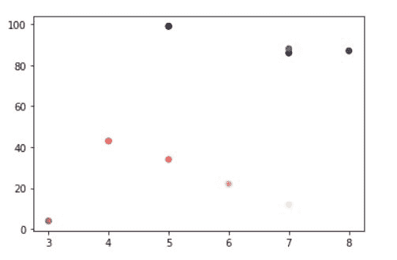

# 如何在 Matplotlib 中用变量给散点图上色？

> 原文:[https://www . geesforgeks . org/how-to-color-distributed-by-a-variable-in-matplotlib/](https://www.geeksforgeeks.org/how-to-color-scatterplot-by-a-variable-in-matplotlib/)

在本文中，我们将看到如何在 [Matplotlib](https://www.geeksforgeeks.org/python-introduction-matplotlib/) 中通过变量给散点图着色。这里我们将使用 [matplotlib.pyplot .散点图()](https://www.geeksforgeeks.org/matplotlib-pyplot-scatter-in-python/)方法 matplotlib 库用于绘制散点图。散点图广泛用于表示变量之间的关系以及一个变量的变化如何影响另一个变量。

> **语法:***matplotlib . pyplot . scatter(x _ axis _ data，y_axis_data，**s =无，c =无，marker =无，cmap =无，vmin =无，vmax =无，alpha =无，线宽=无，edgecolors =无* *)*

**示例 1:通过变量值的颜色散点图。**

在这个例子中，我们将看到如何用变量值给散点图着色。这里我们将绘制一个简单的散点图，包含 x 和 y 数据，然后使用 **c** 属性为点着色(散点图变量点)。

## 蟒蛇 3

```
import matplotlib.pyplot as plt 

x =[5, 7, 8, 7, 2, 17, 2, 9, 
    4, 11, 12, 9, 6] 

y =[99, 86, 87, 88, 100, 86, 
    103, 87, 94, 78, 77, 85, 86] 

plt.scatter(x, y, c = 'red') 

# To show the plot 
plt.show() 
```

**输出:**


**示例 2:具有相关** **值的颜色散点图点。**

在这个例子中，我们将根据另一个变量绘制一个变量。有时我们需要精确的可视化，所以在这种情况下，它可以帮助我们可视化依赖于另一个变量的数据。这里，我们将对每个点使用三个不同的值，并对特定数据使用 colormap。

## 蟒蛇 3

```
import matplotlib.pyplot as plt 

x =[5, 7, 8, 7, 3, 4, 5, 6, 7]

y =[99, 86, 87, 88, 4, 43, 34, 22, 12]

z = [1,2,3,4, 5, 6, 7, 8, 9]

plt.scatter(x, y, c = z , cmap = "magma")
```

**输出:**

