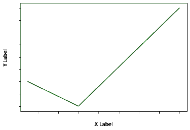
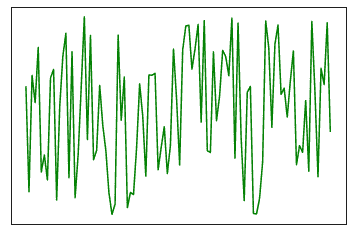
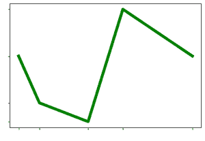
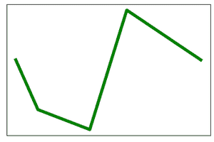

# 如何在 Matplotlib 中隐藏轴文本刻度或刻度标签？

> 原文:[https://www . geesforgeks . org/如何隐藏轴-文本-刻度-或-刻度-标签-in-matplotlib/](https://www.geeksforgeeks.org/how-to-hide-axis-text-ticks-or-tick-labels-in-matplotlib/)

**先决条件:**T2【马特洛特利

默认情况下，Matplotlib 库显示轴刻度和刻度标签。有时需要隐藏这些轴刻度和刻度标签。本文讨论了一些可以做到这一点的方法。

### 使用的功能:

*   **XT ticks(*****)ticks = None，labels=None，* * kwargs*****)**–用于获取和设置 x 轴的当前 tick 位置和标签。
*   **yticks(** ***刻度=无，标签=无，**kwargs*** **)-** 用于获取和设置 y 轴的当前刻度位置和标签。
*   **集合 _ 可见(** ***布尔*** **)-** 集合可见

### 隐藏刻度标签

**方法 1:**

函数 xticks()和 yticks()用于表示数据点应该显示的位置。他们以一份清单作为论据。因此，可以通过将 xticks 和 yticks 设置为空列表来禁用轴文本刻度或刻度标签，如下所示:

```
plt.xticks([])
plt.yticks([])
```

**例 1:**

## 蟒蛇 3

```
import matplotlib.pyplot as plt

x1 = [5, 8, 10]
y1 = [12, 16, 8]
x2 = [6, 9, 12]
y2 = [14, 10, 8]

plt.plot(x1, y1, 'g', linewidth=7)
plt.plot(x2, y2, 'b', linewidth=7)

plt.title('Disabling xticks and yticks', fontsize=20)

plt.xlabel('X axis', fontsize=15)
plt.ylabel('Y axis', fontsize=15)

# disabling xticks by Setting xticks to an empty list
plt.xticks([])  

# disabling yticks by setting yticks to an empty list
plt.yticks([])  

plt.show()
```

**输出:**


**方法二:**

默认情况下，在 matplotlib 库中，地块绘制在白色背景上。因此，将刻度标签的颜色设置为白色可以使轴刻度标签隐藏。为此，只有颜色属性需要与 w(代表白色)一起作为一个值传递给 xticks()和 yticks()函数。实现如下:

**例 2:**

## 蟒蛇 3

```
import matplotlib.pyplot as plt

plt.plot([5, 10, 20], [20, 10, 50], color='g')

plt.xlabel("X Label")
plt.ylabel("Y Label")

# xticks color white
plt.xticks(color='w')

# yticks color white
plt.yticks(color='w')

plt.show()
```

**输出:**



**方法 3:**

空定位器是一种刻度定位器，它使轴刻度和刻度标签消失。简单地传递 NullLocator()函数就足够了。

**示例 3:**

## 蟒蛇 3

```
import numpy as np
import matplotlib.ticker as ticker

ax = plt.axes()

x = np.random.rand(100)
ax.plot(x, color='g')

ax.xaxis.set_major_locator(ticker.NullLocator())
ax.yaxis.set_major_locator(ticker.NullLocator())
```

**输出:**



**方法 4:**

请仔细观察 xticks()和 yticks()的语法，如果只是将一个空格和数据一起传递给它们，输出将是我们想要的结果。

**例 4:**

## 蟒蛇 3

```
import matplotlib.pyplot as plt

x = [5, 8, 15, 20, 30]
y = [15, 10, 8, 20, 15]
plt.plot(x, y, color='g', linewidth=5)

# x-label as blank
plt.xticks(x, " ")

# y-label as blank
plt.yticks(y, " ")

plt.show()
```

**输出:**


**方法 5:**

这个方法只是方法 4 的修改。不要传递空字符串，而是在函数本身中将 label 指定为空格。

**例 5:**

## 蟒蛇 3

```
import matplotlib.pyplot as plt

x = [5, 8, 15, 20, 30]
y = [15, 10, 8, 20, 15]
plt.plot(x, y, color='g', linewidth=5)

plt.xticks(x, labels=" ")
plt.yticks(y, labels=" ")

plt.show()
```

**输出:**



**方法 6:**

使用 set _ visibile()，我们还可以将刻度标签的可见性设置为 False，这不会使它们出现在我们的绘图中。这个方法隐藏了标签和记号，所以如果某些需求需要显示记号，这不是 for 的选项，但是上面显示的多种方法是理想的。

**例 6:**

## 蟒蛇 3

```
import matplotlib.pyplot as plt

x = [5, 8, 15, 20, 30]
y = [15, 10, 8, 20, 15]
plt.plot(x, y, color='g', linewidth=5)

# getting current axes
a = plt.gca()

# set visibility of x-axis as False
xax = a.axes.get_xaxis()
xax = xax.set_visible(False)

# set visibility of y-axis as False
yax = a.axes.get_yaxis()
yax = yax.set_visible(False)

plt.show()
```

**输出:**

