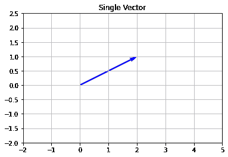
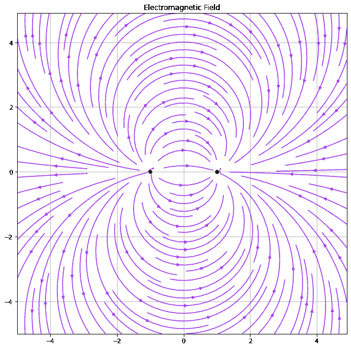

# 如何在 Matplotlib 中绘制一个简单的矢量场？

> 原文:[https://www . geeksforgeeks . org/如何绘制 matplotlib 中的简单矢量场/](https://www.geeksforgeeks.org/how-to-plot-a-simple-vector-field-in-matplotlib/)

包含大小和方向的量称为矢量。简单地说，我们可以说，向量场是这样的向量在空间子集上的参与或协作。矢量场是理解我们现实生活环境的关键方面。

为了更直观，您可以将向量场视为表示多变量函数，其输入和输出空间都具有相同的维度。矢量场中绘制的箭头长度通常不是按比例绘制的，但是一个矢量的长度与另一个矢量的长度之比应该是准确的。

在本文中，我们将讨论如何在 python 中绘制矢量场。为了执行此任务，我们将使用 *matplotlib* 模块中的*颤()*方法和 *streamplot()* 方法。

**语法:**

使用*颤颤()*方法绘制矢量场:

> matplotlib.pyplot.quiver(X、y、u、v、**kw)

其中 X *，Y* 定义矢量位置，U *，V* 是相对于矢量位置的方向箭头。

要使用 *streamplot()* 方法绘制矢量场:

> matplotlib.pyplot.streamplot(X，Y，U，V，密度=1，线宽=无，颜色=无，**kw)

其中 X，Y 是均匀间隔的网格[1D 阵列]，U 和 V 代表网格上每个点的流速。密度是地块每一面积的矢量数。线宽代表流线的厚度。

**以下是一些描述如何使用*****matplotlib*****模块绘制矢量场的示例:**

**示例 1:** 使用 *matplotlib* 模块中的*颤()*方法绘制单个矢量。

## 蟒蛇 3

```py
# Import libraries
import numpy as np
import matplotlib.pyplot as plt

# Vector origin location
X = [0]
Y = [0]

# Directional vectors
U = [2] 
V = [1] 

# Creating plot
plt.quiver(X, Y, U, V, color='b', units='xy', scale=1)
plt.title('Single Vector')

# x-lim and y-lim
plt.xlim(-2, 5)
plt.ylim(-2, 2.5)

# Show plot with grid
plt.grid()
plt.show()
```

**输出:**



**示例 2:** 使用*颤()*方法生成多个向量。

## 蟒蛇 3

```py
# Import libraries
import numpy as np
import matplotlib.pyplot as plt

# Vector origin location
X = [0]
Y = [0]

# Directional vectors
U = [2] 
V = [1] 

# Creating plot
plt.quiver(X, Y, U, V, color='b', units='xy', scale=1)
plt.title('Single Vector')

# x-lim and y-lim
plt.xlim(-2, 5)
plt.ylim(-2, 2.5)

# Show plot with grid
plt.grid()
plt.show()
```

**输出:**


**示例 3:** 使用 *matplotlib* 模块中的 *streamplot()* 方法绘制多个矢量。

## 蟒蛇 3

```py
# Import required modules
import numpy as np
import matplotlib.pyplot as plt

# 1D arrays
x = np.arange(-5,5,0.1)
y = np.arange(-5,5,0.1)

# Meshgrid
X,Y = np.meshgrid(x,y)

# Assign vector directions
Ex = (X + 1)/((X+1)**2 + Y**2) - (X - 1)/((X-1)**2 + Y**2)
Ey = Y/((X+1)**2 + Y**2) - Y/((X-1)**2 + Y**2)

# Depict illustration
plt.figure(figsize=(10, 10))
plt.streamplot(X,Y,Ex,Ey, density=1.4, linewidth=None, color='#A23BEC')
plt.plot(-1,0,'-or')
plt.plot(1,0,'-og')
plt.title('Electromagnetic Field')

# Show plot with grid
plt.grid()
plt.show()
```

**输出:**

