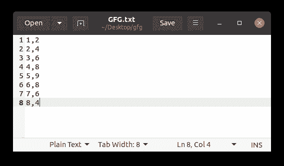

# 如何使用 Matplotlib 从文本文件中绘制数据？

> 原文:[https://www . geeksforgeeks . org/如何使用-matplotlib/](https://www.geeksforgeeks.org/how-to-plot-data-from-a-text-file-using-matplotlib/) 从文本文件绘制数据

**搜索:**[【matplot lib】](https://www.geeksforgeeks.org/python-introduction-matplotlib/)、[【num py】](https://www.geeksforgeeks.org/numpy-in-python-set-1-introduction/)

在本文中，我们将看到如何为[**【Matplotlib】**](https://www.geeksforgeeks.org/python-introduction-matplotlib/)加载数据文件。Matplotlib 是一个用于数据可视化的 2D Python 库。我们可以使用相同的数据绘制不同类型的图表，例如:

*   条形图
*   线图
*   发散图
*   直方图和许多图表。

在本文中，我们将学习如何使用**“Matplotlib”**python 模块从文件中加载数据来制作图形。这里我们还将讨论从文件中提取数据的两种不同方法。在第一个模块中，我们将讨论使用内置的 **CVS** 模块提取数据，在第二个模块中，我们将使用第三方**【NumPy】**模块从文件中提取数据。

**要求:**

应该从中提取数据的文本文件。让文件名= GFG.txt



**方法 1:** 在这个方法中，我们将使用 CSV 模块提取数据来加载 CVS 文件。

**第一步:**

导入所有必需的模块。

## 蟒蛇 3

```py
import matplotlib.pyplot as plt
import csv
```

**步骤 2:** 创建 X 和 Y 变量，从文本文件中存储 X 轴数据和 Y 轴数据。

## 蟒蛇 3

```py
import matplotlib.pyplot as plt
import csv

X = []
Y = []
```