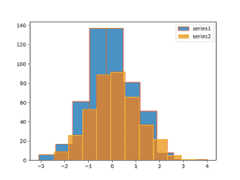
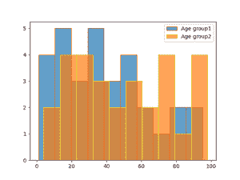
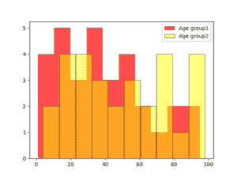

# 如何在 Matplotlib 中一起绘制两个直方图？

> 原文:[https://www . geeksforgeeks . org/如何在 matplotlib 中绘制两个直方图/](https://www.geeksforgeeks.org/how-to-plot-two-histograms-together-in-matplotlib/)

**先决条件**:

*   [Matplotlib](https://www.geeksforgeeks.org/python-introduction-matplotlib/)

直方图是将分组数据点组织到指定范围内的图形表示。创建直方图提供了数据分布的可视化表示。通过使用直方图，我们可以将大量数据及其频率表示为一个连续的图。

### 使用的功能

为了在 Matplotlib 中创建直方图，我们使用了属于 pyplot 模块的 hist()函数。为了一起绘制两个直方图，我们必须通过给定一些设置，对两个数据集分别使用 hist()函数。

**语法:**

> matplotlib.pyplot.hist(x，bins，edgecolor，label)

**参数:**

<figure class="table">

| **参数** | **描述** |
| x | 用于绘制直方图的数组或数据集 |
| 垃圾箱 | 用于区间的整数值或序列 |
| edgecolor 或 ec | 设置直方图条的边缘颜色 |
| 颜色 | 设置直方图条的条颜色 |
| 标签 | 用于表示直方图的标签，它是字符串类型。 |
| 希腊字母的第一个字母 | 用于设置透明度。 |
| 标签 | 用于表示直方图的名称或标签。 |

</figure>

### 方法

*   导入模块
*   为两个数据集创建或加载数据
*   分别绘制两个数据帧的直方图
*   把它们连在一起

**例 1:**

## 计算机编程语言

```
# importing libraries
import matplotlib.pyplot as plt
import numpy as np

# generating two series of random 
# values using numpy random module 
# of shape (500,1)
series1 = np.random.randn(500, 1)
series2 = np.random.randn(400, 1)

# plotting first histogram
plt.hist(series1)

# plotting second histogram
plt.hist(series2)

# Showing the plot using plt.show()
plt.show()
```

**输出:**


**例 2:**

## 计算机编程语言

```
# importing libraries
import matplotlib.pyplot as plt
import numpy as np
from numpy.lib.histograms import histogram

# generating two series of random values 
# using numpy random module of shape (500,1)
series1 = np.random.randn(500, 1)
series2 = np.random.randn(400, 1)

# plotting first histogram
plt.hist(series1, label='series1', alpha=.8, edgecolor='red')

# plotting second histogram
plt.hist(series2, label='series2', alpha=0.7, edgecolor='yellow')
plt.legend()

# Showing the plot using plt.show()
plt.show()
```

**输出:**



**示例 3:** 代表两个年龄组的直方图

## 计算机编程语言

```
# importing libraries
import matplotlib.pyplot as plt

# giving two age groups data
age_g1 = [1, 3, 5, 10, 15, 17, 18, 16, 19, 21,
          23, 28, 30, 31, 33, 38, 32, 40, 45, 
          43, 49, 55, 53, 63, 66, 85, 80, 57, 
          75, 93, 95]

age_g2 = [6, 4, 15, 17, 19, 21, 28, 23, 31, 36,
          39, 32, 50, 56, 59, 74, 79, 34, 98, 97,
          95, 67, 69, 92, 45, 55, 77, 76, 85]

# plotting first histogram
plt.hist(age_g1, label='Age group1', alpha=.7, edgecolor='red')

# plotting second histogram
plt.hist(age_g2, label='Age group2', alpha=0.7, edgecolor='yellow')
plt.legend()

# Showing the plot using plt.show()
plt.show()
```

**输出:**



**例 4:**

## 计算机编程语言

```
# importing libraries
import matplotlib.pyplot as plt

# giving two age groups data
age_g1 = [1, 3, 5, 10, 15, 17, 18, 16, 19,
          21, 23, 28, 30, 31, 33, 38, 32, 
          40, 45, 43, 49, 55, 53, 63, 66, 
          85, 80, 57, 75, 93, 95]

age_g2 = [6, 4, 15, 17, 19, 21, 28, 23, 31, 
          36, 39, 32, 50, 56, 59, 74, 79, 34, 
          98, 97, 95, 67, 69, 92, 45, 55, 77,
          76, 85]

# plotting first histogram
plt.hist(age_g1, label='Age group1', bins=14, alpha=.7, edgecolor='red')

# plotting second histogram
plt.hist(age_g2, label="Age group2", bins=14, alpha=.7, edgecolor='yellow')
plt.legend()

# Showing the plot using plt.show()
plt.show()
```

**输出:**


**示例 5** :改变默认的条形颜色

## 计算机编程语言

```
# importing libraries
import matplotlib.pyplot as plt

# giving two age groups data
age_g1 = [1, 3, 5, 10, 15, 17, 18, 16, 19, 21,
          23, 28, 30, 31, 33, 38, 32, 40, 45, 
          43, 49, 55, 53, 63, 66, 85, 80, 57, 
          75, 93, 95]

age_g2 = [6, 4, 15, 17, 19, 21, 28, 23, 31, 36,
          39, 32, 50, 56, 59, 74, 79, 34, 98, 97,
          95, 67, 69, 92, 45, 55, 77, 76, 85]

# plotting first histogram
plt.hist(age_g1, label='Age group1', alpha=.7, color='red')

# plotting second histogram
plt.hist(age_g2, label="Age group2", alpha=.5,
         edgecolor='black', color='yellow')
plt.legend()

# Showing the plot using plt.show()
plt.show()
```

**输出:**

