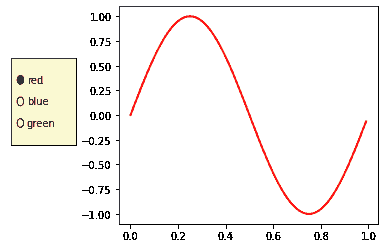
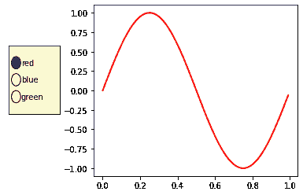
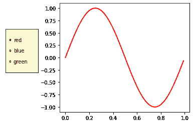

# 如何调整 Matplotlib 单选按钮的大小？

> 原文:[https://www . geesforgeks . org/如何调整大小-matplotlib-radiobuttons/](https://www.geeksforgeeks.org/how-to-resize-matplotlib-radiobuttons/)

Matplotlib 是一个神奇的 Python 可视化库，用于数组的 2D 图。Matplotlib 是一个多平台数据可视化库，构建在 NumPy 数组上，旨在与更广泛的 SciPy 堆栈一起工作。

单选按钮是可视化中最常用的小部件。单选按钮允许我们在可视化中的多个选项之间进行选择。在这种情况下，用户可以通过按钮选择三种不同颜色中的一种来显示正弦波。

这是单选按钮的简单可视化。

## 蟒蛇 3

```
# import modules
import numpy as np
import matplotlib.pyplot as plt
from matplotlib.widgets import RadioButtons

# creating an array starting from
# 0 to 1 with step size 0.01
t = np.arange(0.0, 1.0, 0.01)

# the values of sin values of t
s0 = np.sin(2*np.pi*t)

# depict visualization
fig, ax = plt.subplots()
l, = ax.plot(t, s0, lw=2, color='red')
plt.subplots_adjust(left=0.3)

# adjust radio buttons
axcolor = 'lightgoldenrodyellow'
rax = plt.axes([0.05, 0.4, 0.15, 0.30],
               facecolor=axcolor)

radio = RadioButtons(rax, ('red', 'blue', 'green'))

plt.show()
```

**输出:**



在上面的代码中， **plt.axes()** 将轴添加到当前图形中，并使其成为当前轴。第一个参数是**框=【左、底、宽、高】**的 4 元组浮点数。第二个参数是*** *夸脱**。此方法还接受返回的 axes 类的关键字参数。可以是脸型、身材等。在方法 **RadioButtons()** 中，第一个参数是上面创建的轴，第二个参数是我们想要的标签的元组。

### **调整单选按钮**中圆圈的半径

圆的默认大小是 0.05。我们添加一条如下所示的简单直线来改变半径。如果圆的半径大于 0.05，比如说 0.09。

## 蟒蛇 3

```
# import module
import numpy as np
import matplotlib.pyplot as plt
from matplotlib.widgets import RadioButtons

# creating an array starting from
# 0 to 1 with step size 0.01
t = np.arange(0.0, 1.0, 0.01)

# the values of sin values of t
s0 = np.sin(2*np.pi*t)

# depict visualiiation
fig, ax = plt.subplots()
l, = ax.plot(t, s0, lw=2, color='red')
plt.subplots_adjust(left=0.3)

# adjust radiobuttons
axcolor = 'lightgoldenrodyellow'
rax = plt.axes([0.05, 0.4, 0.15, 0.30],
               facecolor=axcolor)
radio = RadioButtons(rax, ('red', 'blue', 'green'))

# adjust radius here. The default is 0.05
for circle in radio.circles:
    circle.set_radius(0.09)
```

**输出:**



这里还有一个例子，圆的半径小于 0.05，比如 0.02

## 蟒蛇 3

```
# import module
import numpy as np
import matplotlib.pyplot as plt
from matplotlib.widgets import RadioButtons

# creating an array starting from
# 0 to 1 with step size 0.01
t = np.arange(0.0, 1.0, 0.01)

# the values of sin values of t
s0 = np.sin(2*np.pi*t)

# depict visualization
fig, ax = plt.subplots()
l, = ax.plot(t, s0, lw=2, color='red')
plt.subplots_adjust(left=0.3)

# adjust radiobuttons
axcolor = 'lightgoldenrodyellow'
rax = plt.axes([0.05, 0.4, 0.15, 0.30],
               facecolor=axcolor)

radio = RadioButtons(rax, ('red', 'blue', 'green'))

# adjust radius here. The default is 0.05
for circle in radio.circles:
    circle.set_radius(0.02)
```

**输出:**

