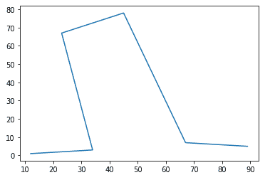
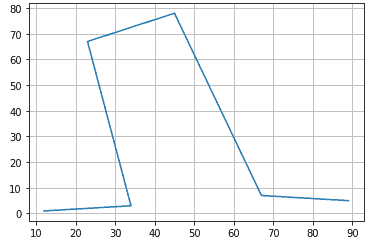

# 如何在 Matplotlib 图上显示网格线？

> 原文:[https://www . geesforgeks . org/如何显示网格线-on-matplotlib-plots/](https://www.geeksforgeeks.org/how-to-show-gridlines-on-matplotlib-plots/)

在本文中，我们将看到如何向 matplotlib 图中添加网格线以及可以在 Python 中使用的各种可配置参数。

**例**:

使用样本数据创建 matplotlib 图。

## 计算机编程语言

```py
# Importing the library
import matplotlib.pyplot as plt

# Define X and Y data points
X = [12, 34, 23, 45, 67, 89]
Y = [1, 3, 67, 78, 7, 5]

# Plot the graph using matplotlib
plt.plot(X, Y)

# Function to view the plot
plt.show()
```

**输出**



## 网格()

grid()方法用于在 matplotlib 图中定义网格。语法由–

> **语法**:
> 
> matplotlib.pyplot.grid(b=None，其中='major '，axis='both '，**kwargs)
> 
> **参数**:
> 
> *   **b: bool 或 None，可选:**是否显示网格线。如果提供了任何 kwargs，则假定您希望网格打开，b 将设置为真。如果 b 为“无”，并且没有 kwargs，这将切换线条的可见性。
> *   **哪个:{ '主要'，'次要'，'两者' }，可选:**要应用更改的网格线。
> *   **轴:{'both '，' x '，' y'}，可选:**应用更改的轴。
> *   ****kwargs: Line2D 属性:**定义网格的线条属性

**示例 1:默认网格线**

## 计算机编程语言

```py
# Importing the library
import matplotlib.pyplot as plt

# Define X and Y data points
X = [12, 34, 23, 45, 67, 89]
Y = [1, 3, 67, 78, 7, 5]

# Plot the graph using matplotlib
plt.plot(X, Y)

# Add gridlines to the plot
plt.grid(b=True)
# `plt.grid()` also works

# Function to view the plot
plt.show()
```

**输出**



**示例 2:** 将网格线应用于 x 轴

在我们只想看到垂直或水平网格线的情况下，我们可以使用`**轴**参数。仅查看垂直网格线–

**语法**:

```py
plt.grid(b=True, axis='x')
```

## 蟒蛇 3

```py
# Importing the library
import matplotlib.pyplot as plt

# Define X and Y data points
X = [12, 34, 23, 45, 67, 89]
Y = [1, 3, 67, 78, 7, 5]

# Plot the graph using matplotlib
plt.plot(X, Y)

# Add gridlines to the plot
plt.grid(b=True, axis='x')
# `plt.grid()` also works

# Function to view the plot
plt.show()
```

**输出**:


**示例 3:** 将网格线应用于 y 轴

在我们只想看到垂直或水平网格线的情况下，我们可以使用“轴”参数。仅查看水平网格线–

**语法:**

```py
 plt.grid(b=True, axis='y')
```

## 蟒蛇 3

```py
# Importing the library
import matplotlib.pyplot as plt

# Define X and Y data points
X = [12, 34, 23, 45, 67, 89]
Y = [1, 3, 67, 78, 7, 5]

# Plot the graph using matplotlib
plt.plot(X, Y)

# Add gridlines to the plot
plt.grid(b=True, axis='y')
# `plt.grid()` also works

# Function to view the plot
plt.show()
```

**输出**:


**示例 4:** 提供线型和线宽

我们已经看到网格线是实线。我们可以使用参数`**线型**或` **ls** '来更改它以查看不同的线型，如破折号。同样，我们可以使用参数`**线宽`**来改变网格线的粗细。这些参数是作为关键字参数的一部分提供的，可以在文档链接中查看。

提供线条风格–

**语法:**

```py
plt.grid(linestyle='--')
```

## 蟒蛇 3

```py
# Importing the library
import matplotlib.pyplot as plt

# Define X and Y data points
X = [12, 34, 23, 45, 67, 89]
Y = [1, 3, 67, 78, 7, 5]

# Plot the graph using matplotlib
plt.plot(X, Y)

# Add gridlines to the plot
plt.grid(linestyle='--')
# `plt.grid()` also works

# Function to view the plot
plt.show()
```