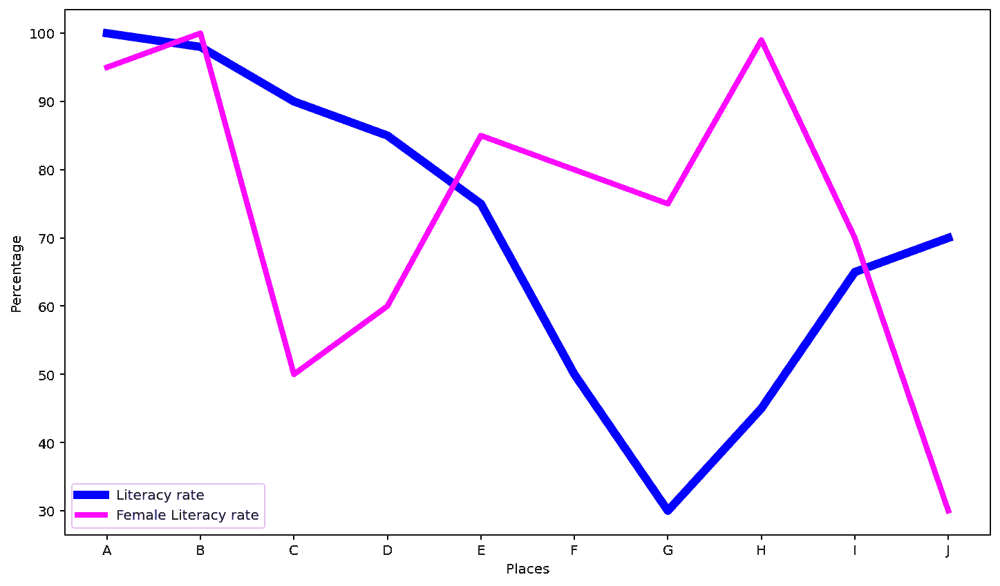

# 用 Matplotlib

增加线条的粗细

> 原文:[https://www . geeksforgeeks . org/用 matplotlib 增加线条厚度/](https://www.geeksforgeeks.org/increase-the-thickness-of-a-line-with-matplotlib/)

**先决条件:**T2【马特洛特利

Matplotlib 是使用可用数据集绘制图形的最广泛使用的库。Matplotlib 支持折线图，用于表示连续时间跨度内的数据。在折线图中，数据值被绘制为点，然后用一条线连接起来，以显示度量值随时间的趋势。线宽属性提供了增加线条粗细的功能。

**线宽:**默认线宽为 1。对于有多条线的图形，很难用较浅的颜色描绘这些线。这种情况可以通过增加线宽来解决。与其他数据相比，线宽可用于聚焦某些数据。它可以帮助获得数据集中特定记录的详细可视化。该属性属于绘图函数()。

### 方法

*   导入模块
*   创建或加载数据
*   绘制具有所需线宽的图表
*   显示图

### **使用的功能**

*   **xlabel()-** 此功能用于设置 x 轴的标签

> **语法:** plt.xlabel(xlabel，fontdict=None，labelpad=None，**kwargs)
> 
> **参数:**
> 
> *   **xlabel:** 接受字符串类型值，用于标注 X 轴。
> *   **字体属性**:用于覆盖标签的默认字体属性。其默认值为“无”，并且是可选的。
> *   **labelpad:** 默认值为无。它用于指定标签与轴的间距。这是可选的。
> *   ****kwargs** :用于指定可用于修改标签外观的其他属性。

*   **ylabel()-** 此功能用于设置 y 轴的标签

> **语法:**PLT . ylabel(ylbel，fontdict=None，labelpad=None，**kwargs)
> 
> **参数:**
> 
> *   **ylabel:** 接受字符串类型值，用于标注 Y 轴。
> *   **字体字典:**用于覆盖标签的默认字体属性。其默认值为“无”，并且是可选的。
> *   **labelpad:** 默认值为无。它用于指定标签与轴的间距。这是可选的。
> *   ****kwargs:** 用于指定可用于修改标签外观的其他属性。

*   **图()-** 它用来制作点 x，y. 的 2D 六边形宁滨图

> **语法:**PLT . PLT(x，y，数据=无，**kwargs)
> 
> **参数**
> 
> *   **x，y :** 用于指定沿 x 轴和 y 轴绘制的数据。
> *   **数据:**默认值为无。它是一个带有标签数据的对象，可以代替 x，y 值传递。如果数据对象被传递，那么应该指定 xand y 标签。
> *   ****kwargs:** 用于指定线条属性，如线宽、颜色、抗锯齿、标记、标记颜色等。

*   **图例()-** 图例是描述图形元素的区域。在 matplotlib 库中，有一个名为 legend() 的函数，用于在轴上放置一个图例。

> **语法:**PLT . legend(* *选项)
> 
> **参数**
> 
> *** *选项:**用于指定图例的属性、大小、位置、边缘颜色、面颜色等

**例 1:**

## 蟒蛇 3

```
import matplotlib.pyplot as plt

places = ["A", "B", "C", "D", "E", "F", "G", "H", "I", "J"]
literacy_rate = [100, 98, 90, 85, 75, 50, 30, 45, 65, 70]
female_literacy = [95, 100, 50, 60, 85, 80, 75, 99, 70, 30]

plt.xlabel("Places")
plt.ylabel("Percentage")

plt.plot(places, literacy_rate, color='blue',
         linewidth=6, label="Literacy rate")

plt.plot(places, female_literacy, color='fuchsia',
         linewidth=4, label="Female Literacy rate")

plt.legend(loc='lower left', ncol=1)
```

**输出**



**例 2:**

## 蟒蛇 3

```
import matplotlib.pyplot as plt

age = [10, 20, 30, 40, 50, 60, 70, 80, 90, 100]
cardiac_cases = [5, 15, 20, 40, 55, 55, 70, 80, 90, 95]
survival_chances = [99, 99, 90, 90, 80, 75, 60, 50, 30, 25]

plt.xlabel("Age")
plt.ylabel("Percentage")

plt.plot(age, cardiac_cases, color='black', linewidth=2,
         label="Cardiac Cases", marker='o', markerfacecolor='red', markersize=12)

plt.plot(age, survival_chances, color='yellow', linewidth=3,
         label="Survival Chances", marker='o', markerfacecolor='green', markersize=12)

plt.legend(loc='lower right', ncol=1)
```

**输出**

