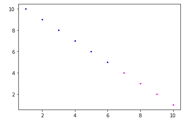

# 在 matplotlib 上标记不同的色点

> 原文:[https://www . geesforgeks . org/mark-different-color-points-on-matplotlib/](https://www.geeksforgeeks.org/mark-different-color-points-on-matplotlib/)

**[Matplotlib](https://www.geeksforgeeks.org/python-introduction-matplotlib/)** 是 Python 中一个惊人的可视化库，用于数组的 2D 图。Matplotlib 是一个多平台数据可视化库，构建在 NumPy 数组上，旨在与更广泛的 SciPy 堆栈一起工作。

在本文中，任务是根据列表中元素的值(比如 x 小于或等于 7)应该用蓝色表示，而那些更大的值应该用洋红色表示的条件，在图形中标记不同的颜色点。这个想法是绘制一个图表，在一个条件下用不同的颜色将点分组，基本上是用一种颜色将聚类分组。为此，我们对 x 的所有值运行一个循环，并为 x 的相应值分配一个颜色值。将由蓝色和洋红色组成一个列表，指定第 I 个索引处的颜色。

下面是实现。

```
import  numpy as np
import matplotlib.pyplot as plt

# values of x
x = np.array([1, 2, 3, 4, 5,
              6, 7, 8, 9, 10])

# values of y
y = np.array([10, 9, 8, 7, 6, 5,
              4, 3, 2, 1])

# empty list, will hold color value
# corresponding to x
col =[]

for i in range(0, len(x)):
    if x[i]<7:
        col.append('blue')  
    else:
        col.append('magenta') 

for i in range(len(x)):

    # plotting the corresponding x with y 
    # and respective color
    plt.scatter(x[i], y[i], c = col[i], s = 10,
                linewidth = 0)

plt.show()
```

**输出:**

