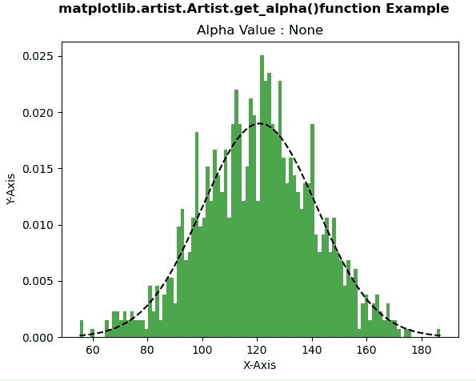
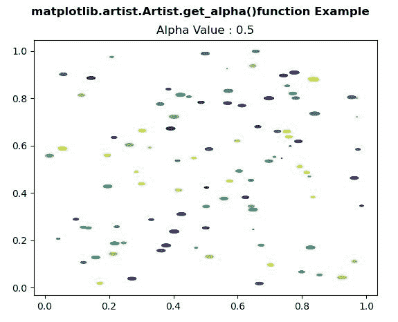

# Python 中的 matplotlib . artist . artist . get _ alpha()

> 原文:[https://www . geesforgeks . org/matplotlib-artist-artist-get _ alpha-in-python/](https://www.geeksforgeeks.org/matplotlib-artist-artist-get_alpha-in-python/)

**[Matplotlib](https://www.geeksforgeeks.org/python-introduction-matplotlib/)** 是 Python 中的一个库，是 NumPy 库的数值-数学扩展。**艺术家类**包含抽象基类，用于渲染到图形画布中的对象。图形中所有可见的元素都是艺术家的子类。

## matplotlib . artist . artist . get _ alpha()方法

matplotlib 库的 artist 模块中的 **get_alpha()方法**用于获取用于混合的 alpha 值。

> **语法:** Artist.get_alpha(self)
> 
> **参数:**该方法不接受任何参数。
> 
> **返回:**此方法返回用于混合的 alpha 值。

下面的例子说明了 matplotlib 中的 matplotlib . artist . get _ alpha()函数:

**例 1:**

```
# Implementation of matplotlib function
from matplotlib.artist import Artist  
import matplotlib 
import numpy as np 
import matplotlib.pyplot as plt 

np.random.seed(10**7) 
mu = 121 
sigma = 21
x = mu + sigma * np.random.randn(1000) 

num_bins = 100
fig, ax = plt.subplots() 

n, bins, patches = ax.hist(x, num_bins, 
                           density = 1, 
                           color ='green', 
                           alpha = 0.7) 

y = ((1 / (np.sqrt(2 * np.pi) * sigma)) *
     np.exp(-0.5 * (1 / sigma * (bins - mu))**2)) 

ax.plot(bins, y, '--', color ='black') 

ax.set_xlabel('X-Axis') 
ax.set_ylabel('Y-Axis') 

w = Artist.get_alpha(ax) 
ax.set_title("Alpha Value : "+str(w)) 

fig.suptitle('matplotlib.artist.Artist.get_alpha()\
function Example', fontweight ="bold") 

plt.show()
```

**输出:**


**例 2:**

```
# Implementation of matplotlib function
from matplotlib.artist import Artist  
import matplotlib.pyplot as plt 
import numpy as np 

rx, ry = 3., 1.

value1 = rx * ry * np.pi 
value2 = np.arange(0, 3 * np.pi + 0.01, 0.2) 
value3 = np.column_stack([rx / value1 * np.cos(value2), 
                          ry / value1 * np.sin(value2)]) 

x, y, s, c = np.random.rand(4, 99) 
s *= 10**2.

fig, ax = plt.subplots() 
ax.scatter(x, y, s, c, marker = value3) 

Artist.set_alpha(ax, 0.5) 

w = Artist.get_alpha(ax) 
ax.set_title("Alpha Value : "+str(w)) 

fig.suptitle('matplotlib.artist.Artist.get_alpha()\
function Example', fontweight ="bold") 

plt.show()
```

**输出:**
