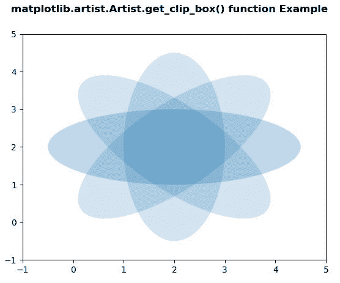
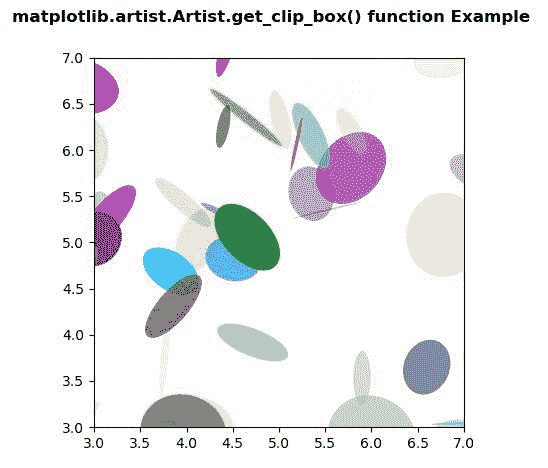

# Python 中的 matplotlib . artist . artist . get _ clip _ box()

> 原文:[https://www . geesforgeks . org/matplotlib-artist-artist-get _ clip _ box-in-python/](https://www.geeksforgeeks.org/matplotlib-artist-artist-get_clip_box-in-python/)

**[Matplotlib](https://www.geeksforgeeks.org/python-introduction-matplotlib/)** 是 Python 中的一个库，是 NumPy 库的数值-数学扩展。**艺术家类**包含抽象基类，用于渲染到图形画布中的对象。图形中所有可见的元素都是艺术家的子类。

## matplotlib . artist . artist . get _ clip _ box()方法

matplotlib 库的 artist 模块中的 **get_clip_box()方法**用于获取剪贴盒。

> **语法:** Artist.get_clip_box(self)
> 
> **参数:**该方法不接受任何参数。
> 
> **返回:**该方法返回动画状态。

以下示例说明了 matplotlib 中的 matplotlib . artist . artist . get _ clip _ box()函数:

**例 1:**

```
# Implementation of matplotlib function
from matplotlib.artist import Artist
import matplotlib.pyplot as plt 
import numpy as np 
from matplotlib.patches import Ellipse 

delta = 45.0

angles = np.arange(0, 360 + delta, delta) 
ells = [Ellipse((2, 2), 5, 2, a) for a in angles] 

fig, ax = plt.subplots() 

print("Value Return by get_clip_box()") 
for e in ells: 
    Artist.set_clip_box(e, ax.bbox) 
    print(Artist.get_clip_box(e)) 
    e.set_alpha(0.1) 
    ax.add_artist(e) 

plt.xlim(-1, 5) 
plt.ylim(-1, 5) 

fig.suptitle('matplotlib.artist.Artist.get_clip_box() \
function Example', fontweight ="bold") 

plt.show()
```

**输出:**


```
Value Return by get_clip_box()
TransformedBbox(
    Bbox(x0=0.125, y0=0.10999999999999999, x1=0.9, y1=0.88),
    BboxTransformTo(
        TransformedBbox(
            Bbox(x0=0.0, y0=0.0, x1=6.4, y1=4.8),
            Affine2D(
                [[100\.   0\.   0.]
                 [  0\. 100\.   0.]
                 [  0\.   0\.   1.]]))))
TransformedBbox(
    Bbox(x0=0.125, y0=0.10999999999999999, x1=0.9, y1=0.88),
    BboxTransformTo(
        TransformedBbox(
            Bbox(x0=0.0, y0=0.0, x1=6.4, y1=4.8),
            Affine2D(
                [[100\.   0\.   0.]
                 [  0\. 100\.   0.]
                 [  0\.   0\.   1.]]))))
TransformedBbox(
    Bbox(x0=0.125, y0=0.10999999999999999, x1=0.9, y1=0.88),
    BboxTransformTo(
        TransformedBbox(
            Bbox(x0=0.0, y0=0.0, x1=6.4, y1=4.8),
            Affine2D(
                [[100\.   0\.   0.]
                 [  0\. 100\.   0.]
                 [  0\.   0\.   1.]]))))
TransformedBbox(
    Bbox(x0=0.125, y0=0.10999999999999999, x1=0.9, y1=0.88),
    BboxTransformTo(
        TransformedBbox(
            Bbox(x0=0.0, y0=0.0, x1=6.4, y1=4.8),
            Affine2D(
                [[100\.   0\.   0.]
                 [  0\. 100\.   0.]
                 [  0\.   0\.   1.]]))))
TransformedBbox(
    Bbox(x0=0.125, y0=0.10999999999999999, x1=0.9, y1=0.88),
    BboxTransformTo(
        TransformedBbox(
            Bbox(x0=0.0, y0=0.0, x1=6.4, y1=4.8),
            Affine2D(
                [[100\.   0\.   0.]
                 [  0\. 100\.   0.]
                 [  0\.   0\.   1.]]))))
TransformedBbox(
    Bbox(x0=0.125, y0=0.10999999999999999, x1=0.9, y1=0.88),
    BboxTransformTo(
        TransformedBbox(
            Bbox(x0=0.0, y0=0.0, x1=6.4, y1=4.8),
            Affine2D(
                [[100\.   0\.   0.]
                 [  0\. 100\.   0.]
                 [  0\.   0\.   1.]]))))
TransformedBbox(
    Bbox(x0=0.125, y0=0.10999999999999999, x1=0.9, y1=0.88),
    BboxTransformTo(
        TransformedBbox(
            Bbox(x0=0.0, y0=0.0, x1=6.4, y1=4.8),
            Affine2D(
                [[100\.   0\.   0.]
                 [  0\. 100\.   0.]
                 [  0\.   0\.   1.]]))))
TransformedBbox(
    Bbox(x0=0.125, y0=0.10999999999999999, x1=0.9, y1=0.88),
    BboxTransformTo(
        TransformedBbox(
            Bbox(x0=0.0, y0=0.0, x1=6.4, y1=4.8),
            Affine2D(
                [[100\.   0\.   0.]
                 [  0\. 100\.   0.]
                 [  0\.   0\.   1.]]))))
TransformedBbox(
    Bbox(x0=0.125, y0=0.10999999999999999, x1=0.9, y1=0.88),
    BboxTransformTo(
        TransformedBbox(
            Bbox(x0=0.0, y0=0.0, x1=6.4, y1=4.8),
            Affine2D(
                [[100\.   0\.   0.]
                 [  0\. 100\.   0.]
                 [  0\.   0\.   1.]]))))

```

**例 2:**

```
# Implementation of matplotlib function
from matplotlib.artist import Artist
import matplotlib.pyplot as plt 
import numpy as np 
from matplotlib.patches import Ellipse 

NUM = 200

ells = [Ellipse(xy = np.random.rand(2) * 10, 
                width = np.random.rand(), 
                height = np.random.rand(), 
                angle = np.random.rand() * 360) 
        for i in range(NUM)] 

fig, ax = plt.subplots(subplot_kw ={'aspect': 'equal'}) 

print("Value Return by get_clip_box()") 
x = 0

for e in ells: 
    ax.add_artist(e) 
    Artist.set_clip_box(e, ax.bbox) 
    e.set_alpha(np.random.rand()) 
    e.set_facecolor(np.random.rand(4)) 

    if x<2: 
        print(Artist.get_clip_box(e)) 
        x+= 1

ax.set_xlim(3, 7) 
ax.set_ylim(3, 7) 

fig.suptitle('matplotlib.artist.Artist.get_clip_box()\
function Example', fontweight ="bold") 

plt.show()
```

**输出:**


```
Value Return by get_clip_box()
TransformedBbox(
    Bbox(x0=0.125, y0=0.10999999999999999, x1=0.9, y1=0.88),
    BboxTransformTo(
        TransformedBbox(
            Bbox(x0=0.0, y0=0.0, x1=6.4, y1=4.8),
            Affine2D(
                [[100\.   0\.   0.]
                 [  0\. 100\.   0.]
                 [  0\.   0\.   1.]]))))
TransformedBbox(
    Bbox(x0=0.125, y0=0.10999999999999999, x1=0.9, y1=0.88),
    BboxTransformTo(
        TransformedBbox(
            Bbox(x0=0.0, y0=0.0, x1=6.4, y1=4.8),
            Affine2D(
                [[100\.   0\.   0.]
                 [  0\. 100\.   0.]
                 [  0\.   0\.   1.]]))))

```