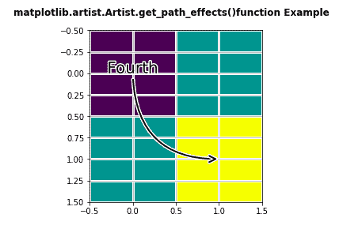

# Python 中的 matplotlib . artist . artist . get _ path _ effects()

> 原文:[https://www . geesforgeks . org/matplotlib-artist-artist-get _ path _ effects-in-python/](https://www.geeksforgeeks.org/matplotlib-artist-artist-get_path_effects-in-python/)

**[Matplotlib](https://www.geeksforgeeks.org/python-introduction-matplotlib/)** 是 Python 中的一个库，是 NumPy 库的数值-数学扩展。**艺术家类**包含抽象基类，用于渲染到图形画布中的对象。图形中所有可见的元素都是艺术家的子类。

## matplotlib . artist . artist . get _ path _ effects()方法

matplotlib 库的 artist 模块中的 **get_path_effects()方法**用于获取 set_path_effects 的属性。

> **语法:**artist . get _ path _ effects(self)
> 
> **参数:**该方法不接受任何参数。
> 
> **返回:**该方法返回 set_path_effects 的属性。

以下示例说明了 matplotlib 中的 matplotlib . artist . artist . get _ path _ effects()函数:

**例 1:**

```py
# Implementation of matplotlib function
from matplotlib.artist import Artist  
import matplotlib.pyplot as plt 
import numpy as np 
import matplotlib.patheffects as path_effects 

fig, ax = plt.subplots() 
t = ax.text(0.02, 0.5, 
            'GeeksForGeeks',  
            fontsize = 40, 
            weight = 1000,  
            va ='center') 

t.set_path_effects([path_effects.PathPatchEffect(offset =(4, -4),  
                                                 hatch ='xxxx', 
                                                 facecolor ='gray'), 
                    path_effects.PathPatchEffect(edgecolor ='white', 
                                                 linewidth = 1.1, 
                                                 facecolor ='black')]) 

print("Value Return by get_path_effects() : \n") 
for i in Artist.get_path_effects(t): 
    print(i)

fig.suptitle('matplotlib.artist.Artist.get_path_effects()\
function Example', fontweight ="bold") 

plt.show()
```

**输出:**


```py
Value Return by get_path_effects() : 

<matplotlib.patheffects.PathPatchEffect object at 0x0AAAB890>
<matplotlib.patheffects.PathPatchEffect object at 0x0AAABA70>

```

**例 2:**

```py
# Implementation of matplotlib function
from matplotlib.artist import Artist  
import matplotlib.pyplot as plt 
import matplotlib.patheffects as PathEffects 
import numpy as np 

fig, ax1 = plt.subplots() 
ax1.imshow([[1, 2], [2, 3]]) 
txt = ax1.annotate("Fourth", 
                   (1., 1.),  
                   (0., 0), 
                   arrowprops = dict(arrowstyle ="->", 
                                     connectionstyle ="angle3",
                                     lw = 2), 
                   size = 20,  
                   ha ="center",  
                   path_effects =[PathEffects.withStroke(linewidth = 3, 
                                                         foreground ="w")]) 

txt.arrow_patch.set_path_effects([ 
    PathEffects.Stroke(linewidth = 5, foreground ="w"), 
    PathEffects.Normal()]) 

ax1.grid(True, linestyle ="-") 

pe = [PathEffects.withStroke(linewidth = 3, 
                             foreground ="w")] 

for l in ax1.get_xgridlines() + ax1.get_ygridlines(): 
    l.set_path_effects(pe) 

print("Value Return by get_path_effects() : \n") 

for l in ax1.get_xgridlines() + ax1.get_ygridlines(): 
    for i in Artist.get_path_effects(l):
        print(i)

fig.suptitle('matplotlib.artist.Artist.get_path_effects()\
function Example', fontweight ="bold") 

plt.show()
```

**输出:**



```py
Value Return by get_path_effects() : 

<matplotlib.patheffects.withStroke object at 0x0A66DBD0>
<
<matplotlib.patheffects.withStroke object at 0x0A66DBD0>
<matplotlib.patheffects.withStroke object at 0x0A66DBD0>
<matplotlib.patheffects.withStroke object at 0x0A66DBD0>
<matplotlib.patheffects.withStroke object at 0x0A66DBD0>
<matplotlib.patheffects.withStroke object at 0x0A66DBD0>
<matplotlib.patheffects.withStroke object at 0x0A66DBD0>
<matplotlib.patheffects.withStroke object at 0x0A66DBD0>
<matplotlib.patheffects.withStroke object at 0x0A66DBD0>
<matplotlib.patheffects.withStroke object at 0x0A66DBD0>
<matplotlib.patheffects.withStroke object at 0x0A66DBD0>
<matplotlib.patheffects.withStroke object at 0x0A66DBD0>
<matplotlib.patheffects.withStroke object at 0x0A66DBD0>
<matplotlib.patheffects.withStroke object at 0x0A66DBD0>
<matplotlib.patheffects.withStroke object at 0x0A66DBD0>
<matplotlib.patheffects.withStroke object at 0x0A66DBD0>
<matplotlib.patheffects.withStroke object at 0x0A66DBD0>

```