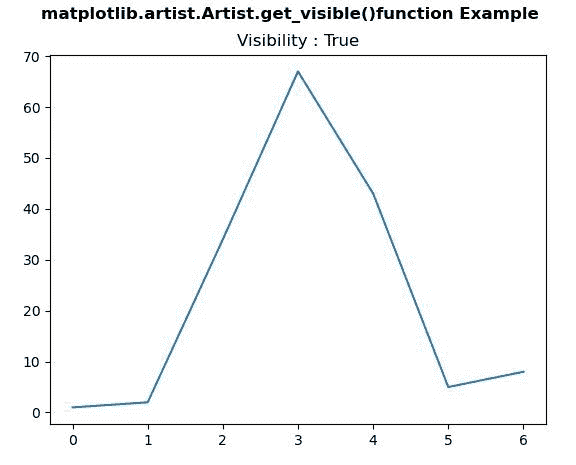
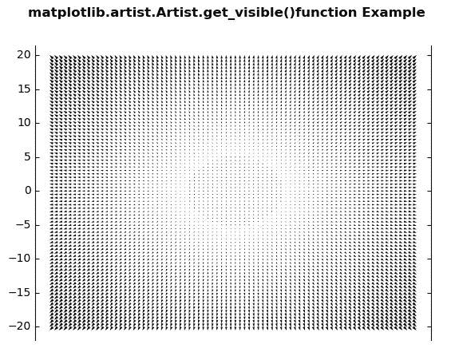

# Python 中的 matplotlib . artist . artist . get _ visible()

> 原文:[https://www . geesforgeks . org/matplotlib-artist-artist-get _ visible-in-python/](https://www.geeksforgeeks.org/matplotlib-artist-artist-get_visible-in-python/)

**[Matplotlib](https://www.geeksforgeeks.org/python-introduction-matplotlib/)** 是 Python 中的一个库，是 NumPy 库的数值-数学扩展。**艺术家类**包含抽象基类，用于渲染到图形画布中的对象。图形中所有可见的元素都是艺术家的子类。

## matplotlib . artist . artist . get _ visible()方法

matplotlib 库的 artist 模块中的 **get_visible()方法**用于获取可见性。

> **语法:** Artist.get_visible(self)
> 
> **参数:**该方法不接受任何参数。
> 
> **返回:**此方法返回可见性。

下面的例子说明了 matplotlib . artist . artist . get _ visible()函数:

**例 1:**

```
# Implementation of matplotlib function
from matplotlib.artist import Artist  
import matplotlib.pyplot as plt 
from mpl_toolkits.axisartist.axislines import Subplot 

fig, ax = plt.subplots() 

ax.plot([1, 2, 34, 67, 43, 5, 8]) 

ax.set_title("Visibility : " +str(Artist.get_visible(ax)))

fig.suptitle('matplotlib.artist.Artist.get_visible()\
function Example', fontweight ="bold") 

plt.show()
```

**输出:**


**例 2:**

```
# Implementation of matplotlib function
from matplotlib.artist import Artist  
import numpy as np 
import matplotlib.pyplot as plt 
from mpl_toolkits.axisartist.axislines import Subplot 

fig = plt.figure() 

ax = Subplot(fig, 111) 
fig.add_subplot(ax) 

X = np.arange(-20, 20, 0.5) 
Y = np.arange(-20, 20, 0.5) 
U, V = np.meshgrid(X, Y) 

ax.quiver(X, Y, U, V) 

ax.axis["bottom"].set_visible(False) 
ax.axis["top"].set_visible(False) 

print("Visibilities of Axis") 
print("Bottom :", Artist.get_visible(ax.axis["bottom"]), 
      "\nTop :", Artist.get_visible(ax.axis["top"]), 
      "\nLeft :", Artist.get_visible(ax.axis["left"]), 
      "\nRight :", Artist.get_visible(ax.axis["right"]))

fig.suptitle('matplotlib.artist.Artist.get_visible()\
function Example', fontweight ="bold") 

plt.show()
```

**输出:**


```
Visibilities of Axis
Bottom : False 
Top : False 
Left : True 
Right : True

```