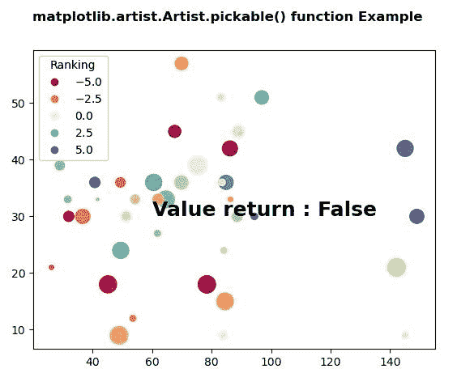

# Python 中的 matplotlib . artist . artist . pickle()

> 原文:[https://www . geeksforgeeks . org/matplotlib-artist-artist-python 中的可拾取/](https://www.geeksforgeeks.org/matplotlib-artist-artist-pickable-in-python/)

**[Matplotlib](https://www.geeksforgeeks.org/python-introduction-matplotlib/)** 是 Python 中的一个库，是 NumPy 库的数值-数学扩展。**艺术家类**包含抽象基类，用于渲染到图形画布中的对象。图形中所有可见的元素都是艺术家的子类。

## matplotlib . artist . artist . pickle()方法

matplotlib 库的 artist 模块中的**可选取()方法**用于返回该 artist 是否可选取。

> **语法:**艺术家.可挑选的(自我)
> 
> **参数:**此方法不接受任何参数。
> 
> **返回:**此方法返回艺术家是否可挑。

下面的例子说明了 matplotlib 中的 matplotlib . artist . artist . pick able()函数:

**例 1:**

```
# Implementation of matplotlib function
from matplotlib.artist import Artist
import numpy as np 
np.random.seed(19680801) 
import matplotlib.pyplot as plt 

volume = np.random.rayleigh(27, size = 40) 
amount = np.random.poisson(10, size = 40) 
ranking = np.random.normal(size = 40) 
price = np.random.uniform(1, 10, size = 40) 

fig, ax = plt.subplots() 

scatter = ax.scatter(volume * 2, amount * 3, 
                     c = ranking * 3,  
                     s = 0.3*(price * 3)**2, 
                     vmin = -4, vmax = 4,  
                     cmap = "Spectral") 

legend1 = ax.legend(*scatter.legend_elements(num = 5), 
                    loc ="upper left", 
                    title ="Ranking") 

ax.add_artist(legend1) 

ax.text(60, 30, "Value return : "
        + str(Artist.pickable(ax)),  
        fontweight ="bold",  
        fontsize = 18) 

fig.suptitle('matplotlib.artist.Artist.pickable() function\
 Example', fontweight ="bold") 

plt.show()
```

**输出:**


**例 2:**

```
# Implementation of matplotlib function
from matplotlib.artist import Artist
import numpy as np 
import matplotlib.pyplot as plt 
import matplotlib.cbook as cbook 

np.random.seed(10**7) 
data = np.random.lognormal(size =(10, 4), 
                           mean = 4.5, 
                           sigma = 4.75) 

labels = ['G1', 'G2', 'G3', 'G4'] 

result = cbook.boxplot_stats(data,  
                             labels = labels,  
                             bootstrap = 1000) 

for n in range(len(result)): 
    result[n]['med'] = np.median(data) 
    result[n]['mean'] *= 0.1

fig, axes1 = plt.subplots() 
axes1.bxp(result) 

axes1.text(2, 30000, 
           "Value return : " 
           + str(Artist.pickable(axes1)),  
           fontweight ="bold") 

fig.suptitle('matplotlib.artist.Artist.pickable()\
 function Example', fontweight ="bold") 

plt.show()
```

**输出:**
